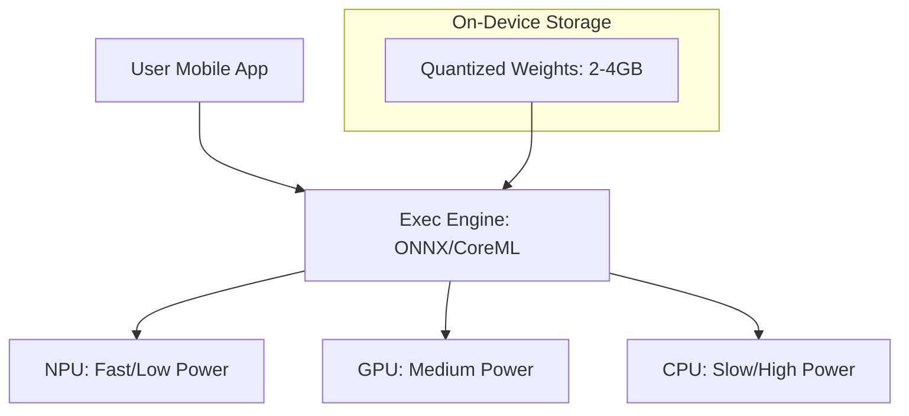

# Edge AI & Mobile LLMs: Aapki Jeb mein Intelligence

## 1. Shuruwat ke liye Hinglish Explanation 🇮🇳
Bhai, kya tumne kabhi socha hai ki tumhara phone "Airplane Mode" mein bhi tumhari photo se background remove kar deta hai ya text translate kar deta hai? Yeh kaise hota hai? 

Yeh hai **Edge AI**. Iska matlab hai ki AI model kisi cloud server par nahi, balki seedha tumhare device (Phone, Laptop, Watch) par chal raha hai. **Mobile LLMs** (jaise Gemini Nano ya Llama-3-8B quantized) itne chote hote hain ki woh tumhare phone ki RAM mein fit ho jate hain. Isse teen bade fayde hote hain: **Speed** (No internet delay), **Privacy** (Data phone se bahar nahi jata), aur **Cost** (Company ka server bill bach jata hai). 2026 mein "Local AI" hi asli trend hai.

---

## 2. Gehri Technical Samjhai
Edge AI ka matlab hai ki optimized models ko decentralized hardware par deploy karna.
- **Hardware Accelerators**: Apple's NPU (Neural Engine), Qualcomm's Hexagon, ya Google's TPU use karte hain mobile chips par.
- **Model Formats**: CoreML (Apple), TensorFlow Lite (Android), aur ONNX.
- **Quantization**: Models ko 4GB-12GB mobile RAM mein fit karne ke liye essential. Usually 4-bit (GGUF/AWQ).
- **Execution Providers**: Software layers jo AI math ko hardware-specific instructions mein translate karte hain.

---

## 3. Ganitik Intuition
Mobile deployment ek **Memory-Bandwidth constrained** problem hai.
Modern mobile NPUs 40+ TOPs (Tera Operations per Second) tak pahunch sakte hain.
Lekin bottleneck often **RAM Bandwidth** hota hai (data LPDDR5 RAM se chip par kitni tezi se move karta hai).
Agar 4-bit model 4GB RAM leta hai, aur aapke phone ki bandwidth 50GB/s hai, toh aapki max theoretical speed 12.5 tokens per second hogi. Optimization memory fetches per token reduce karne par focus karti hai.

---

## 4. Architecture Diagrams


---

## 5. Production-ready Examples
`MLX` (Apple ka specialized framework for Silicon) use karte hain:

```python
import mlx.core as mx
from mlx_lm import load, generate

# 1. Load model optimized for Apple Silicon (NPU/GPU)
model, tokenizer = load("mlx-community/Llama-3-8B-4bit")

# 2. Run local inference
response = generate(model, tokenizer, prompt="Write a quick email.", verbose=True)

# Note: This runs entirely on the Macbook's M1/M2/M3 chip with zero API calls.
```

---

## 6. Real-world Use Cases
- **Privacy-Sensitive Chat**: Medical ya financial apps jahan data device se bahar nahi ja sakta.
- **Real-time Translation**: Network nahi hai wahan areas mein instant voice-to-voice translation.
- **Auto-complete**: Mobile keyboards mein super-fast typing suggestions.

---

## 7. Failure Cases
- **Thermal Throttling**: 7B model ko 10 minutes tak chalane se phone garam ho jata hai, jiski vajah se CPU 1/10th speed par slow ho jata hai.
- **Battery Drain**: Large model inference phone ki battery ko 2-3 hours continuous use mein khatam kar sakta hai.

---

## 8. Debugging Guide
1. **NPU Utilization**: Developer tools (jaise Xcode Instruments) use karke check karein ki NPU actually use ho raha hai ya model slow CPU par fall back kar raha hai.
2. **Energy Profiling**: Battery life optimize karne ke liye "Millijoules per token" measure karein.

---

## 9. Tradeoffs
| Feature | Cloud LLM (GPT-4) | Mobile LLM (Llama-3-8B) |
|---|---|---|
| Availability | Internet chahiye | Offline |
| Privacy | Kam | 100% |
| Intelligence | Expert | Junior Assistant |

---

## 10. Security Concerns
- **Binary Reversal**: Ek attacker aapki app download karke APK/IPA file se quantized model weights easily extract kar sakta hai.

---

## 11. Scaling Challenges
- **Fragmentation**: 1000 different Android phones (jinke different NPUs hain) ke liye optimize karna maintenance nightmare hai. (Pehle iPhone/Samsung par focus karein).

---

## 12. Cost Considerations
- **Server Bill**: $0. Aap user ka hardware aur electricity use kar rahe hain. Yeh ultimate "Cost Optimization" hai.

---

## 13. Best Practices
- **KV Cache Quantization use karein**: Critical mobile RAM save karta hai.
- **Early Exit**: Simple tasks ke liye tiny model use karein aur sirf hard questions ke liye cloud par "Escalate" karein.
- **NPU ke liye Optimize karein**: Custom CUDA kernels se bachein; CoreML/TFLite dwara supported standard operators ke andar rahein.

---

## 14. Interview Questions
1. Mobile LLM inference ke liye RAM bandwidth TFLOPS se zyada important kyun hai?
2. AI ke liye mobile GPU ke upar NPU use karne ke kya fayde hain?

---

## 15. Latest 2026 Patterns
- **Apple Intelligence (On-Device)**: Query complexity ke hisaab se 3B local model aur private cloud model ke beech seamlessly switching.
- **LoRA-as-a-Feature**: 50MB "Skill adapters" (jaise 'Legal Expert') download karke base on-device model ko enhance karein bina poori 4GB model ko re-download kiye.