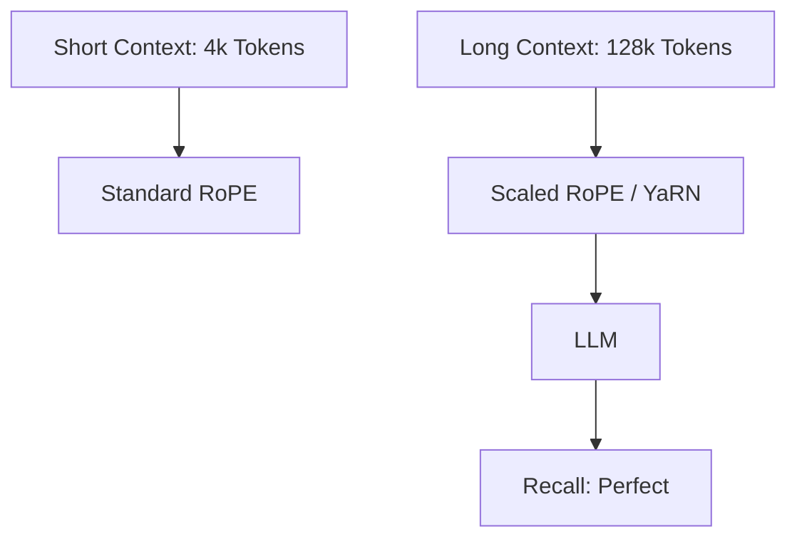

# Extending Context Window: 4k se 1M+ Tokens Tak

## 1. Beginner-friendly Hinglish Explanation 🇮🇳
Bhai, socho tum ek aisi movie dekh rahe ho jahan tum har 5 minute baad pichli kahani bhool jate ho. Bore ho jaoge na? Purane LLMs ka "Context Window" chota tha (jaise 2k ya 4k tokens). Agar tum unhe poori book doge, toh woh shuruat ka part bhool jayenge.

**Extending Context Window** wahi technology hai jisse hum model ki "Yaddasht" (Memory) badhate hain. Aaj kal ke models (jaise Gemini ya Llama-3) 128k se lekar 1 Million+ tokens tak yaad rakh sakte hain. Iske liye humein sirf hardware nahi, balki math (Attention mechanism) mein bhi badlav karne padte hain. Is module mein hum wahi "Memory hacks" seekhenge.

---

## 2. Gehri Technical Explanation
Context window extension mein humein attention ki quadratic complexity aur positional encodings ki limitations ko overcome karna padta hai.
- **Architectural Changes**: Grouped Query Attention (GQA) and Flash Attention.
- **Positional Extrapolation**: Modifying RoPE (Rotary Positional Embeddings) to handle larger indices.
- **Memory Management**: PagedAttention (vLLM) to handle massive KV caches.
- **Inference Efficiency**: Speculative decoding and activation sparse methods.

---

## 3. Ganitik Intuition
Main challenge yeh hai ki model sequence length $L$ par train hua hai toh $L + \Delta$ par fail ho jata hai kyunki positional embeddings out of distribution ho jati hain.
Isko solve karne ke liye hum **Linear Interpolation** use karte hain:
$$\theta_i = \theta \cdot s$$
jahan $s$ scaling factor hai. Yeh 128k sequence ko "Squeeze" karta hai model ke trained 4k space mein, jisse generalize kar sakta hai bina full retraining ke.

---

## 4. Architecture Diagrams


---

## 5. Production-ready Examples
Model ka context limit check karna:

```python
from transformers import AutoConfig

config = AutoConfig.from_pretrained("meta-llama/Llama-3-8B-Instruct")
print(f"Max Position Embeddings: {config.max_position_embeddings}")
# Output: 8192 (or 131072 for long-context versions)

# To extend it manually (Naively):
config.max_position_embeddings = 16384
# Note: This requires fine-tuning (Continued Pre-training) to work well.
```

---

## 6. Real-world Use Cases
- **Legal/Compliance**: 10 alag 100-page contracts upload karke contradictions poochhna.
- **Codebase Analysis**: Poore GitHub repository se baat karna.
- **Movie Summarization**: Poore script ka analysis karke character arcs dhoondhna.

---

## 7. Failure Cases
- **Lost in the Middle**: 1M context ke baad bhi, models prompt ke beech ke facts ko ignore kar dete hain.
- **VRAM Explosion**: 128k context Llama-3-8B ka KV Cache hi 20GB+ VRAM le sakta hai.

---

## 8. Debugging Guide
1. **Needle-in-a-Haystack Test**: 100k token document mein ek random fact chupao aur dekho model use dhoondh paata hai ya nahi.
2. **Perplexity over Distance**: Dekho ki PPL long sequence mein aage jaane par badhta hai ya nahi.

---

## 9. Tradeoffs
| Feature | Small Context (8k) | Large Context (128k) |
|---|---|---|
| Latency | Tez | Dheema |
| Cost | Kam | Bahut Zyada |
| RAG ki zaroorat | Zyada | Madhyam |

---

## 10. Security Concerns
- **Context Denial of Service**: 1M token request bhejna jo saari GPU memory bhar de, aur doosre users ko block kar de.

---

## 11. Scaling Challenges
- **The Attention Bottleneck**: Optimizations ke baad bhi, $O(N^2)$ 1 Million tokens par dard deta hai. Humein "Linear Attention" ya "Ring Attention" chahiye.

---

## 12. Cost Considerations
- **API Billing**: GPT-4o par 1 Million tokens ki ek *single* request par $5-$10 kharch ho sakta hai.

---

## 13. Best Practices
- **GQA** (Grouped Query Attention) use karo 8x KV cache memory bachane ke liye.
- **Flash Attention 2** use karo 2x speedup ke liye.
- Agar beech mein accuracy important hai, toh massive context window ki jagah **RAG** use karo.

---

## 14. Interview Questions
1. 2k tokens par trained model naturally 8k tokens par kyu kaam nahi kar sakta?
2. "Needle-in-a-Haystack" test kya hai?

---

## 15. Latest 2026 Patterns
- **Ring Attention**: Attention calculation ko 100s of GPUs par ek "Ring" mein distribute karna taaki **Infinite Context** support ho.
- **Context Compression**: Ek LLM use karke 1M tokens ko 1k "Summary Tokens" mein "Compress" karna jo full meaning retain karein.