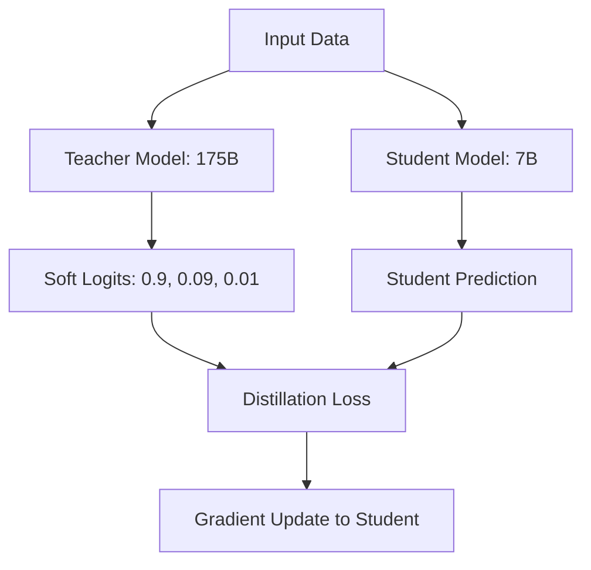

# Knowledge Distillation: Giant se Genius tak

## 1. Shuruaat ke liye Hinglish Explanation 🇮🇳
Bhai, socho ek "Professor" (Teacher Model) hai jise sab kuch aata hai, aur ek "Student" (Student Model) hai jo chota aur tez hai. Student ke paas itni capacity nahi hai ki woh puri library padhe. 

**Knowledge Distillation** wahi process hai jahan Professor apna "Gyan" chote student ko transfer karta hai. Student sirf Professor ke "Answers" nahi seekhta, balki woh yeh bhi seekhta hai ki Professor ne woh answer kyun diya (Probabilities). Isse ek chota model (jaise 7B) bhi bade model (jaise 175B) ki tarah "Smart" behave karne lagta hai. Yeh bilkul "Guru-Shishya" parampara jaisa hai AI ki duniya mein.

---

## 2. Gehri Technical Explanation
Knowledge distillation ek compression technique hai jahan ek chhota "Student" model bade "Teacher" model ke behavior ko mimic karne ke liye train kiya jaata hai.
- **Logit Distillation**: Student apne output probability distribution (logits) aur teacher ke beech ka difference minimize karta hai.
- **Feature Distillation**: Student teacher ke intermediate layer representations ko match karne ki koshish karta hai.
- **Data Augmentation**: Teacher ka use karke student ke liye high-quality "Synthetic Data" (Teacher-forcing) generate karna.
- **Soft Targets**: "The answer is A" seekhne ke bajaye, student ye seekhta hai ki "A 90% likely hai, B 9% likely hai, aur C 1% likely hai". Yeh "Soft" signal words ke beech ke relationship ke baare mein kaafi zyada information contain karta hai.

---

## 3. Mathematical Intuition (Ganit ki Samajh)
Distillation loss $\mathcal{L}$ standard cross-entropy aur **KL Divergence** ka combination hai:
$$\mathcal{L} = (1-\alpha) \mathcal{L}_{CE}(y, \hat{y}) + \alpha T^2 \mathcal{L}_{KL}(P_{teacher}, P_{student})$$
jahan $T$ **Temperature** hai. Zyada $T$ probability distribution ko "smooth" karta hai, aur student ko "Dark Knowledge" (incorrect classes ke beech relative relationships) reveal karta hai.

---

## 4. Architecture ke Diagrams


---

## 5. Production-ready Examples (Production ke liye Udaharan)
DistilBERT style approach ka use karke model ko distill karna (Conceptual):

```python
import torch.nn.functional as F

def distillation_loss(student_logits, teacher_logits, labels, T=2.0, alpha=0.5):
    # 1. Soft targets from teacher
    soft_teacher = F.softmax(teacher_logits / T, dim=-1)
    soft_student = F.log_softmax(student_logits / T, dim=-1)
    
    # 2. KL Divergence for "Gyan" transfer
    distill_loss = F.kl_div(soft_student, soft_teacher, reduction='batchmean') * (T**2)
    
    # 3. Standard Cross Entropy for ground truth
    student_loss = F.cross_entropy(student_logits, labels)
    
    return alpha * distill_loss + (1 - alpha) * student_loss
```

---

## 6. Real-world Use Cases (Duniyawi Istemaal)
- **DistilBERT**: BERT ka 40% chhota version jo 97% performance retain karta hai.
- **TinyLlama**: Llama-2 ke massive knowledge ko 1.1B model mein distill karna mobile devices ke liye.
- **Zephyr-7B**: Ek model jisne distillation-based alignment (teacher outputs par DPO) use kiya chat benchmarks mein Llama-2-70B ko beat karne ke liye.

---

## 7. Failure Cases (Naakaami ke Mamle)
- **Capacity Gap**: Agar teacher bahut smart hai (jaise GPT-4) aur student bahut chhota hai (jaise 100M), to student kuch seekhne mein fail ho sakta hai aur sirf noise produce karega.
- **Bias Inheritance**: Student teacher model ke saare hallucinations aur biases seekh leta hai.

---

## 8. Debugging Guide (Debugging ke Nirdesh)
1. **Logit Correlation**: Student aur teacher logits ke beech correlation check karo. Agar kam hai, to aapka temperature $T$ bahut chhota ho sakta hai.
2. **Layer Mapping**: Agar feature distillation kar rahe ho, to ensure karo ki sahi layers map kar rahe ho (e.g., Teacher layer 24 $\to$ Student layer 6).

---

## 9. Tradeoffs (Fayde-Nuksaan)
| Feature | Scratch se Training | Distillation |
|---|---|---|
| Converge Karne ki Speed | Dheere | Tez |
| Final Accuracy | Baseline | Higher (teacher ko mimic karta hai) |
| Resources ki Zaroorat | Massive Data | High-end Teacher API/Weights |

---

## 10. Security Concerns (Suraksha Chintayein)
- **Model Stealing**: Distillation ka use karke proprietary cloud model (jaise GPT-4) ki local copy banana sirf uski API query karke aur uske responses par training karke.

---

## 11. Scaling Challenges (Scaling ki Chunautiyaan)
- **Compute for Teacher**: Aapko student ke har ek training step ke liye bade teacher model ko run karna padta hai, jo bahut expensive hota hai. Hum aksar time bachane ke liye teacher logits ko "Pre-compute" karte hain.

---

## 12. Cost Considerations (Laagat ke Vichaar)
- **Storage**: Teacher model se trillions "Soft Logits" (floats) store karna petabytes disk space le sakta hai.

---

## 13. Best Practices (Behatar Practices)
- **Temperature $T$ 2 se 5 ke beech** use karo.
- Random student ke bajaye **Pre-trained student** se shuru karo.
- LLMs ke liye **Sequence-level distillation** (teacher ko poora sentence generate karne dena) use karo.

---

## 14. Interview Questions (Interview ke Sawal)
1. Distillation mein "Soft Knowledge" ya "Dark Knowledge" kya hai?
2. Hum KL loss ko $T^2$ se kyun multiply karte hain?

---

## 15. Latest 2026 Patterns (2026 ke Naye Patterns)
- **Iterative Distillation**: Student chhote shishya ke liye teacher ban jaata hai (Recursive distillation).
- **On-the-fly Distillation**: Model ko inference ke dauran user ke specific context ke basis par distill karna.
```