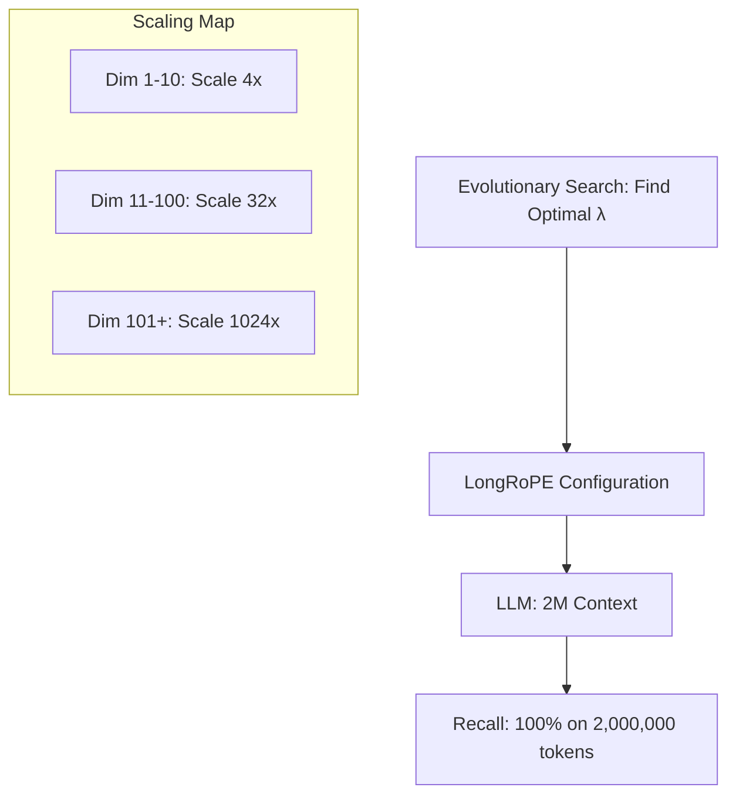

# LongRoPE: 2 Million Tokens Tak Pahunchana

## 1. Shuruaat Ke Liye Hinglish Samjhaya 🇮🇳
Bhai, socho tumne 4k context window ke liye RoPE scaling use ki, phir 128k ke liye YaRN use kiya. Lekin jab tumhe 20 Lakh (2 Million) tokens tak jana ho, toh purani math kaam nahi karti. 

**LongRoPE** Microsoft Research ka ek naya approach hai. Isne dekha ki model ki har "Dimension" alag tarah se context ko yaad rakhti hai. Toh LongRoPE ne kya kiya? Usne ek **Evolutionary Algorithm** (AI se search karwaya) use kiya taaki har dimension ke liye "Perfect" scaling factor dhunda ja sake. Isse humne Llama-2-7B jaise models ko bina intelligence khoye 2 Million tokens tak stretch kar diya. Yeh context extension ki "Limit" ko tod deta hai.

---

## 2. Gehri Technical Vyakhya
LongRoPE (2024/2025 research) extreme context extension ke liye teen key pillars identify karta hai:
- **Non-uniform RoPE Rescaling**: Ek single scaling factor $s$ ki jagah, yeh different dimensions ke liye scaling factors $\vec{s}$ ka vector use karta hai.
- **Evolutionary Search**: Automated search use karke optimal $\vec{s}$ dhunda jata hai jo long sequences par perplexity ko minimize kare.
- **Short-Context Recovery**: Long aur short documents ke mixture se fine-tuning kiya jata hai taaki model 2M extended hone ke baad 512-token prompts par "Buddhu" na ban jaaye.

---

## 3. Ganitiya Samajh
Standard RoPE scaling ek constant $s$ use karta hai. LongRoPE isse $\lambda_i$ se replace karta hai:
$$\theta_i = \theta \cdot \lambda_i$$
jahan $\lambda_i$ ko search kiya jata hai taaki **Interpolation** (squeezing) aur **Extrapolation** (expanding) ke beech tradeoff balance ho. Yeh "Position Collapse" ko rokta hai jahan model sochta hai ki do alag door positions ek jaise hain.

---

## 4. Architecture Diagrams


---

## 5. Production Ke Liye Taiyar Examples
Non-uniform scaling ko implement karna (Simplified):

```python
# Conceptual LongRoPE implementation
def get_longrope_factors(dim, target_context):
    # This vector is usually pre-computed via search
    factors = load_searched_factors("longrope_factors.bin")
    return factors

# The model then applies these specific factors 
# during the Rotary Embedding step.
```

---

## 6. Asli Duniya Ke Upayog Cases
- **Full Source Code Repo**: Poore Linux Kernel source code ko ek prompt mein padh lena.
- **Long-term Financial History**: 10 saal ke bank statements aur emails ka analysis karke kisi specific transaction pattern ko dhundna.
- **Personalized AI**: User ke saath har baat cheet ko yaad rakhna.

---

## 7. Failure Cases
- **Compute Ceiling**: Agar model ke paas 2M window bhi ho, attention calculate karna bahut waqt leta hai (Minutes per response).
- **Search Latency**: Naye model ke liye optimal scaling factors dhundhne mein hazaaron GPU hours lag sakte hain.

---

## 8. Debugging Guide
1. **Dimension Saturation**: Check karo ki kai dimensions ek hi value mein collapse ho gaye hain (Yeh poor search ko indicate karta hai).
2. **Short-context degradation**: Ensure karo ki model abhi bhi "2+2" jaisa simple sawaal solve kar sakta hai.

---

## 9. Tradeoffs
| Feature | YaRN (128k) | LongRoPE (2M) |
|---|---|---|
| Scaling Factor | Uniform | Non-Uniform |
| Intelligence | High | Highest |
| Search Cost | Zero | Very High |

---

## 10. Security Chintayein
- **Context Injection**: Window itna bada hone ki wajah se, attacker 1.9 Million tokens "Malicious Noise" aur 100 tokens "Instruction" chhupa sakta hai jo user kabhi nahi dekhta.

---

## 11. Scaling Chunautiyan
- **VRAM**: 2 Million tokens ke liye around 320GB VRAM chahiye sirf KV cache ke liye (8-bit GQA use karte hue). Ek single user ke liye H100 8-GPU node chahiye!

---

## 12. Cost Vichar
- **Memory Cost**: 2M tokens ko VRAM mein store karna 128k context se 16x zyada mahanga hai.

---

## 13. Best Practices
- **LongRoPE** ko tabhi use karo jab RAG fail ho "Cross-document reasoning" ki wajah se.
- **KV Cache Quantization** (4-bit) ke saath combine karo taaki VRAM requirements kam ho.

---

## 14. Interview Questions
1. RoPE ke liye non-uniform scaling uniform scaling se behtar kyun hai?
2. LongRoPE paper ke teen pillars kya hain?

---

## 15. 2026 Ke Naye Patterns
- **Activation Sharding**: 2M context window ko multiple GPUs par split karna bina Ring Attention use kiye.
- **Dynamic Context Windows**: Model 4k window se start hota hai aur "Expands" apne scaling factors ko tabhi karta hai jab prompt bada hota hai.