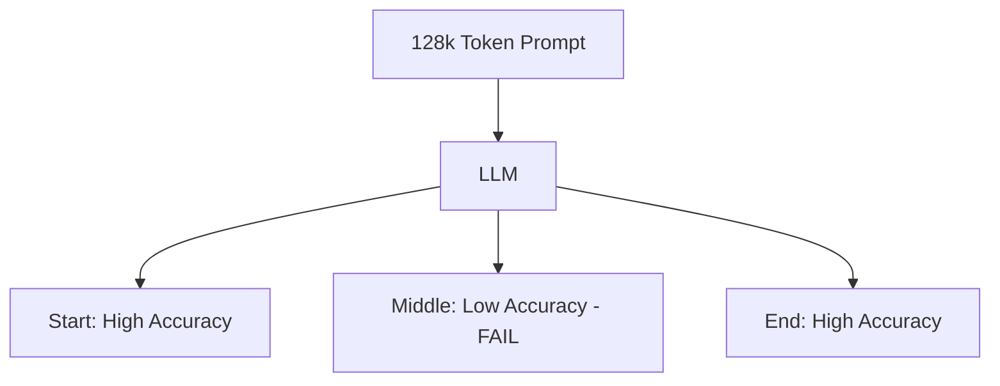

# Lost in the Middle Revisited: Size Sab Kuch Nahi Hai

## 1. Beginner-friendly Hinglish Explanation 🇮🇳
Bhai, socho tumne ek 1000-page ki book padhi aur kisi ne tumse pucha: "Page 452 par hero ne kya pehna tha?". Tumhe shayad yaad na ho, lekin tumhe yeh zaroor yaad hoga ki book shuru kaise hui aur khatam kaise hui. 

LLMs ke saath bhi yahi hota hai. Use **Lost in the Middle** kehte hain. Model ko "Prompt" ke shuruat aur aakhri part bohot achhe se yaad rehte hain, lekin beech wala part woh "Gajini" ki tarah bhool jata hai. Sirf 1M context window hone se problem solve nahi hoti, kyunki model use "Dhyan" (Attention) nahi de pata. Is module mein hum dekhenge ki is weakness ko kaise overcome karein.

---

## 2. Deep Technical Explanation
Research shows karti hai ki LLM performance retrieval tasks pe U-shaped curve follow karti hai.
- **Primacy Bias**: Pehle kuch tokens (usually system prompt bhi included) pe strong attention hota hai.
- **Recency Bias**: Sabse recent tokens (output ke closest) pe strong attention hota hai.
- **Middle Neglect**: Middle ke tokens ka attention weight low hota hai, aur model ki layers inhe usually "filter out" kar deti hain.
- **Cause**: Training data mostly short context se bana hota hai, ya attention mechanism extreme long sequences mein dilute ho jata hai.

---

## 3. Mathematical Intuition
**Attention Entropy** sequence length $N$ ke saath increase hoti hai.
128k sequence ke middle mein, attention probability mass bahut saare tokens pe spread ho jata hai:
$$P(a_{ij}) = \frac{\exp(q_i \cdot k_j)}{\sum_{k=1}^N \exp(q_i \cdot k_k)}$$
As $N \to \infty$, $P(a_{ij}) \to 0$.
Jab tak token $j$ ke paas ek extremely strong "Signal" nahi hai, tab tak woh query $i$ ke liye "Noise" ban jata hai.

---

## 4. Architecture Diagrams


---

## 5. Production-ready Examples
"Lost in the Middle" ke testing ke liye (Needle-in-a-Haystack script):

```python
def needle_in_haystack(model, context_size, needle_position):
    # 1. Generate a long 'haystack' of filler text
    # 2. Insert the 'needle' (a secret fact) at needle_position (e.g., 50%)
    # 3. Ask the model to retrieve the fact
    # 4. Check if it fails
    pass

# Mitigation: Agar 50% pe failure milti hai, toh critical context ko 
# prompt ke shuruaat ya aakhri part mein le jaao.
```

---

## 6. Real-world Use Cases
- **Medical Diagnostics**: Agar kisi patient ki critical allergy 50-page record ke middle mein likhi hai, toh LLM use miss kar sakta hai aur dangerous drug suggest kar sakta hai.
- **Contract Analysis**: Ek dense PDF ke middle mein chupi hui "Termination Clause" miss ho jana.

---

## 7. Failure Cases
- **False Confidence**: Model kehta hai "The information is not present" jabke woh middle mein maujood hai.
- **Hallucinated Retrieval**: Model apna answer bana leta hai kyunki use "Middle fog" mein real answer nahi milta.

---

## 8. Debugging Guide
1. **Heatmap Analysis**: Long query ke attention weights ko visualize karo. Agar heatmap ka middle part "Dim" hai, toh tumhara model lost hai.
2. **Context Shuffling**: Apne context chunks ko shuffle karo aur dekho ki answer badalta hai ya nahi.

---

## 9. Tradeoffs
| Strategy | Fayda | Nuksan |
|---|---|---|
| Large Context | Use karna aasaan | Mehnga / Middle mein Low Accuracy |
| RAG | High Accuracy | Setup Complex hai / Latency issue |
| Long-Context FT | Better Recall | Training mehngi hai |

---

## 10. Security Concerns
- **Attention Hijacking**: Document mein "Attention-Grabbing" tokens (jaise `!!! URGENT !!!`) daal kar model ko middle content ignore karne par majboor karna.

---

## 11. Scaling Challenges
- **Fine-tuning for Recall**: High-quality training data dhundhna mushkil hai jo specifically model ko middle par dhyan dene par majboor kare.

---

## 12. Cost Considerations
- **Waste of Tokens**: Agar model middle 80% ignore karta hai, toh tum 100k tokens ke liye paise de rahe ho lekin sirf 20k tokens jaisa result paa rahe ho.

---

## 13. Best Practices
- **Important info end mein daalo**: LLMs ka recency bias sabse strong hota hai.
- **Pehle Summarize karo**: Long document ko 2k ke "Executive Summary" mein summarize karo aur usse use karo.
- **RAG use karo**: Massive datasets mein pinpoint accuracy ke liye RAG abhi bhi superior hai.

---

## 14. Interview Questions
1. Long prompt ke middle mein performance kyun drop hoti hai?
2. Prompt engineering "Lost in the Middle" problem ko kaise solve kar sakta hai?

---

## 15. Latest 2026 Patterns
- **Activation Shifting**: Decoding ke time "Attention Focus" ko context window ke different parts dynamically shift karna.
- **Long-Context RAG**: Sirf 10 sabse relevant pages retrieve karna lekin unhe ek single long context ki tarah feed karna taaki inter-page relationships preserve rahein.