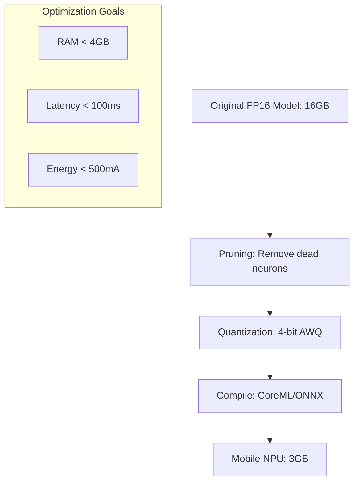

# On-Device Optimization: Chhoti Chips se Juice Nikaalna

## 1. Beginner-friendly Hinglish Samjhaai 🇮🇳
Bhai, socho tumhare paas ek 2GB RAM wala purana phone hai aur tum uspar "Llama" chalana chahte ho. Yeh bilkul waise hi hai jaise ek choti "Nano" car mein "Truck" ka engine fit karna. 

**On-Device Optimization** wahi "Enginerring Jugad" hai jo is namumkin kaam ko mumkin banata hai. Hum model ko "Sikod" (Compress) dete hain taaki woh kam jagah le. Hum **Pruning** use karte hain (bekaar connections ko katna), **Quantization** (precision kam karna), aur **Knowledge Distillation**. Is module mein hum seekhenge ki kaise ek AI model ko "Gym" le ja kar use "Slim" aur "Fast" banaya jaye.

---

## 2. Gehri Technical Explanation
Edge devices ke liye optimization teen constraints par focus karti hai: RAM, Latency, aur Power.
- **Quantization (Post-Training)**: 4-bit (INT4) abhi ka standard hai. AWQ (Activation-aware Weight Quantization) accuracy preserve karta hai "important" weights ko higher precision mein rakh kar.
- **Pruning**: Un neural connections ko hatana jinka weights zero ke aas-paas hain. Structural pruning entire layers ya heads ko hata deta hai.
- **Speculative Decoding on Device**: Ek chhote 100M model ko use karke tokens draft karna same chip par 3B model ke liye.
- **Graph Compilation**: Model ko fixed execution graph mein convert karna (jaise TVM ya XLA) taaki interpreter overhead hat jaaye.

---

## 3. Mathematical Samjhaai
**AWQ (Activation-aware Weight Quantization)**:
Standard quantization sab weights ko equal treat karti hai. AWQ pehchanta hai ki weights ka ek chhota percentage (1%) "Salient" hota hai aur output ko control karta hai.
$$\min_{s} \|W \cdot X - Q(W \cdot s) \cdot X / s\|$$
Optimal scaling factor $s$ dhundh kar, hum in salient weights ko protect karte hain baaki ko aggressively compress karte hain 4-bit tak. Yeh perplexity loss ko significantly reduce karta hai naive quantization ke comparison mein.

---

## 4. Architecture Diagram


---

## 5. Production-ready Udaharan
Android ke liye optimization `TensorFlow Lite` ke saath (Conceptual):

```python
import tensorflow as tf

# 1. Convert model to TFLite format
converter = tf.lite.TFLiteConverter.from_saved_model('my_llm')

# 2. Enable Post-Training Quantization
converter.optimizations = [tf.lite.Optimize.DEFAULT]
converter.target_spec.supported_types = [tf.float16] # Or INT8

tflite_model = converter.convert()

# 3. Save optimized model
with open('model.tflite', 'wb') as f:
  f.write(tflite_model)
```

---

## 6. Asli Duniya ke Use Cases
- **Smart Watches**: Ek chhota 100M model chha raha hai voice-to-text aur intent classification ke liye.
- **Browser AI**: WebGPU ka use karke 2B model seedha Chrome/Safari mein chhana local page summarization ke liye.

---

## 7. Asafalta ke Mamle
- **Catastrophic Accuracy Drop**: Bahut saare layers prune karne se model grammar ya logic ko poore tarah "bhool" sakta hai.
- **Hardware Incompatibility**: INT8 optimized model us hardware par FP16 se bhi dheema ho sakta hai jisme specialized INT8 arithmetic units nahi hain.

---

## 8. Debugging Margdarshan
1. **Perplexity Delta**: Optimization se pehle aur baad PPL measure karo. Delta > 0.5 ka matlab hai tumhari quantization bahut aggressive hai.
2. **Layer Sensitivity**: `Qualcomm AI Stack` jaise tools use karo ye identify karne ke liye ki quantization ke dauran kaunsa specific layer sabse zyada precision kho raha hai.

---

## 9. Tradoffs
| Metric | Original (FP16) | Optimized (INT4) |
|---|---|---|
| RAM | 100% | 25% |
| Accuracy | 100% | 95-98% |
| Latency | Dheema | Bahut Tez |

---

## 10. Suraksha Chintaen
- **Side-Channel Leakage**: Shared edge hardware par optimized models timing attacks (quantized multiplication kitna time leta hai) ke through information leak kar sakte hain.

---

## 11. Badhai ki Chunautiyan
- **Device Diversity**: Jo iPhone 15 Pro (A17 chip) par kaam karta hai, ho sakta hai 2021 ke budget Android phone par crash ho jaye.

---

## 12. Lagat ke Vichar
- **Engineering Time**: Model ko edge deployment ke liye tune karne mein hafton ka expert human work lag sakta hai, jo cloud mein bada GPU rent karne se bhi zyada mehnga hota hai.

---

## 13. Sabse Achchhe Tarike
- **Quantization-Aware Training (QAT)**: Training ke baad quantize karne ke bajaye, training *ke dauran* hi quantization simulate karo taaki model precision loss handle karna seekh jaye.
- **AWQ ya GGUF ka istemal karein**: Yeh abhi sabse bharose mand formats hain 4-bit par LLM intelligence preserve karne ke liye.

---

## 14. Interview Sawal
1. Weight Pruning aur Neuron Pruning mein kya antar hai?
2. AWQ (Activation-aware Quantization) standard RTN (Round-to-Nearest) se kaise alag hai?

---

## 15. 2026 ke Latest Patterns
- **Binary & Ternary LLMs**: Research un models mein ho rahi hai jo weights ke liye sirf -1, 0, aur 1 use karte hain, jisse multiplication ki zaroorat almost zero ho jati hai aur ye ultra-low-power chips par chalte hain.
- **Modular LoRA Adapters**: Base model ko device par rakhte hain aur chhote "Task Adapters" (10-50MB) sirf jaroorat par download karte hain.