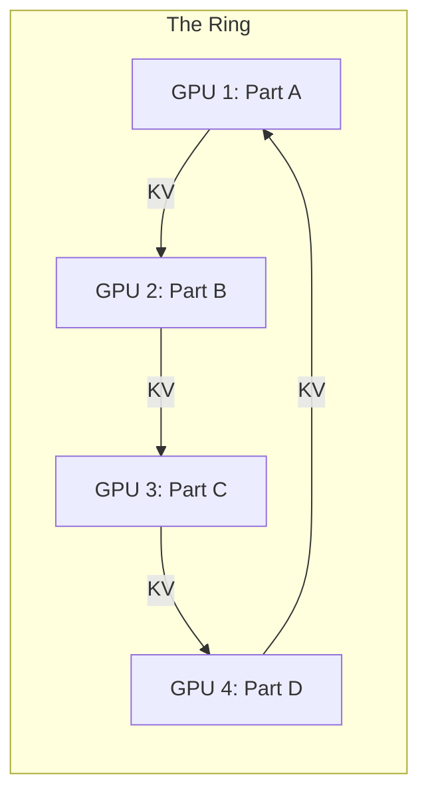

# Ring Attention: Infinite Context ka Rasta

## 1. Beginner-friendly Hinglish Samjhai 🇮🇳
Bhai, socho tumhe ek 1 crore tokens ki book padhni hai. Ek GPU ke paas itni memory nahi hoti ki woh pura "Attention Matrix" store kar sake. Toh tum kya karoge?

**Ring Attention** wahi "Jugad" hai. Ismein hum bohot saare GPUs (jaise 128 ya 1024) ko ek "Ghere" (Ring) mein khada kar dete hain. Har GPU document ka ek chota hissa padhta hai aur phir "Key" aur "Value" vectors ko agle GPU ko pass kar deta hai. Yeh bilkul "Passing the parcel" game jaisa hai. Isse hum 1 Million, 10 Million, ya usse bhi zyada tokens handle kar sakte hain bina "Out of Memory" huye. Yeh long-context LLMs ka "Ultimate weapon" hai.

---

## 2. Gehrai se Technical Samjhai
Ring Attention ek distributed attention mechanism hai jo communication aur computation ko overlap karta hai.
- **Problem**: Standard attention $O(N^2)$ memory maangta hai. Flash Attention ke saath bhi, ek GPU 1M tokens ka KV cache nahi rakh sakta.
- **Solution**: Sequence ko $P$ GPUs mein distribute karo. Har GPU apne local query block ke liye attention compute karta hai aur phir KV blocks ko ring mein "Rotate" karta hai.
- **Asynchronous Communication**: Block $i$ ka attention compute karne ke dauran, GPU already block $i-1$ ko agle neighbor ko bhej raha hai aur block $i+1$ receive kar raha hai.

---

## 3. Ganitiya Sahajbodh (Mathematical Intuition)
Attention $O = \text{softmax}(QK^T)V$ ko chunks mein split kiya jata hai.
Har GPU $Q_{local}, K_{local}, V_{local}$ rakhta hai.
Ring rotation har GPU ko sequence mein har $K$ aur $V$ ko dekhne deta hai.
$$\text{Output}_i = \sum_{j=1}^P \text{Attention}(Q_i, K_j, V_j)$$
Total time complexity per GPU $O(N^2/P)$ rehti hai, lekin memory per GPU $O(N/P)$ rehti hai, jo linear scaling hai!

---

## 4. Sanrachna Chitra (Architecture Diagrams)


---

## 5. Production-ready Udaharan
Conceptual Ring Attention loop (Python-like pseudo-code):

```python
import torch.distributed as dist

def ring_attention(q_local, k_local, v_local):
    out = 0
    l_max = -inf
    curr_k, curr_v = k_local, v_local
    
    for step in range(world_size):
        # 1. Compute local attention (using Flash Attention)
        attn_out, l_new = compute_flash_attn(q_local, curr_k, curr_v)
        
        # 2. Update output (online softmax logic)
        out = update_out(out, attn_out, l_max, l_new)
        l_max = max(l_max, l_new)
        
        # 3. Rotate KV blocks across GPUs
        curr_k = dist.send_recv_rotate(curr_k)
        curr_v = dist.send_recv_rotate(curr_v)
        
    return out
```

---

## 6. Vastavik Duniya mein Upyog
- **Whole-Genome Sequencing**: Arabon base pairs ke saath DNA sequences analyze karna.
- **Long Video Understanding**: 1-hour ke videos ko ek single token sequence ki tarah process karna.
- **Scientific Simulation**: Saalon ke climate logs ke data ko correlate karna.

---

## 7. Failure ke Mamle
- **Network Latency**: Agar aapke GPUs ultra-fast InfiniBand/NVLink se nahi jude hain, toh KV blocks ko "Pass" karne mein compute time se zyada time lagega.
- **Non-determinism**: 1000 nodes par "Online Softmax" karne mein numerical stability issues aate hain.

---

## 8. Debugging Guide (Samasya Nivaran)
1. **Communication vs Compute Ratio**: Agar GPUs 50% time idle hain, toh aapka network bottleneck hai.
2. **Correctness Test**: Ring Attention output ko single-GPU attention se chhote sequence (e.g., 32k) par compare karo.

---

## 9. Tradeoffs (Sambandhon ka Tulana)
| Feature | Single GPU (Flash) | Ring Attention |
|---|---|---|
| Max Sequence | 128k (Simaa) | Infinite (GPUs ke saath badhta hai) |
| Networking | Koi nahi | Extreme (High bandwidth) |
| Latency | Tez | Nodes ke saath linear increase |

---

## 10. Suraksha ki Chintaein
- **Data Sniffing**: Jab KV blocks network mein move kar rahe hote hain, toh unhe intercept kiya ja sakta hai agar inter-GPU network encrypted nahi hai (clusters mein rare hai lekin possible hai).

---

## 11. Scaling ki Chunautiyan
- **The "Ring Wall"**: Jaise ring 10,000 GPUs tak badhti hai, ek GPU ke fail hone aur poori ring ke tootne ki probability dramatically badh jati hai.

---

## 12. Kharch ke Vichar
- **Hardware**: Ring Attention efficient banane ke liye aapko "H100 Cluster" chahiye. T4s par Ethernet se karne par 100x slow hoga.

---

## 13. Sabse Achhe Tareeke (Best Practices)
- Latency chhupane ke liye **Async P2P (Peer-to-Peer)** communication use karo.
- Ring mein pass hone wale parcels ka size kam karne ke liye **GQA** ke saath combine karo.

---

## 14. Interview ke Sawal
1. Ring Attention Attention Matrix ke memory bottleneck ko kaise solve karta hai?
2. InfiniBand Ring Attention ke liye kyun important hai?

---

## 15. 2026 ke Latest Patterns
- **Striped Attention**: Ek variation jo GPUs ke beech workload behtar balance karta hai "Idle" time avoid karne ke liye.
- **Hierarchical Ring**: Node ke andar ek chhota ring (fast NVLink) aur nodes ke beech ek bada ring (InfiniBand) use karna.