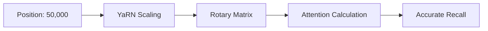

# RoPE Scaling & YaRN: Zyada Context Kheenchna

## 1. Beginner ke Liye Aasan Hinglish Explanation 🇮🇳
Bhai, socho tum ek scale (ruler) use kar rahe ho jo sirf 30cm tak measure kar sakta hai. Ab tumhe 100cm measure karna hai. Tum kya karoge? 
1. Ya toh tum 100cm ka bada scale banao (Retraining - Expensive!).
2. Ya phir tum har 1cm ko 0.3cm maan lo (Interpolation). 

**RoPE Scaling** wahi "Ruler scaling" hai. **YaRN** iska ek advanced version hai jo ensure karta hai ki model high-frequency details (jaise comma, full-stop) na bhool jaye jab hum scale badhate hain. Isse hum 4k tokens par trained model ko 128k tokens par chalne layak bana dete hain bina uski intelligence khoe.

---

## 2. Gehri Technical Explanation
RoPE (Rotary Positional Embeddings) positions ko 2D plane mein rotations ke roop mein represent karta hai. 
- **Linear Scaling**: Position index ko factor $s$ se divide karo. Yeh high-frequency waves ko "smush" kar deta hai, jisse model fine-grained details kho deta hai.
- **NTK-aware Scaling**: Rotation frequency ke base ko modify karta hai taaki high-frequency information lose na ho.
- **YaRN (Yet another RoPE extensioN)**: "Attention Scaling" aur "Frequency Interpolation" use karta hai taaki 10x-32x context extensions par near-perfect performance achieve ho.

---

## 3. Ganitiya Intuition
Dimension $d$ ke liye RoPE frequency yeh hai:
$$f_i = \text{base}^{-2i/d}$$
**Linear Scaling** mein, hum $pos$ ki jagah $pos/s$ use karte hain.
**NTK Scaling** mein, hum base change karte hain:
$$\text{base}_{new} = \text{base} \cdot s^{d/(d-2)}$$
Yeh ensure karta hai ki highest frequency ka "wavelength" constant rahe jab bhi context badhe.

---

## 4. Architecture Diagrams


---

## 5. Production ke Liye Ready Examples
Config mein NTK-aware scaling implement karna:

```python
# In a HuggingFace config.json
"rope_scaling": {
    "type": "ntk",
    "factor": 4.0 # Extends 8k to 32k
}

# In 2026, many models use Dynamic RoPE Scaling
# which adjusts the factor based on the actual sequence length during inference.
```

2026 mein, kai models Dynamic RoPE Scaling use karte hain jo inference ke dauran actual sequence length ke hisaab se factor adjust karta hai.

---

## 6. Asli Duniya Ke Use Cases
- **Upgrading Old Models**: Ek Llama-2-7B (4k context) ko lekar use 32k context par kaam karvana ek specialized RAG app ke liye.
- **Long-form Writing**: Model ko 50,000-word novel mein plot consistency maintain karne mein madad karna.

---

## 7. Failure Cases (Nakami Ke Mamle)
- **Information Washout**: Agar scaling factor bahut high hai (jaise 100x), toh positions ka "signal-to-noise" ratio bahut low ho jata hai, aur model words ka order mix up karne lagta hai.
- **Training Gap**: Agar model ko naye scale ke saath fine-tune nahi kiya gaya, toh woh zyada hallucinate kar sakta hai.

---

## 8. Debugging Guide (Samasya Nivaran Guide)
1. **Perplexity Degradation**: Sequence length badhne ke saath PPL plot karo. Agar 8k par spike aata hai (4k model ke liye), toh scaling fail ho rahi hai.
2. **Frequency Analysis**: Ensure karo ki embedding ke high-frequency components abhi bhi active hain.

---

## 9. Tradeoffs (Sulah)
| Method | Accuracy | Extrapolation Limit |
|---|---|---|
| Linear | Low | 2x - 4x |
| NTK-Aware | Medium | 8x - 16x |
| YaRN | High | 32x - 64x |

---

## 10. Security Concerns (Suraksha Chintaein)
- **Position Confusion Attacks**: Aisa prompt banana jo "Interpolated" space ka fayda uthakar model ko document ke galat hisse par attend karwade.

---

## 11. Scaling Challenges (Scaling Ki Chunautiyan)
- **Context Fine-tuning**: YaRN ke saath bhi, aam taur par model ko stabilize karne ke liye long documents par 500-1000 steps of "Continued Pre-training" ki zaroorat hoti hai.

---

## 12. Cost Considerations (Kharcha Ke Vichar)
- **Training Tokens**: Scale fine-tune karne ke liye dataset of very long documents (books, codebases) ki zaroorat hoti hai. Yeh short chat pairs se curate karna zyada mushkil hota hai.

---

## 13. Best Practices (Sabse Achhi Practices)
- >4x extensions ke liye **YaRN** use karo.
- Frequency calculations mein numerical overflow se bachne ke liye hamesha **BFloat16** use karo.

---

## 14. Interview Questions (Interview Ke Sawal)
1. Linear Scaling very large context windows par kyun fail hota hai?
2. NTK scaling simple interpolation se kaise alag hai?

---

## 15. Latest 2026 Patterns (2026 Ke Naye Patterns)
- **LongRoPE**: Ek search-based method jo har individual dimension ke liye "Optimal" scaling factor dhoondhta hai, jisse 2M+ context windows possible hote hain.
- **Rotary Persistence**: "Decaying" rotations ke saath models ko train karna taaki local context par zyada focus ho aur global context bhi bana rahe.