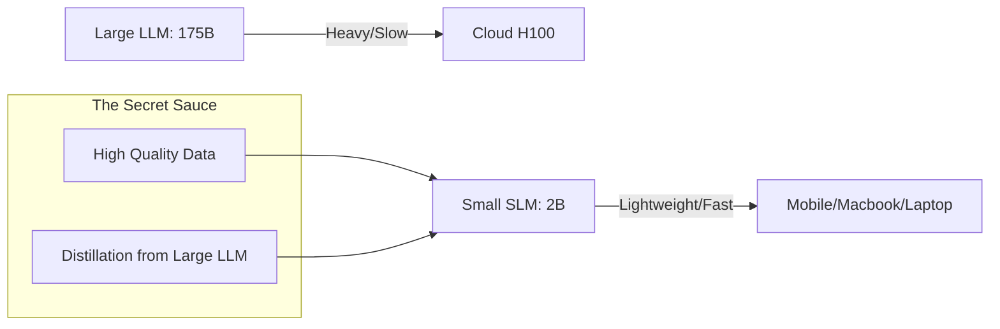

# SLM Fundamentals: Small hi Naya Big Hai

## 1. Shuruwati Hinglish Samjhaaiye 🇮🇳
Bhai, har kaam ke liye humein "GPT-4" jaisa bada hathi (Elephant) nahi chahiye. Agar tumhe sirf email summarize karna hai ya code mein bug dhundna hai, toh ek chota aur fast model (jaise Llama-3-8B ya Phi-3) bhi wahi kaam kar sakta hai, aur woh bhi saste mein!

**Small Language Models (SLMs)** wahi models hain jo 1B se 10B parameters ke beech hote hain. Inka focus "Size" par nahi, balki "Quality of Data" par hota hai. Yeh bilkul waise hi hai jaise ek moti book padhne ke bajaye tum sirf "Summary notes" padho. 2026 mein industry "Bigger is Better" se "Smaller is Smarter" ki taraf move kar rahi hai.

---

## 2. Gehri Technical Samjhaaiye
SLMs aise models hain jo efficiency, low latency, aur on-device deployment ke liye optimized hote hain.
- **Parameter Count**: Usually between 100M and 10B.
- **Architecture**: Yeh aksar "Weight-sharing", "GQA", ya "Depth-wise separable convolutions" ka upyog karte hain size kam karne ke liye.
- **Data Quality (Textbook approach)**: SLMs jaise ki Microsoft ka **Phi** high-quality synthetic "Textbooks" aur curated web data par trained hote hain, jisse woh 10x size ke models ko outperform kar sakte hain.
- **Training Objective**: Aksar ek specific domain (Code, Math, Chat) par focus kiya jata hai, general knowledge ke bajaye.

## 3. Ganitiya Antardrishti
SLMs ka aim hota hai per parameter **Information Density** ko maximize karna.
Agar model ke paas $P$ parameters hain aur $D$ tokens par trained hai, toh "Knowledge per Parameter" $D/P$ hota hai.
SLMs bahut high $D/P$ ratio use karte hain (e.g., training a 1B model on 5 Trillion tokens), jisse model apni theoretical efficiency limit tak pahunch jata hai.

## 4. Sanrachna Ke Daigram


## 5. Production ke Liye Examples
Memory usage ki tulna (Conceptual):

```python
# Llama-3-70B (4-bit): ~40GB VRAM (Needs A100/H100)
# Phi-3-Mini-3.8B (4-bit): ~2.5GB VRAM (Runs on a Phone!)

# Production Tip: Use SLMs for:
# 1. Routing (Is this query for search or math?)
# 2. Summarization
# 3. Simple Chatbots
```

## 6. Asli Duniya Ke Use Cases
- **Mobile Assistants**: Aapke phone par offline voice assistants.
- **Edge Devices**: Security cameras mein AI face/object detection ke liye.
- **Private Coding**: Apne laptop par locally 3B model chalana, jisse aapka code kabhi machine se bahar nahi jaata.

## 7. Viphalta Ke Cases
- **Reasoning Gaps**: SLMs aksar complex 10-step math problems mein fail ho jate hain, jo 175B model aasani se solve kar leta hai.
- **World Knowledge**: 2B model ko har obscure history fact nahi pata hoga kyunki uske paas poora internet memorize karne ke liye kaafi "Storage" (Parameters) nahi hai.

## 8. Debugging Guide
1. **Perplexity Gap**: Agar model facts hallucinate karne lagta hai, toh woh apni "Knowledge Ceiling" tak pahunch gaya hai.
2. **Instruction Following**: Chhote models aksar complex formatting mein struggle karte hain (e.g., "Output JSON with exactly these 15 keys").

## 9. Vyaparik Samjhaute
| Feature | Large LLM (70B+) | Small SLM (< 10B) |
|---|---|---|
| Latency | High | Very Low |
| Cost | High | Very Low |
| Intelligence | Expert | Specialist |

## 10. Suraksha Chintaein
- **Model Theft**: 2B model ko steal aur run karna 175B model se bahut aasan hai.
- **Local Jailbreaks**: Kyunki yeh on-device hai, users ke paas cloud-based APIs ke comparison mein safety filters bypass karne ke zyada tools hain.

## 11. Badhaai Ki Chunautiyan
- **Data Bottleneck**: Ek chhote model ko 10 Trillion tokens ke liye train karne justify karne ke liye enough "High-quality" data dhunda mushkil hai.

## 12. Lagat Ke Vichar
- **Inference Savings**: 3B model chalana utne hi tokens ke liye GPT-4o se 50x cheaper hai.

## 13. Sarvottam Practices
- **Fine-tune for your task**: Ek general 3B model theek hai, lekin aapke data par fine-tuned 3B model ek beast hai.
- **Use Quantization**: SLMs ko hamesha 4-bit ya 8-bit mein run karein, jisse speed maximize ho.

## 14. Interview Ke Prashn
1. SLMs ke liye data quality bade LLMs se zyada important kyun hai?
2. 70B model ki tulna mein 1B parameter model ki kya limitations hain?

## 15. 2026 Ke Naaye Patterns
- **DeepSeek-V3 Style MOE**: Bade models jo inference ke dauran sirf 3B-5B parameters activate karke "Small" models ki tarah act karte hain.
- **Sub-1B Models**: 100M-500M parameter models jo "Speculative Drafters" ya "Grammar Checkers" ke roop mein use hote hain.