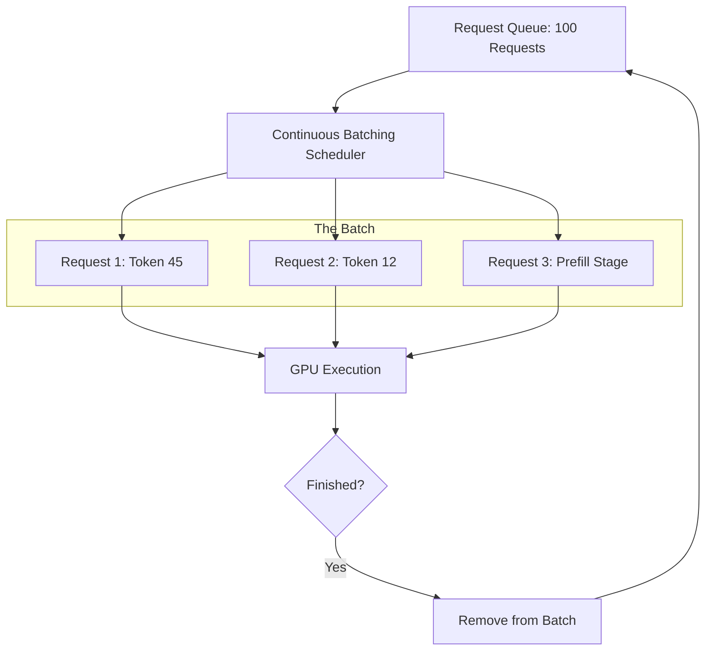

# 📦 Batching Strategies: Maximizing Throughput
> **Objective:** Master the art of grouping multiple user requests into a single GPU forward pass, understanding Continuous Batching and Chunked Prefills to optimize inference servers | **Language:** Hinglish | **Standard:** 2026 Expert Framework

---

## 🧭 1. Beginner-Friendly Hinglish Explanation
Batching ka matlab hai "Ek sath dher saare kaam karna".

- **The Problem:** Agar ek GPU par sirf ek user handle karoge, toh GPU $90\%$ time khaali baitha rahega. Par 100 users ko ek sath handle karna mushkil hai kyunki har koi alag length ka sawal puchta hai.
- **The Solution:** 
  - **Static Batching:** Sabka wait karo jab tak batch bhar na jaye (Bad for latency).
  - **Continuous Batching:** Jaise hi ek user ka answer khatam ho, turant naye user ko batch mein "Ghusao" (2026 Standard).
- **Intuition:** Ye ek "Bus" jaisa hai. Static batching mein bus tabhi chalti hai jab sab seats bhar jayein. Continuous batching mein bus chalti rehti hai aur log raste mein chadh-utar sakte hain.

---

## 🧠 2. Deep Technical Explanation
Batching is the primary way to solve the **Memory-Bandwidth Bottleneck**:

1. **Static Batching:** Multiple requests are padded to the same length. Wasteful because of the padding tokens.
2. **Continuous Batching (Iteration-level Scheduling):** After every single decoding step, the scheduler looks for finished requests to remove and new requests to add. 
3. **Chunked Prefill:** Breaking a long user prompt into smaller chunks so that the "Decoding" of other users doesn't get "Paused" while the long prompt is being processed.
4. **The Goal:** Maximize the number of tokens generated per second per GPU.

---

## 📐 3. Mathematical Intuition
**Why Batching is Efficient:**
Loading model weights ($W$) takes the same time for 1 user as it does for 64 users.
- **1 User:** Load $W$, do 1 Vector-Matrix multiplication.
- **64 Users:** Load $W$, do 1 Matrix-Matrix multiplication.
GPUs are optimized for Matrix-Matrix math. Thus, 64 users are processed in almost the same time as 1 user, leading to **$64x$ higher throughput**.

---

## 🏗️ 4. Architecture Diagrams


---

## 💻 5. Production-Ready Examples
Configuration for a high-throughput server (e.g., vLLM):
```python
# vLLM automatically handles continuous batching
from vllm import LLM, SamplingParams

llm = LLM(
    model="meta-llama/Llama-3-70b",
    max_num_seqs=256, # Max concurrent users in a batch
    max_model_len=4096,
    trust_remote_code=True
)

# vLLM will schedule these efficiently
prompts = ["Hello", "How are you?", "Write a poem"] * 100
outputs = llm.generate(prompts, sampling_params)
```

---

## 🌍 6. Real-World Use Cases
- **Public API Providers (OpenAI/Anthropic):** Using massive batches (e.g., 512+) to serve millions of users at low cost.
- **Data Labeling:** Batching 1000 tasks together to finish the entire dataset in minutes instead of hours.

---

## ❌ 7. Failure Cases
- **Padding Inefficiency:** In static batching, if one request is 1000 tokens and others are 10 tokens, $90\%$ of the computation is wasted on padding.
- **The "Killer Request":** A single request with a 128k context can "Starve" the rest of the batch, taking up all the KV cache memory.

---

## 🛠️ 8. Debugging Guide
| Problem | Reason | Solution |
| :--- | :--- | :--- |
| **Throughput is low** | Batch size is too small | Increase **`max_num_seqs`** until you hit VRAM limits. |
| **Latency spikes for new users** | Prefill is blocking decoding | Use **Chunked Prefill** (vLLM `--enable-chunked-prefill`). |

---

## ⚖️ 9. Tradeoffs
- **High Batch Size (High Throughput / High Latency)** vs **Low Batch Size (Low Throughput / Low Latency).**

---

## 🛡️ 10. Security Concerns
- **Side-Channel Analysis:** In a shared batch, one user might be able to guess the content of another user's prompt by measuring subtle differences in processing time.

---

## 📈 11. Scaling Challenges
- **The Memory Wall:** A batch of 256 users with 8k context requires **$256 \times 8k$** KV cache slots. This can easily exceed 100GB of VRAM.

---

## 💰 12. Cost Considerations
- Batching is the #1 way to reduce "Cost per 1M tokens". Always aim for the highest batch size your VRAM allows.

漫
---

## 📝 14. Interview Questions
1. "What is the difference between Static and Continuous batching?"
2. "How does Continuous Batching improve GPU utilization?"
3. "Explain the concept of 'Chunked Prefill' and why it's used."

---

## 🚀 15. Latest 2026 LLM Engineering Patterns
- **Multi-Host Batching:** Distributing a single batch across multiple nodes using Tensor Parallelism.
- **Predictive Batching:** A scheduler that "Predicts" how long a request will take and groups similar requests together to minimize "Wait time" in the batch.
漫
漫
