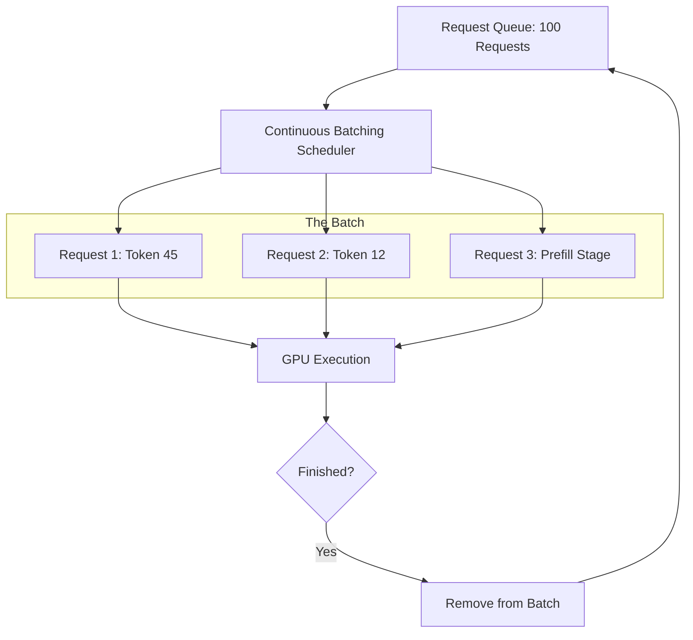

# 📦 Batching Strategies: Throughput Ko Maximize Karna
> **Objective:** Multiple user requests ko ek single GPU forward pass mein group karne ki kala mein mahir hona, Continuous Batching aur Chunked Prefills ko samajhna aur inference servers ko optimize karna | **Language:** Hinglish | **Standard:** 2026 Expert Framework

---

## 🧭 1. Beginner-Friendly Hinglish Explanation
Batching ka matlab hai "Ek sath dher saare kaam karna".

- **Samस्या:** Agar ek GPU par sirf ek user handle karoge, toh GPU $90\%$ time khaali baitha rahega. Par 100 users ko ek sath handle karna mushkil hai kyunki har koi alag length ka sawal puchta hai.
- **Samadhaan:** 
  - **Static Batching:** Sabka wait karo jab tak batch bhar na jaye (Bad for latency).
  - **Continuous Batching:** Jaise hi ek user ka answer khatam ho, turant naye user ko batch mein "Ghusao" (2026 Standard).
- **Intuition:** Ye ek "Bus" jaisa hai. Static batching mein bus tabhi chalti hai jab sab seats bhar jayein. Continuous batching mein bus chalti rehti hai aur log raste mein chadh-utar sakte hain.

---

## 🧠 2. Deep Technical Explanation
Batching **Memory-Bandwidth Bottleneck** ko solve karne ka primary tareeka hai:

1. **Static Batching:** Multiple requests padded kiye jaate hain same length tak. Padding tokens ki vajah se ye wasteful hai.
2. **Continuous Batching (Iteration-level Scheduling):** Har single decoding step ke baad, scheduler dekhta hai ki kaun si request finish hui hai aur nayi requests ko add kare.
3. **Chunked Prefill:** Ek long user prompt ko chhote chunks mein todna taaki other users ka "Decoding" "Paused" na ho jab long prompt process ho raha ho.
4. **Lakshya:** Har second per GPU generate hone wale tokens ki maximum number.

---

## 📐 3. Mathematical Intuition
**Batching Efficient Kyun Hai:**
Model weights ($W$) ko load karna 1 user ke liye utna hi time leta hai jitna 64 users ke liye.
- **1 User:** $W$ load karo, 1 Vector-Matrix multiplication karo.
- **64 Users:** $W$ load karo, 1 Matrix-Matrix multiplication karo.
GPUs Matrix-Matrix math ke liye optimized hain. Isliye, 64 users almost utne hi time mein process hote hain jitna 1 user, jisse **$64x$ higher throughput** milta hai.

---

## 🏗️ 4. Architecture Diagrams

```mermaid
graph TD
    Queue[Request Queue: 100 Requests] --> Scheduler[Continuous Batching Scheduler]
    subgraph "The Batch"
    R1[Request 1: Token 45]
    R2[Request 2: Token 12]
    R3[Request 3: Prefill Stage]
    end
    Scheduler --> R1
    Scheduler --> R2
    Scheduler --> R3
    R1 --> GPU[GPU Execution]
    R2 --> GPU
    R3 --> GPU
    GPU --> Done{Finished?}
    Done -->|Yes| Eject[Remove from Batch]
    Eject --> Queue
```

---

## 💻 5. Production-Ready Examples
High-throughput server ke liye configuration (e.g., vLLM):
```python
# vLLM automatically handles continuous batching
from vllm import LLM, SamplingParams

llm = LLM(
    model="meta-llama/Llama-3-70b",
    max_num_seqs=256, # Max concurrent users in a batch
    max_model_len=4096,
    trust_remote_code=True
)

# vLLM will schedule these efficiently
prompts = ["Hello", "How are you?", "Write a poem"] * 100
outputs = llm.generate(prompts, sampling_params)
```

---

## 🌍 6. Real-World Use Cases
- **Public API Providers (OpenAI/Anthropic):** Massive batches (e.g., 512+) use karke millions of users ko low cost par serve karte hain.
- **Data Labeling:** 1000 tasks ko ek saath batch karke poora dataset minutes mein khatam kar dete hain, hours nahi lagte.

---

## ❌ 7. Failure Cases
- **Padding Inefficiency:** Static batching mein, agar ek request 1000 tokens ki hai aur baaki 10 tokens ki, toh $90\%$ computation padding par waste hota hai.
- **The "Killer Request":** Ek single request jiska context 128k hai, poori batch ko "Starve" kar sakti hai, saari KV cache memory le kar.

---

## 🛠️ 8. Debugging Guide
| Samस्या | Karan | Samadhaan |
| :--- | :--- | :--- |
| **Throughput low hai** | Batch size bahut chhota hai | **`max_num_seqs`** badhao jab tak VRAM limit na hit ho. |
| **Naye users ke liye latency spike hoti hai** | Prefill decoding ko block kar raha hai | **Chunked Prefill** use karo (vLLM `--enable-chunked-prefill`). |

---

## ⚖️ 9. Tradeoffs
- **Zyada Batch Size (Zyada Throughput / Zyada Latency)** vs **Kam Batch Size (Kam Throughput / Kam Latency).**

---

## 🛡️ 10. Security Concerns
- **Side-Channel Analysis:** Ek shared batch mein, ek user doosre user ke prompt ke content ko guess kar sakta hai processing time mein subtle differences measure karke.

---

## 📈 11. Scaling Challenges
- **Memory Wall Samस्या:** 256 users ka batch jiska context 8k hai, usme **$256 \times 8k$** KV cache slots chahiye. Ye aaram se 100GB VRAM se zyada ho sakta hai.

---

## 💰 12. Cost Considerations
- Batching #1 tareeka hai "Cost per 1M tokens" reduce karne ka. Hamesha highest batch size ka target rakho jo tumhara VRAM allow kare.

漫

---

## 📝 14. Interview Questions
1. "Static aur Continuous batching mein kya antar hai?"
2. "Continuous Batching GPU utilization kaise improve karta hai?"
3. "'Chunked Prefill' ka concept aur iska upyog kyun kiya jata hai, samjhao."

---

## 🚀 15. Latest 2026 LLM Engineering Patterns
- **Multi-Host Batching:** Ek single batch ko multiple nodes mein distribute karna Tensor Parallelism ka use karke.
- **Predictive Batching:** Ek scheduler jo "Predict" karta hai ki ek request kitna time lega aur similar requests ko group karta hai batch mein "Wait time" minimize karne ke liye.
漫
漫
```