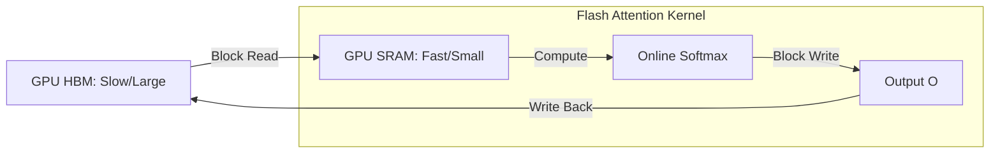

# Flash Attention: Speeding Up the Bottleneck

## 1. Beginner-friendly Hinglish Explanation 🇮🇳
Bhai, socho tumhe ek bohot bada calculation karna hai. Tumhare paas ek "Badi notebook" (GPU Global Memory) hai jo slow hai, aur ek "Choti rough sheet" (SRAM) hai jo super-fast hai. 

Pehle transformer baar-baar badi notebook se data padhte aur likhte the, jiski wajah se training slow ho jati thi. **Flash Attention** ne kya kiya? Usne calculation ko chote-chote "Tiles" mein baant diya jo "Choti rough sheet" par fit ho sakein. Isse GPU ko "Badi notebook" par baar-baar nahi jana padta. Result? Training 2-3x fast ho jati hai aur tum 10x lambe documents handle kar sakte ho. Yeh 2026 ka sabse bada speed hack hai.

---

## 2. Deep Technical Explanation
Flash Attention is an IO-aware exact attention algorithm.
- **Problem**: Self-attention is memory-bound (HBM access), not compute-bound. Calculating the $N \times N$ attention matrix and writing it back to HBM is the bottleneck.
- **Solution**: **Tiling** and **Recomputation**. It breaks the Q, K, V matrices into blocks and processes them in SRAM (fast memory). It never materializes the full $N \times N$ matrix.
- **Version 2/3**: Optimized for newer architectures (H100) using thread-block clusters and overlapping data movement with compute.

---

## 3. Mathematical Intuition
Standard Attention: $O(N^2)$ memory reads/writes.
Flash Attention: $O(N^2/M)$ memory reads/writes, where $M$ is the SRAM size.
Since $M$ is much larger than 1, this significantly reduces the IO overhead. It also uses **Online Softmax** to compute the softmax accurately block-by-block without seeing the whole row at once.

---

## 4. Architecture Diagrams


---

## 5. Production-ready Examples
Enabling Flash Attention 2 in `transformers`:

```python
import torch
from transformers import AutoModelForCausalLM

model = AutoModelForCausalLM.from_pretrained(
    "meta-llama/Llama-3-8B",
    torch_dtype=torch.bfloat16,
    attn_implementation="flash_attention_2", # The magic line
    device_map="auto"
)

# Note: Requires NVIDIA Ampere (A100) or Hopper (H100) GPUs and 'flash-attn' library.
```

---

## 6. Real-world Use Cases
- **Long Context Training**: Training models with 128k or 1M context windows.
- **High-throughput Inference**: Serving models 2x faster than standard PyTorch attention.

---

## 7. Failure Cases
- **Hardware Compatibility**: Flash Attention doesn't run on older GPUs (like T4 or V100) or Apple Silicon (uses MPS instead).
- **Head Dimension**: It only supports specific head dimensions (usually multiples of 8 or 16).

---

## 8. Debugging Guide
1. **Performance Profiling**: Use `torch.profiler` to see if `fmha_kernel` is being called.
2. **Numerical Stability**: Sometimes Flash Attention can have minor precision differences compared to standard attention due to tiling.

---

## 9. Tradeoffs
| Metric | Standard Attention | Flash Attention |
|---|---|---|
| Speed | Slow | 2x-4x Faster |
| VRAM | $O(N^2)$ | $O(N)$ (Linear) |
| Hardware| Any | Ampere+ (A100/H100) |

---

## 10. Security Concerns
- **Kernel Exploits**: Low-level CUDA kernels like Flash Attention are complex and could theoretically have memory overflow vulnerabilities if given maliciously crafted sequence lengths.

---

## 11. Scaling Challenges
- **FP16 vs BF16**: Flash Attention works best with BF16. In FP16, you might hit precision issues with online softmax at very long context.

---

## 12. Cost Considerations
- **Compute Efficiency**: Higher GPU utilization means you finish training in 5 days instead of 10, saving 50% on cluster rental.

---

## 13. Best Practices
- Always use **Flash Attention 2** (or 3 if on H100).
- Ensure your sequence length is a **multiple of 128** for maximum tiling efficiency.

---

## 14. Interview Questions
1. How does Flash Attention reduce memory usage from $O(N^2)$ to $O(N)$?
2. What is "Online Softmax" and why is it needed for tiling?

---

## 15. Latest 2026 Patterns
- **Flash Attention 3**: Uses the TMA (Tensor Memory Accelerator) in H100 GPUs to overlap data loading with matrix multiplication, reaching 75% of peak theoretical performance.
- **FP8 Flash Attention**: Using 8-bit floats for even faster attention with negligible accuracy loss.
