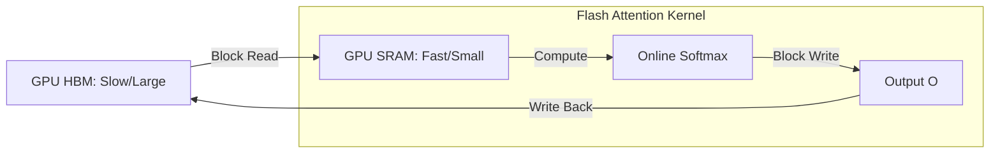

# Flash Attention: Bottleneck ko Speed Up Karna

## 1. Shuruati Hinglish Samjhaai 🇮🇳
Bhai, socho tumhe ek bohot bada calculation karna hai. Tumhare paas ek "Badi notebook" (GPU Global Memory) hai jo slow hai, aur ek "Choti rough sheet" (SRAM) hai jo super-fast hai. 

Pehle transformer baar-baar badi notebook se data padhte aur likhte the, jiski wajah se training slow ho jati thi. **Flash Attention** ne kya kiya? Usne calculation ko chote-chote "Tiles" mein baant diya jo "Choti rough sheet" par fit ho sakein. Isse GPU ko "Badi notebook" par baar-baar nahi jana padta. Result? Training 2-3x fast ho jati hai aur tum 10x lambe documents handle kar sakte ho. Yeh 2026 ka sabse bada speed hack hai.

---

## 2. Gehri Technical Samjhaai
Flash Attention ek IO-aware exact attention algorithm hai.
- **Problem**: Self-attention memory-bound (HBM access) hota hai, compute-bound nahi. $N \times N$ attention matrix calculate karke HBM mein wapas likhna bottleneck hai.
- **Solution**: **Tiling** aur **Recomputation**. Yeh Q, K, V matrices ko blocks mein tod kar SRAM (fast memory) mein process karta hai. Yeh poori $N \times N$ matrix ko materialize nahi karta.
- **Version 2/3**: Naye architectures (H100) ke liye optimize kiya gaya hai, thread-block clusters aur overlapping data movement with compute ke saath.

---

## 3. Ganitik Samajh
Standard Attention: $O(N^2)$ memory reads/writes.
Flash Attention: $O(N^2/M)$ memory reads/writes, jahan $M$ SRAM size hai.
Since $M$ 1 se kaafi bada hota hai, yeh IO overhead ko bahut reduce karta hai. Yeh **Online Softmax** use karta hai taaki softmax accurately block-by-block compute ho, bina ek saath poori row dekhe.

---

## 4. Architecture Chitre

```mermaid
graph LR
    HBM[GPU HBM: Slow/Large] -- Block Read --> SRAM[GPU SRAM: Fast/Small]
    subgraph "Flash Attention Kernel"
        SRAM -- Compute --> Softmax[Online Softmax]
        Softmax -- Block Write --> Result[Output O]
    end
    Result -- Write Back --> HBM
```

---

## 5. Production-ready Udaharan
`transformers` mein Flash Attention 2 enable karna:

```python
import torch
from transformers import AutoModelForCausalLM

model = AutoModelForCausalLM.from_pretrained(
    "meta-llama/Llama-3-8B",
    torch_dtype=torch.bfloat16,
    attn_implementation="flash_attention_2", # The magic line
    device_map="auto"
)

# Note: NVIDIA Ampere (A100) ya Hopper (H100) GPUs aur 'flash-attn' library chahiye.
```

---

## 6. Vastavik Duniya ke Use Cases
- **Long Context Training**: 128k ya 1M context windows ke saath models train karna.
- **High-throughput Inference**: Models ko standard PyTorch attention se 2x fast serve karna.

---

## 7. Asafalta Cases
- **Hardware Compatibility**: Flash Attention purane GPUs (jaise T4 ya V100) ya Apple Silicon par nahi chalta (MPS use hota hai).
- **Head Dimension**: Yeh sirf specific head dimensions ko support karta hai (usually 8 ya 16 ke multiples).

---

## 8. Debugging Margdarshan
1. **Performance Profiling**: Dekhne ke liye `torch.profiler` use karo ki `fmha_kernel` call ho raha hai ya nahi.
2. **Numerical Stability**: Kabhi-kabhi Flash Attention mein standard attention ke compared thode precision differences ho sakte hain tiling ki wajah se.

---

## 9. Vyaparik Samjhauta
| Metric | Standard Attention | Flash Attention |
|---|---|---|
| Speed | Slow | 2x-4x Fast |
| VRAM | $O(N^2)$ | $O(N)$ (Linear) |
| Hardware| Koi bhi | Ampere+ (A100/H100) |

---

## 10. Suraksha Chintayen
- **Kernel Exploits**: Low-level CUDA kernels jaise Flash Attention complex hote hain aur theoretically memory overflow vulnerabilities ho sakti hain agar maliciously crafted sequence lengths di jayein.

---

## 11. Scaling Chunautiyan
- **FP16 vs BF16**: Flash Attention BF16 ke saath best kaam karta hai. FP16 mein, bahut long context mein online softmax ke saath precision issues aa sakte hain.

---

## 12. Laagat Vichaar
- **Compute Efficiency**: Zyada GPU utilization ka matlab hai tum training 5 din mein khatam kar sakte ho 10 ki jagah, cluster rental par 50% bachat.

---

## 13. Sarvottam Abhyas
- Hamesha **Flash Attention 2** (ya 3 agar H100 hai to) use karo.
- Maximum tiling efficiency ke liye apni sequence length ko **128 ka multiple** rakho.

---

## 14. Interview Prashna
1. Flash Attention memory usage $O(N^2)$ se $O(N)$ kaise reduce karta hai?
2. "Online Softmax" kya hai aur tiling ke liye yeh kyun zaroori hai?

---

## 15. Naye 2026 Patterns
- **Flash Attention 3**: H100 GPUs mein TMA (Tensor Memory Accelerator) use karta hai taaki data loading ko matrix multiplication ke saath overlap kiya jaa sake, peak theoretical performance ka 75% reach karta hai.
- **FP8 Flash Attention**: 8-bit floats use karna aur bhi fast attention ke liye negligible accuracy loss ke saath.