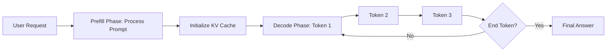

# ⚡ Inference Fundamentals: The Speed of Intelligence
> **Objective:** Master the principles of LLM inference, focusing on the decoding process, latency vs throughput trade-offs, and the lifecycle of a request in a production environment | **Language:** Hinglish | **Standard:** 2026 Expert Framework

---

## 🧭 1. Beginner-Friendly Hinglish Explanation
Inference ka matlab hai "Train ho chuke model se answer mangna".

- **The Problem:** LLM train karna ek baar ka kaam hai, par use millions of users ko serve karna asli challenge hai. Har token generate karne mein time lagta hai.
- **The Lifecycle:** 
  - **Prefill:** Model pura prompt ek sath padhta hai (Fast).
  - **Decoding:** Model ek-ek karke tokens likhta hai (Slow).
- **Intuition:** Ye ek "Author" jaisa hai. Padhne (Reading) mein wo fast hai, par likhne (Writing) mein wo ek-ek shabd karke likhta hai, jisme time lagta hai.

---

## 🧠 2. Deep Technical Explanation
Inference is an **Autoregressive** process governed by two main metrics:

1. **TTFT (Time To First Token):** How fast the model starts responding. Depends on prompt processing speed (Prefill).
2. **TPOT (Time Per Output Token):** How fast the model continues writing. Depends on the decoding speed.
3. **Throughput:** Total tokens generated per second across all users.
4. **The Bottleneck:** LLM inference is **Memory-Bound**, not Compute-bound. The speed is limited by how fast weights can be loaded from VRAM into the GPU cores, not by how fast the math is done.

---

## 📐 3. Mathematical Intuition
**Memory Bandwidth Constraint:**
To generate one token for a $70B$ model (FP16):
- We must read $140GB$ of weights from VRAM.
- If an A100 has $2000GB/s$ bandwidth:
- Max theoretical speed = $2000 / 140 \approx 14$ tokens/sec.
**No matter how many GPUs you have, a single request is limited by this bandwidth.**

---

## 🏗️ 4. Architecture Diagrams


---

## 💻 5. Production-Ready Examples
The basic inference loop in PyTorch:
```python
import torch

# Standard greedy decoding
input_ids = tokenizer("Hello", return_tensors="pt").input_ids
generated = input_ids

for _ in range(50):
    with torch.no_grad():
        outputs = model(generated)
        next_token = torch.argmax(outputs.logits[:, -1, :], dim=-1)
        generated = torch.cat([generated, next_token.unsqueeze(0)], dim=-1)
        if next_token == tokenizer.eos_token_id: break
```

---

## 🌍 6. Real-World Use Cases
- **Chatbots:** Optimizing for low TTFT so the user doesn't feel the "Lag".
- **Batch Processing:** Optimizing for high throughput to summarize 1 million documents overnight at the lowest cost.

---

## ❌ 7. Failure Cases
- **Token Starvation:** Too many users, and the GPU can't keep up, making everyone's "TPOT" drop to 1 token/sec.
- **Context Overflow:** User sends a 100k token prompt that crashes the server's VRAM.

---

## 🛠️ 8. Debugging Guide
| Problem | Reason | Solution |
| :--- | :--- | :--- |
| **High Latency** | Sequential decoding | Use **Batching** or **Speculative Decoding**. |
| **CUDA Out of Memory** | KV Cache is too large | Use **PagedAttention** (vLLM) or Quantized KV caches. |

---

## ⚖️ 9. Tradeoffs
- **Streaming (Low TTFT / High perceived speed)** vs **Non-streaming (Simpler / High perceived lag).**

---

## 🛡️ 10. Security Concerns
- **DDoS via Long Prompts:** An attacker sending many maximum-length prompts to saturate your KV cache and crash your inference server.

---

## 📈 11. Scaling Challenges
- **The KV Cache Problem:** As context length grows, the memory needed to store the KV cache exceeds the memory needed for the model weights.

---

## 💰 12. Cost Considerations
- Inference is where $90\%$ of a company's AI budget goes. A $2x$ speedup in inference equals a $50\%$ reduction in annual burn.

---

## ✅ 13. Best Practices
- **Always use a KV Cache.** Never re-process the whole prompt for every token.
- **Use FP8 or INT8 quantization** for production serving to double your throughput.
- **Implement request queuing** to prevent server crashes during traffic spikes.

漫
---

## 📝 14. Interview Questions
1. "Why is LLM inference memory-bound rather than compute-bound?"
2. "What is the difference between TTFT and TPOT?"
3. "Explain why generating the first token is usually slower than subsequent tokens for large prompts."

---

## 🚀 15. Latest 2026 LLM Engineering Patterns
- **Prefill-Decode Disaggregation:** Running the "Prefill" on one set of GPUs and the "Decoding" on another to maximize efficiency.
- **Micro-Batching:** Processing requests in tiny batches of 4-8 to balance latency and throughput perfectly.
漫
