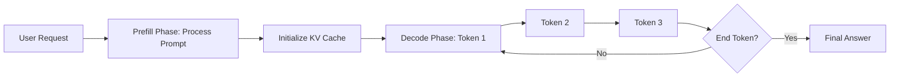

# ⚡ Inference Fundamentals: Intelligence ki Speed
> **Uddeshya:** LLM inference ke principles master karna, decoding process, latency vs throughput trade-offs, aur production environment mein ek request ke lifecycle par focus karna | **Bhaasha:** Hinglish | **Maanak:** 2026 Expert Framework

---

## 🧭 1. Shuruwat Ke Liye Hinglish Samjhai
Inference ka matlab hai "Train ho chuke model se answer mangna".

- **Samashya:** LLM train karna ek baar ka kaam hai, par use millions of users ko serve karna asli challenge hai. Har token generate karne mein time lagta hai.
- **Jeevan Chakra:** 
  - **Prefill:** Model pura prompt ek sath padhta hai (Fast).
  - **Decoding:** Model ek-ek karke tokens likhta hai (Slow).
- **Sahajbodh:** Ye ek "Author" jaisa hai. Padhne (Reading) mein wo fast hai, par likhne (Writing) mein wo ek-ek shabd karke likhta hai, jisme time lagta hai.

---

## 🧠 2. Gehri Technical Samjhai
Inference ek **Autoregressive** process hai jo do main metrics se control hota hai:

1. **TTFT (Time To First Token):** Model kitni tezi se respond karna start karta hai. Ye prompt processing speed (Prefill) par depend karta hai.
2. **TPOT (Time Per Output Token):** Model kitni tezi se likhna (respond karna) continue karta hai. Ye decoding speed par depend karta hai.
3. **Throughput:** Total tokens jo har second generate hote hain across all users.
4. **Bottleneck:** LLM inference **Memory-Bound** hai, Compute-bound nahi. Speed limit hai ki weights ko VRAM se GPU cores mein kitni fast load kiya ja sakta hai, na ki math kitni fast hoti hai.

---

## 📐 3. Ganitiya Samjhai
**Memory Bandwidth Constraint:**
Ek $70B$ model (FP16) ke liye ek token generate karne ke liye:
- Hume VRAM se $140GB$ weights read karne padte hain.
- Agar A100 ka bandwidth $2000GB/s$ hai:
- Max theoretical speed = $2000 / 140 \approx 14$ tokens/sec.
**Aapke paas kitne bhi GPUs hain, ek single request is bandwidth ke through limit hoti hai.**

---

## 🏗️ 4. Architecture Diagrams

```mermaid
graph LR
    User[User Request] --> Prefill[Prefill Phase: Process Prompt]
    Prefill --> KV[Initialize KV Cache]
    KV --> Decode[Decode Phase: Token 1]
    Decode --> Token2[Token 2]
    Token2 --> Token3[Token 3]
    Token3 --> End{End Token?}
    End -->|No| Decode
    End -->|Yes| Final[Final Answer]
```

---

## 💻 5. Production-Ke-Liye-Tayar Examples
PyTorch mein basic inference loop:
```python
import torch

# Standard greedy decoding
input_ids = tokenizer("Hello", return_tensors="pt").input_ids
generated = input_ids

for _ in range(50):
    with torch.no_grad():
        outputs = model(generated)
        next_token = torch.argmax(outputs.logits[:, -1, :], dim=-1)
        generated = torch.cat([generated, next_token.unsqueeze(0)], dim=-1)
        if next_token == tokenizer.eos_token_id: break
```

---

## 🌍 6. Asli Duniya Ke Use Cases
- **Chatbots:** Low TTFT ke liye optimize karte hain taaki user ko "Lag" feel na ho.
- **Batch Processing:** High throughput ke liye optimize karte hain taaki 1 million documents ko overnight lowest cost mein summarize kar sakein.

---

## ❌ 7. Viphalta Ke Mamle
- **Token Starvation:** Zyada users aa gaye, aur GPU kuch nahi kar paya, jiski wajah se sabki "TPOT" gir ke 1 token/sec ho gayi.
- **Context Overflow:** User ne 100k token ka prompt bhej diya jisne server ka VRAM crash kar diya.

---

## 🛠️ 8. Debugging Ke Liye Guide
| Samashya | Karan | Samadhan |
| :--- | :--- | :--- |
| **High Latency** | Sequential decoding | **Batching** ya **Speculative Decoding** use karein. |
| **CUDA Out of Memory** | KV Cache ka size bahut bada hai | **PagedAttention** (vLLM) ya Quantized KV caches use karein. |

---

## ⚖️ 9. Samjhauta (Tradeoffs)
- **Streaming (Low TTFT / High perceived speed)** vs **Non-streaming (Simpler / High perceived lag).**

---

## 🛡️ 10. Suraksha Samasya
- **DDoS via Long Prompts:** Attacker maximum-length wale bahut saare prompts bhej raha hai taaki KV cache ko saturate kare aur inference server ko crash kare.

---

## 📈 11. Scaling Ki Chunauti
- **KV Cache Samasya:** Jaise jaise context length badhti hai, KV cache ko store karne ke liye jo memory chahiye wo model weights ke memory se zyada ho jati hai.

---

## 💰 12. Lagat Samjho
- Inference hi wo jagah hai jahaan company ka $90\%$ AI budget kharch hota hai. Inference mein $2x$ speedup annual burn mein $50\%$ reduction ke barabar hai.

---

## ✅ 13. Behatar Tareeke
- **Hamesha KV Cache use karein.** Har token ke liye pura prompt kabhi re-process na karein.
- **FP8 ya INT8 quantization use karein** production serving ke liye, isse throughput double ho jayega.
- **Request queuing implement karein** traffic spikes ke dauran server crashes se bachne ke liye.

漫
---

## 📝 14. Interview Prashna
1. "LLM inference memory-bound kyun hai na ki compute-bound?"
2. "TTFT aur TPOT mein kya difference hai?"
3. "Samjhaye ki kyun large prompts ke liye first token generate karna aam taur par subsequent tokens se slower hota hai."

---

## 🚀 15. 2026 Ke Naye LLM Engineering Patterns
- **Prefill-Decode Disaggregation:** "Prefill" ko ek set of GPUs par aur "Decoding" ko doosre set par run karna, jisse efficiency maximize hoti hai.
- **Micro-Batching:** Requests ko chhote batches (4-8) mein process karna, latency aur throughput ko perfectly balance karne ke liye.
漫