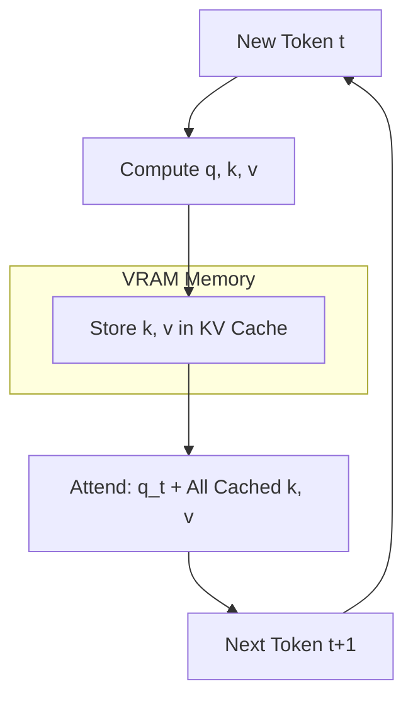

# KV Cache: The Secret to Fast Generation

## 1. Beginner-friendly Hinglish Explanation 🇮🇳
Bhai, socho tum ek lamba sentence likh rahe ho. Har baar naya word likhne ke liye, kya tum pura sentence shuru se dubara padhoge? Nahi na. Tumhe pichle words yaad hain.

Transformers mein bhi yahi hota hai. Next word predict karne ke liye use pichle saare words ki calculation chahiye hoti hai. Agar hum har naye token ke liye "Purani calculation" (Keys aur Values) ko save kar lein, toh humein sab kuch dubara compute nahi karna padega. Isi "Memory" ko hum **KV Cache** kehte hain. Iske bina, LLM har word ke baad slow hota jayega. Iske saath, woh rocket ki speed se generate karta hai.

---

## 2. Deep Technical Explanation
The KV Cache is a technique used during auto-regressive decoding to avoid redundant computation of self-attention.
- **Problem**: In each step, the model computes $Q, K, V$ for all tokens in the sequence. For token $n+1$, the $K$ and $V$ vectors for tokens $1...n$ are identical to the previous step.
- **Solution**: Store $K$ and $V$ for all tokens in GPU memory. Only compute $Q, K, V$ for the *newest* token and reuse the cached $K, V$ for previous tokens.
- **Bottleneck**: KV cache consumes massive amounts of VRAM, especially with long sequences and large batches.

---

## 3. Mathematical Intuition
Standard Attention: $O(N^2)$ per sequence.
With KV Cache:
1. Compute $q_t, k_t, v_t$ for current token $t$.
2. Fetch $K_{1:t-1}$ and $V_{1:t-1}$ from cache.
3. Compute attention score: $\text{softmax}(q_t \cdot K_{1:t}^T / \sqrt{d_k}) V_{1:t}$.
This reduces the per-token complexity from $O(N)$ (re-computing everything) to $O(1)$ in terms of flops, but increases memory bandwidth usage.

---

## 4. Architecture Diagrams


---

## 5. Production-ready Examples
Visualizing KV Cache growth in `transformers`:

```python
from transformers import AutoModelForCausalLM, AutoTokenizer
import torch

model = AutoModelForCausalLM.from_pretrained("meta-llama/Llama-3-8B")
inputs = tokenizer("Once upon a time", return_tensors="pt")

# Use 'use_cache=True' to enable KV caching
outputs = model.generate(**inputs, use_cache=True, max_new_tokens=20, return_dict_in_generate=True)

# The 'past_key_values' in output is the KV cache
kv_cache = outputs.past_key_values
print(f"Number of layers in cache: {len(kv_cache)}")
print(f"Shape of K in layer 0: {kv_cache[0][0].shape}") 
# [batch, heads, seq_len, head_dim]
```

---

## 6. Real-world Use Cases
- **Real-time Chat**: Ensuring responses appear instantly.
- **Streaming LLMs**: Keeping a "Rolling" KV cache to handle infinite conversations.

---

## 7. Failure Cases
- **OOM (Out of Memory)**: The KV cache grows until the GPU runs out of VRAM, crashing the inference.
- **Context Length Limit**: Once the cache hits the max sequence length, the model must "forget" old tokens or stop.

---

## 8. Debugging Guide
1. **Memory Profiling**: Use `nvidia-smi` to watch VRAM usage during long generations.
2. **Cache Fragmentation**: Use vLLM to manage the "Paged" cache and avoid wasted memory blocks.

---

## 9. Tradeoffs
| Metric | Without KV Cache | With KV Cache |
|---|---|---|
| Latency | Very High (Slows down) | Low (Constant speed) |
| VRAM Usage | Low | High |
| FLOPs | $O(N^2)$ total | $O(N)$ total |

---

## 10. Security Concerns
- **Cache Side-Channel**: Measuring the time taken to fetch from KV cache to guess the content of previous tokens (Privacy risk).

---

## 11. Scaling Challenges
- **Multiple Users**: Serving 100 users means storing 100 separate KV caches in VRAM. This is why multi-user serving is VRAM-bound.

---

## 12. Cost Considerations
- **VRAM per User**: Storing the KV cache for a 128k context Llama-3 model can take 10-20GB per user!

---

## 13. Best Practices
- Use **Multi-Query Attention (MQA)** or **Grouped-Query Attention (GQA)** to reduce the size of the KV cache by 8x.
- Use **PagedAttention** (vLLM) to prevent memory fragmentation.

---

## 14. Interview Questions
1. Why does KV cache use more memory but less compute?
2. How does Grouped Query Attention (GQA) optimize the KV cache?

---

## 15. Latest 2026 Patterns
- **KV Cache Quantization**: Compressing the cache from FP16 to 4-bit (INT4) to store 4x more context on the same GPU.
- **Dynamic Eviction**: Automatically dropping "unimportant" tokens from the KV cache based on attention weights.
