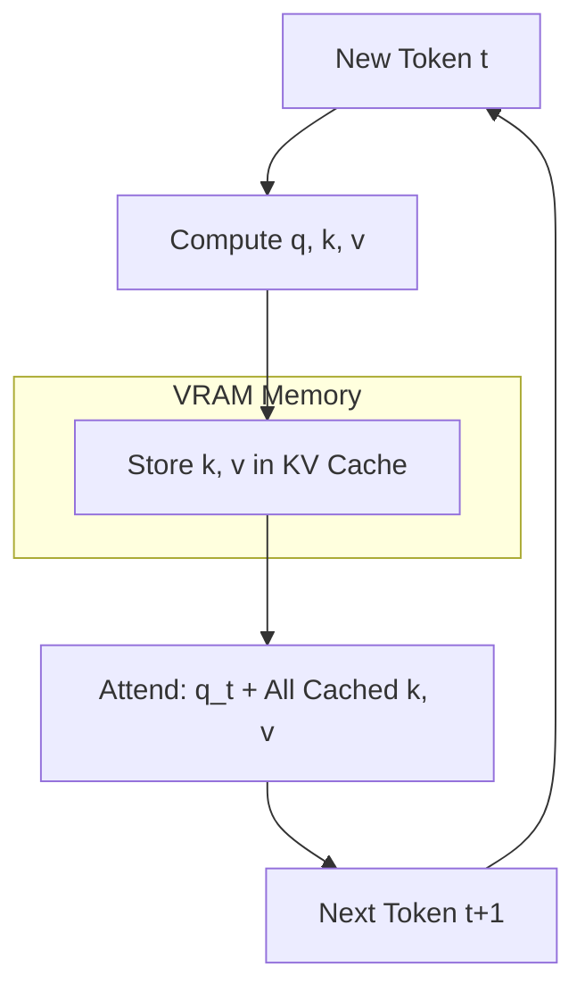

# KV Cache: Fast Generation ka Secret

## 1. Beginner-friendly Hinglish Explanation 🇮🇳
Bhai, socho tum ek lamba sentence likh rahe ho. Har baar naya word likhne ke liye, kya tum pura sentence shuru se dubara padhoge? Nahi na. Tumhe pichle words yaad hain.

Transformers mein bhi yahi hota hai. Next word predict karne ke liye use pichle saare words ki calculation chahiye hoti hai. Agar hum har naye token ke liye "Purani calculation" (Keys aur Values) ko save kar lein, toh humein sab kuch dubara compute nahi karna padega. Isi "Memory" ko hum **KV Cache** kehte hain. Iske bina, LLM har word ke baad slow hota jayega. Iske saath, woh rocket ki speed se generate karta hai.

---

## 2. Deep Technical Explanation
KV Cache ek technique hai jo auto-regressive decoding mein use hoti hai redundant self-attention computation se bachne ke liye.
- **Problem**: Har step mein, model sequence ke saare tokens ke liye $Q, K, V$ compute karta hai. Token $n+1$ ke liye, tokens $1...n$ ke $K$ aur $V$ vectors previous step jaisa hi same hote hain.
- **Solution**: Saare tokens ke $K$ aur $V$ ko GPU memory mein store karo. Sirf *naye* token ke liye $Q, K, V$ compute karo aur purane tokens ke cached $K, V$ ko reuse karo.
- **Bottleneck**: KV cache bahut zyada VRAM consume karta hai, especially jab sequences lambi hon aur batches bade hon.

---

## 3. Mathematical Intuition
Standard Attention: $O(N^2)$ per sequence.
With KV Cache:
1. Current token $t$ ke liye $q_t, k_t, v_t$ compute karo.
2. Cache se $K_{1:t-1}$ aur $V_{1:t-1}$ fetch karo.
3. Attention score compute karo: $\text{softmax}(q_t \cdot K_{1:t}^T / \sqrt{d_k}) V_{1:t}$.
Isse per-token complexity $O(N)$ (sab kuch dubara compute karna) se reduce hokar $O(1)$ ho jati hai flops ke terms mein, lekin memory bandwidth usage badh jati hai.

---

## 4. Architecture Diagrams

```mermaid
graph TD
    In[New Token t] --> QKV[Compute q, k, v]
    QKV --> Cache[Store k, v in KV Cache]
    Cache --> Attend[Attend: q_t + All Cached k, v]
    Attend --> Out[Next Token t+1]
    Out --> In
    
    subgraph "VRAM Memory"
        Cache
    end
```

---

## 5. Production-ready Examples
`transformers` mein KV Cache growth ko visualize karna:

```python
from transformers import AutoModelForCausalLM, AutoTokenizer
import torch

model = AutoModelForCausalLM.from_pretrained("meta-llama/Llama-3-8B")
inputs = tokenizer("Once upon a time", return_tensors="pt")

# 'use_cache=True' ka use karke KV caching enable karo
outputs = model.generate(**inputs, use_cache=True, max_new_tokens=20, return_dict_in_generate=True)

# Output mein 'past_key_values' hi KV cache hai
kv_cache = outputs.past_key_values
print(f"Cache mein layers ki sankhya: {len(kv_cache)}")
print(f"Layer 0 mein K ka shape: {kv_cache[0][0].shape}") 
# [batch, heads, seq_len, head_dim]
```

---

## 6. Real-world Use Cases
- **Real-time Chat**: Responses turant dikhne ke liye ensure karna.
- **Streaming LLMs**: "Rolling" KV cache rakhte hain infinite conversations handle karne ke liye.

---

## 7. Failure Cases
- **OOM (Out of Memory)**: KV cache tab tak badhta hai jab tak GPU ka VRAM khatam na ho jaye, jisse inference crash ho jata hai.
- **Context Length Limit**: Jab cache max sequence length tak pahunch jati hai, toh model ko purane tokens "bhoolna" padega ya rukna padega.

---

## 8. Debugging Guide
1. **Memory Profiling**: `nvidia-smi` ka use karke long generations ke dauran VRAM usage watch karo.
2. **Cache Fragmentation**: vLLM ka use karke "Paged" cache manage karo aur wasted memory blocks se bacho.

---

## 9. Tradeoffs
| Metric | Without KV Cache | With KV Cache |
|---|---|---|
| Latency | Bahut High (Slow hota hai) | Low (Constant speed) |
| VRAM Usage | Low | High |
| FLOPs | $O(N^2)$ total | $O(N)$ total |

---

## 10. Security Concerns
- **Cache Side-Channel**: KV cache se fetch karne mein lage time ko measure karke previous tokens ke content ka guess lagana (Privacy risk).

---

## 11. Scaling Challenges
- **Multiple Users**: 100 users ko serve karne ka matlab hai 100 alag KV caches ko VRAM mein store karna. Isliye multi-user serving VRAM-bound hoti hai.

---

## 12. Cost Considerations
- **VRAM per User**: 128k context Llama-3 model ke liye KV cache store karne mein 10-20GB per user lag sakta hai!

---

## 13. Best Practices
- **Multi-Query Attention (MQA)** ya **Grouped-Query Attention (GQA)** use karo, jisse KV cache ka size 8x tak reduce ho jata hai.
- **PagedAttention** (vLLM) use karo memory fragmentation se bachne ke liye.

---

## 14. Interview Questions
1. KV cache zyada memory kyun use karta hai lekin compute kam?
2. Grouped Query Attention (GQA) KV cache ko kaise optimize karta hai?

---

## 15. Latest 2026 Patterns
- **KV Cache Quantization**: Cache ko FP16 se 4-bit (INT4) mein compress karna, jisse same GPU par 4x zyada context store ho sake.
- **Dynamic Eviction**: Attention weights ke basis par automatically "unimportant" tokens ko KV cache se drop karna.