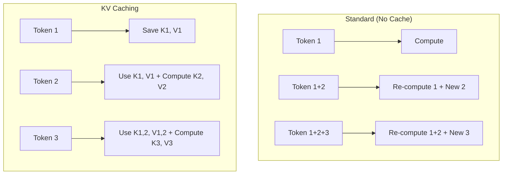

# 🧠 KV Caching: The Memory of Inference
> **Objective:** Master the most critical optimization in LLM inference—Key-Value Caching—understanding how it eliminates redundant computation and the modern techniques like PagedAttention that make it scalable | **Language:** Hinglish | **Standard:** 2026 Expert Framework

---

## 🧭 1. Beginner-Friendly Hinglish Explanation
KV Caching ka matlab hai "Pichli baaton ko yaad rakhna takki unhe baar-baar na padhna pade".

- **The Problem:** LLM jab agla word generate karta hai, toh use pura pichla sentence phir se calculate karna padta hai. Agar sentence 100 words ka hai, toh har naye word ke liye 100 calculations!
- **The Solution:** KV Cache. Hum pichle words ke "Attention Keys" aur "Values" ko save kar lete hain. Ab naye word ke liye sirf us naye word ka math karna padta hai.
- **Intuition:** Ye ek "Calculator" ke "Memory (M+)" button jaisa hai. Aapne ek badi calculation ki, use memory mein save kiya, aur ab aap sirf naya number add kar rahe ho.

---

## 🧠 2. Deep Technical Explanation
KV Caching works by storing the **Key ($K$)** and **Value ($V$)** matrices for every token in every layer:

1. **The Lifecycle:** During the **Prefill** stage, $K$ and $V$ are computed for all prompt tokens. During **Decoding**, we only compute $K$ and $V$ for the *latest* token and append it to the cache.
2. **Memory Usage:** The cache grows linearly with sequence length. 
3. **PagedAttention (vLLM):** Modern inference (2026) doesn't store the cache in one big block (which leads to fragmentation). It breaks it into "Pages" (like RAM), allowing for $90\%$ better memory efficiency.
4. **Quantized KV Cache:** Storing $K$ and $V$ in **FP8** or **INT4** to save space.

---

## 📐 3. Mathematical Intuition
**Memory Cost of KV Cache:**
For a model with $L$ layers, $H$ heads, and head dimension $d$:
$$\text{Memory per token} = 2 (\text{K and V}) \times L \times H \times d \times \text{Bytes per param}$$
For Llama-3 70B (80 layers, 8 heads per GQA group, 128 dim, FP16):
- $2 \times 80 \times 8 \times 128 \times 2 = 327,680$ bytes ($\approx 320 KB$) per token.
- For a **32k context window**, one user uses **10GB of VRAM** just for the cache!

---

## 🏗️ 4. Architecture Diagrams


---

## 💻 5. Production-Ready Examples
How KV Cache is handled in HuggingFace:
```python
# The 'past_key_values' is the KV Cache
outputs = model(input_ids, past_key_values=None, use_cache=True)
next_token_logits = outputs.logits
kv_cache = outputs.past_key_values # Save this for next step

# Step 2: Use the cache
outputs = model(next_token_id, past_key_values=kv_cache, use_cache=True)
```

---

## 🌍 6. Real-World Use Cases
- **Long-context RAG:** Caching the embeddings of a 100-page PDF so the user can ask 50 questions without the model re-reading the PDF every time.
- **Streaming Chat:** Providing a smooth, real-time response by only calculating the delta for the newest token.

---

## ❌ 7. Failure Cases
- **VRAM OOM:** If you have 10 users with 128k context, your 80GB A100 will crash because the KV cache is too huge.
- **Cache Incoherence:** If you modify the prompt mid-way, the old KV cache becomes invalid and must be cleared.

---

## 🛠️ 8. Debugging Guide
| Problem | Reason | Solution |
| :--- | :--- | :--- |
| **Inference gets slower over time** | Memory fragmentation | Use **vLLM (PagedAttention)** to manage cache blocks. |
| **Model gives gibberish after context grows** | Cache precision loss | Avoid aggressive quantization (like INT4) for the KV cache. |

---

## ⚖️ 9. Tradeoffs
- **Full KV Cache (Fast / High VRAM)** vs **Re-computation (Slow / Zero extra VRAM).**

---

## 🛡️ 10. Security Concerns
- **Cache Side-Channel:** An attacker could measure the time it takes to "Load" a KV cache to guess the length or content of a previous user's prompt in a shared environment.

---

## 📈 11. Scaling Challenges
- **The Multi-Query Attention (MQA) Shift:** Newer models use MQA or GQA (Grouped Query Attention) specifically to reduce the size of the KV cache by $8-16x$.

---

## 💰 12. Cost Considerations
- KV Cache is the primary reason why serving long-context models is $10x$ more expensive than short-context models.

---

## ✅ 13. Best Practices
- **Use PagedAttention** for any production deployment.
- **Use GQA-based models** (like Llama-3) to keep the cache size manageable.
- **Evict old cache blocks** (LRU) if memory is full.

漫
---

## 📝 14. Interview Questions
1. "How does KV Caching reduce the computational complexity of decoding?"
2. "Explain the 'Memory Wall' problem in the context of KV Caches."
3. "What is PagedAttention and how does it solve memory fragmentation?"

---

## 🚀 15. Latest 2026 LLM Engineering Patterns
- **KV Cache Offloading:** Moving old parts of the KV cache to the CPU RAM or SSD and only keeping the "Active window" in the GPU VRAM.
- **Semantic Cache Compression:** Identifying and removing "Useless" tokens (like 'the', 'a') from the KV cache to save space without losing logic.
漫
