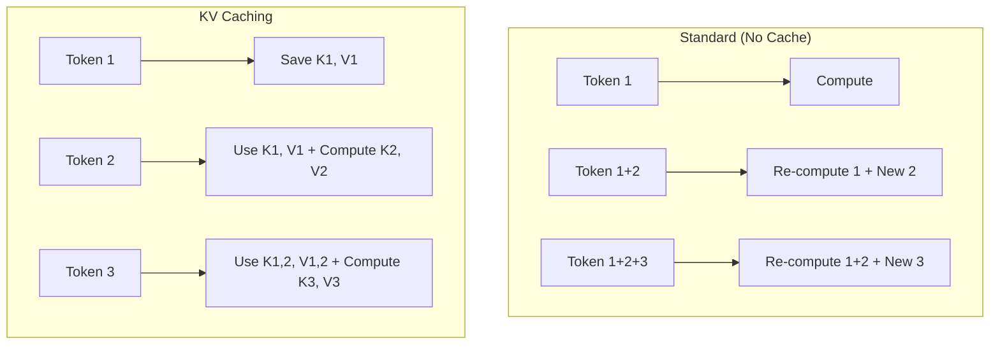

# 🧠 KV Caching: Inference ki Memory
> **Objective:** LLM inference mein sabse critical optimization master karo - Key-Value Caching - ye samajhna ki ye redundant computation ko kaise eliminate karta hai aur modern techniques jaise PagedAttention jo ise scalable banati hain | **Language:** Hinglish | **Standard:** 2026 Expert Framework

---

## 🧭 1. Shuruaat Ke Liye Hinglish Explanation
KV Caching ka matlab hai "Pichli baaton ko yaad rakhna takki unhe baar-baar na padhna pade".

- **The Problem:** LLM jab agla word generate karta hai, toh use pura pichla sentence phir se calculate karna padta hai. Agar sentence 100 words ka hai, toh har naye word ke liye 100 calculations!
- **The Solution:** KV Cache. Hum pichle words ke "Attention Keys" aur "Values" ko save kar lete hain. Ab naye word ke liye sirf us naye word ka math karna padta hai.
- **Intuition:** Ye ek "Calculator" ke "Memory (M+)" button jaisa hai. Aapne ek badi calculation ki, use memory mein save kiya, aur ab aap sirf naya number add kar rahe ho.

---

## 🧠 2. Gehri Technical Explanation
KV Caching har layer mein har token ke liye **Key ($K$)** aur **Value ($V$)** matrices store karke kaam karta hai:

1. **Lifecycle:** **Prefill** stage ke dauran, saare prompt tokens ke liye $K$ aur $V$ compute kiye jaate hain. **Decoding** ke dauran, hum sirf *latest* token ke liye $K$ aur $V$ compute karte hain aur use cache mein append kar dete hain.
2. **Memory Usage:** Cache sequence length ke saath linearly grow hoti hai.
3. **PagedAttention (vLLM):** Modern inference (2026) cache ko ek bade block mein store nahi karta (jisse fragmentation hoti hai). Ye ise "Pages" (jaise RAM) mein tod deta hai, jisse $90\%$ better memory efficiency milti hai.
4. **Quantized KV Cache:** Space bachane ke liye $K$ aur $V$ ko **FP8** ya **INT4** mein store karna.

---

## 📐 3. Mathematical Intuition
**KV Cache ka Memory Cost:**
Ek model ke liye jisme $L$ layers, $H$ heads, aur head dimension $d$ hai:
$$\text{Memory per token} = 2 (\text{K and V}) \times L \times H \times d \times \text{Bytes per param}$$
Llama-3 70B (80 layers, 8 heads per GQA group, 128 dim, FP16) ke liye:
- $2 \times 80 \times 8 \times 128 \times 2 = 327,680$ bytes ($\approx 320 KB$) per token.
- **32k context window** ke liye, ek user sirf cache ke liye **10GB VRAM** use karta hai!

---

## 🏗️ 4. Architecture Diagrams

```mermaid
graph TD
    subgraph "Standard (No Cache)"
    T1[Token 1] --> Calc1[Compute]
    T2[Token 1+2] --> Calc2[Re-compute 1 + New 2]
    T3[Token 1+2+3] --> Calc3[Re-compute 1+2 + New 3]
    end
    
    subgraph "KV Caching"
    C1[Token 1] --> KV1[Save K1, V1]
    C2[Token 2] --> KV2[Use K1, V1 + Compute K2, V2]
    C3[Token 3] --> KV3[Use K1,2, V1,2 + Compute K3, V3]
    end
```

---

## 💻 5. Production-Ready Examples
HuggingFace mein KV Cache kaise handle hota hai:
```python
# 'past_key_values' KV Cache hai
outputs = model(input_ids, past_key_values=None, use_cache=True)
next_token_logits = outputs.logits
kv_cache = outputs.past_key_values # Isse agle step ke liye save karo

# Step 2: Cache ka istemal karo
outputs = model(next_token_id, past_key_values=kv_cache, use_cache=True)
```

---

## 🌍 6. Real-World Use Cases
- **Long-context RAG:** 100-page PDF ke embeddings ko cache karna taki user 50 questions poochh sake bina model ko har baar PDF dubara padhni pade.
- **Streaming Chat:** Sirf newest token ke delta ko calculate karke ek smooth, real-time response provide karna.

---

## ❌ 7. Failure Cases
- **VRAM OOM:** Agar aapke paas 10 users hain 128k context ke saath, toh aapka 80GB A100 crash ho jayega kyunki KV cache bahut huge hai.
- **Cache Incoherence:** Agar aap prompt ko beech mein modify karte hain, to purana KV cache invalid ho jata hai aur use clear karna padta hai.

---

## 🛠️ 8. Debugging Guide
| Problem | Reason | Solution |
| :--- | :--- | :--- |
| **Inference time ke saath slow hota hai** | Memory fragmentation | Cache blocks manage karne ke liye **vLLM (PagedAttention)** use karein. |
| **Context grow hone ke baad model gibberish de raha hai** | Cache precision loss | KV cache ke liye aggressive quantization (jaise INT4) avoid karein. |

---

## ⚖️ 9. Tradeoffs
- **Full KV Cache (Fast / High VRAM)** vs **Re-computation (Slow / Zero extra VRAM).**

---

## 🛡️ 10. Security Concerns
- **Cache Side-Channel:** Ek attacker KV cache ko "Load" karne mein lagne waale time ko measure karke shared environment mein previous user ke prompt ki length ya content guess kar sakta hai.

---

## 📈 11. Scaling Challenges
- **Multi-Query Attention (MQA) Shift:** Naye models MQA ya GQA (Grouped Query Attention) specifically isliye use karte hain taaki KV cache ke size ko $8-16x$ tak reduce kiya ja sake.

---

## 💰 12. Cost Considerations
- KV Cache hi primary reason hai ki long-context models ko serve karna short-context models se $10x$ zyada expensive kyun hota hai.

---

## ✅ 13. Best Practices
- **Kisi bhi production deployment ke liye PagedAttention use karein.**
- **GQA-based models** (jaise Llama-3) use karein cache size manageable rakhne ke liye.
- **Agar memory full ho to purane cache blocks ko (LRU) evict karein.**

漫
---

## 📝 14. Interview Questions
1. "KV Caching decoding ki computational complexity ko kaise reduce karta hai?"
2. "KV Caches ke context mein 'Memory Wall' problem ko explain karo."
3. "PagedAttention kya hai aur ye memory fragmentation ko kaise solve karta hai?"

---

## 🚀 15. Latest 2026 LLM Engineering Patterns
- **KV Cache Offloading:** KV cache ke purane parts ko CPU RAM ya SSD mein move karna aur sirf "Active window" ko GPU VRAM mein rakhna.
- **Semantic Cache Compression:** KV cache se "Useless" tokens (jaise 'the', 'a') ko identify karke remove karna taaki logic khoye bina space bache.
漫