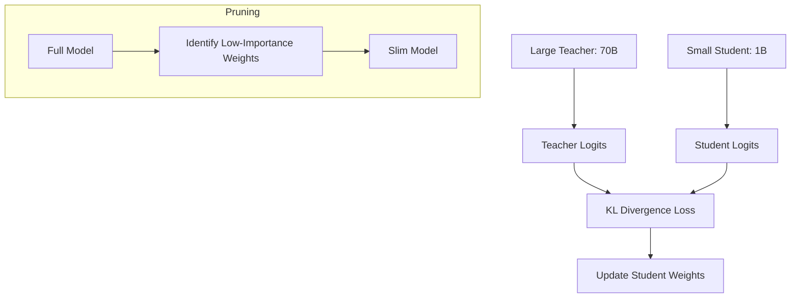

# ✂️ Pruning and Distillation: Leaner, Faster Intelligence
> **Objective:** Master the advanced model compression techniques that reduce the number of parameters and model depth to create ultra-fast Small Language Models (SLMs) from massive base models | **Language:** Hinglish | **Standard:** 2026 Expert Framework

---

## 🧭 1. Beginner-Friendly Hinglish Explanation
Pruning aur Distillation ka matlab hai "Faltu wazan hatana" aur "Knowledge transfer karna".

- **Pruning:** Model ke wo hisse (Neurons/Layers) dhoondna jo koi kaam nahi kar rahe aur unhe "Kaat" (Delete) dena.
- **Distillation:** Ek bada smart model (Teacher) apne chote model (Student) ko sikhata hai. Student bada model nahi ban sakta, par wo teacher ki "Best baatein" copy kar leta hai.
- **Intuition:** 
  - Pruning = Dieting (Weight kam karna).
  - Distillation = Tuition (Bade teacher se chote student ko padhana).

---

## 🧠 2. Deep Technical Explanation
These techniques focus on reducing **Structural Redundancy**:

1. **Structured Pruning:** Removing entire heads, channels, or layers. Hardware-friendly and directly leads to speedup.
2. **Unstructured Pruning:** Removing individual weights. Harder to accelerate on standard GPUs.
3. **Knowledge Distillation (KD):**
   - **Logit Distillation:** The student tries to match the probability distribution (Logits) of the teacher.
   - **Feature Distillation:** The student tries to match the internal activations (hidden states) of the teacher.
4. **Task-specific Distillation:** Making a small model that is *only* good at one task (e.g., Sentiment analysis) by learning from a general GPT-4 teacher.

---

## 📐 3. Mathematical Intuition
**Distillation Loss:**
The student minimizes a combined loss of its own prediction and the teacher's prediction:
$$\mathcal{L} = (1-\alpha) \mathcal{L}_{CE}(\text{student, label}) + \alpha \tau^2 \mathcal{L}_{KL}(\text{student\_logits}/\tau, \text{teacher\_logits}/\tau)$$
- $\tau$ (Temperature): Softens the logits to reveal the "Dark Knowledge" (how much the teacher disliked the 2nd and 3rd best options).

---

## 🏗️ 4. Architecture Diagrams


---

## 💻 5. Production-Ready Examples
The Distillation logic (Conceptual):
```python
import torch.nn.functional as F

def distillation_loss(student_logits, teacher_logits, labels, T=2.0, alpha=0.5):
    # 1. Standard Cross Entropy
    soft_loss = F.kl_div(
        F.log_softmax(student_logits/T, dim=-1),
        F.softmax(teacher_logits/T, dim=-1),
        reduction='batchmean'
    ) * (T * T)
    
    # 2. Hard Label Loss
    hard_loss = F.cross_entropy(student_logits, labels)
    
    return alpha * soft_loss + (1 - alpha) * hard_loss
```

---

## 🌍 6. Real-World Use Cases
- **DistilBERT:** A classic example where BERT was distilled into a $40\%$ smaller and $60\%$ faster version with $97\%$ accuracy.
- **On-device AI:** Distilling a 7B model into a 0.5B model that can run in real-time on a smartwatch.

---

## ❌ 7. Failure Cases
- **Capacity Gap:** If the teacher is too smart (GPT-4) and the student is too small (TinyBERT), the student will be overwhelmed and fail to learn anything.
- **Pruning Damage:** Removing $50\%$ of layers at once can "Brain dead" the model. It's better to prune iteratively ($5\%$ at a time).

---

## 🛠️ 8. Debugging Guide
| Problem | Reason | Solution |
| :--- | :--- | :--- |
| **Accuracy drops 20% after pruning** | Pruned important weights | Use **Taylor expansion** or **Sensitivity Analysis** to find truly "Useless" weights. |
| **Student only copies teacher's errors** | Alpha ($\alpha$) is too high | Decrease the weight of the teacher's loss. |

---

## ⚖️ 9. Tradeoffs
- **Distillation (High Accuracy for Small Model / High Training Cost)** vs **Pruning (Fast Speedup / Risk of Accuracy Loss).**

---

## 🛡️ 10. Security Concerns
- **Knowledge Leakage:** A competitor can "Steal" your proprietary model's behavior by distilling their student model from your model's API outputs.

---

## 📈 11. Scaling Challenges
- **The 'Depth' Wall:** It's easier to reduce the width (heads) of a model than its depth (layers) because deep layers carry essential logic.

---

## 💰 12. Cost Considerations
- Training a distilled model is $2x$ more expensive than standard training because you have to run two models (Teacher + Student) simultaneously.

---

## ✅ 13. Best Practices
- **Use 'Iterative Pruning':** Prune a little, fine-tune, prune more.
- **Match the Student architecture** to the Teacher for easier feature distillation.
- **Distill on your target domain data** for the best specialized performance.

漫
---

## 📝 14. Interview Questions
1. "What is 'Dark Knowledge' in the context of model distillation?"
2. "Why is structured pruning more useful for hardware acceleration than unstructured pruning?"
3. "Explain the role of 'Temperature' in knowledge distillation."

---

## 🚀 15. Latest 2026 LLM Engineering Patterns
- **LLM Pruning-via-merging:** Identifying "Similar" layers and mathematically merging them into one instead of just deleting them.
- **Recursive Distillation:** Teacher $\rightarrow$ Student 1 $\rightarrow$ Student 2. Each step creates a smaller and more specialized model.
漫
