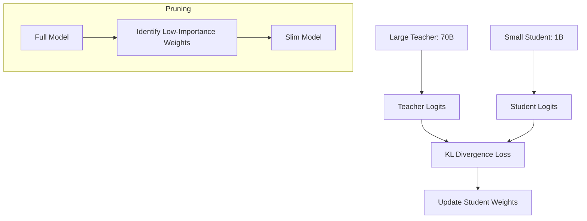

# ✂️ Pruning aur Distillation: Patle aur Tez Intelligence
> **Lakshya:** Advanced model compression techniques ko master karna jo parameters aur model depth ki sankhya ko kam karke massive base models se ultra-fast Small Language Models (SLMs) banate hain | **Language:** Hinglish | **Standard:** 2026 Expert Framework

---

## 🧭 1. Beginner-Friendly Hinglish Explanation
Pruning aur Distillation ka matlab hai "Faltu wazan hatana" aur "Knowledge transfer karna".

- **Pruning:** Model ke wo hisse (Neurons/Layers) dhoondna jo koi kaam nahi kar rahe aur unhe "Kaat" (Delete) dena.
- **Distillation:** Ek bada smart model (Teacher) apne chote model (Student) ko sikhata hai. Student bada model nahi ban sakta, par wo teacher ki "Best baatein" copy kar leta hai.
- **Intuition:** 
  - Pruning = Dieting (Weight kam karna).
  - Distillation = Tuition (Bade teacher se chote student ko padhana).

---

## 🧠 2. Gehri Technical Samjhan
Yeh techniques **Structural Redundancy** ko reduce karne par focus karti hain:

1. **Structured Pruning:** Poore heads, channels, ya layers ko hatana. Hardware-friendly hai aur directly speedup ki taraf lead karta hai.
2. **Unstructured Pruning:** Individual weights ko hatana. Standard GPUs par accelerate karna harder hai.
3. **Knowledge Distillation (KD):**
   - **Logit Distillation:** Student teacher ke probability distribution (Logits) ko match karne ki koshish karta hai.
   - **Feature Distillation:** Student teacher ke internal activations (hidden states) ko match karne ki koshish karta hai.
4. **Task-specific Distillation:** Ek chhota model banana jo *sirf* ek task mein accha hai (e.g., Sentiment analysis) general GPT-4 teacher se seekh kar.

---

## 📐 3. Ganitiya Samjhan
**Distillation Loss:**
Student apne prediction aur teacher ke prediction ka combined loss minimize karta hai:
$$\mathcal{L} = (1-\alpha) \mathcal{L}_{CE}(\text{student, label}) + \alpha \tau^2 \mathcal{L}_{KL}(\text{student\_logits}/\tau, \text{teacher\_logits}/\tau)$$
- $\tau$ (Temperature): Logits ko soften karta hai "Dark Knowledge" reveal karne ke liye (teacher ne 2nd aur 3rd best options ko kitna dislike kiya).

---

## 🏗️ 4. Architecture Diagrams

```mermaid
graph TD
    Teacher[Large Teacher: 70B] --> Logits[Teacher Logits]
    Student[Small Student: 1B] --> SLogits[Student Logits]
    Logits --> Loss[KL Divergence Loss]
    SLogits --> Loss
    Loss --> Update[Update Student Weights]
    subgraph "Pruning"
    Full[Full Model] --> Mask[Identify Low-Importance Weights]
    Mask --> Slim[Slim Model]
    end
```

---

## 💻 5. Production-Ready Examples
The Distillation logic (Conceptual):
```python
import torch.nn.functional as F

def distillation_loss(student_logits, teacher_logits, labels, T=2.0, alpha=0.5):
    # 1. Standard Cross Entropy
    soft_loss = F.kl_div(
        F.log_softmax(student_logits/T, dim=-1),
        F.softmax(teacher_logits/T, dim=-1),
        reduction='batchmean'
    ) * (T * T)
    
    # 2. Hard Label Loss
    hard_loss = F.cross_entropy(student_logits, labels)
    
    return alpha * soft_loss + (1 - alpha) * hard_loss
```

---

## 🌍 6. Real-World Use Cases
- **DistilBERT:** Ek classic example jahaan BERT ko $40\%$ chhote aur $60\%$ tez version mein distill kiya gaya, $97\%$ accuracy ke saath.
- **On-device AI:** 7B model ko 0.5B model mein distill karna jo smartwatch par real-time run kar sakta hai.

---

## ❌ 7. Failure Cases
- **Capacity Gap:** Agar teacher bahut smart hai (GPT-4) aur student bahut chhota hai (TinyBERT), to student overwhelmed ho jayega aur kuch seekhne mein fail hoga.
- **Pruning Damage:** Ek saath $50\%$ layers hatane se model 'Brain dead' ho sakta hai. Better hai ki iteratively prune karein (ek baar mein $5\%$).

---

## 🛠️ 8. Debugging Guide
| Problem | Reason | Solution |
| :--- | :--- | :--- |
| **Accuracy drops 20% after pruning** | Important weights prune kar diye | **Taylor expansion** ya **Sensitivity Analysis** use karein asli "Useless" weights dhundhne ke liye. |
| **Student only copies teacher's errors** | Alpha ($\alpha$) bahut zyada hai | Teacher loss ka weight kam karein. |

---

## ⚖️ 9. Tradeoffs
- **Distillation (Chhote model ke liye High Accuracy / High Training Cost)** vs **Pruning (Fast Speedup / Accuracy Loss ka Risk).**

---

## 🛡️ 10. Security Concerns
- **Knowledge Leakage:** Ek competitor aapke proprietary model ke behavior ko 'Steal' kar sakta hai apne student model ko aapke model ke API outputs se distill karke.

---

## 📈 11. Scaling Challenges
- **The 'Depth' Wall:** Model ki width (heads) reduce karna uski depth (layers) se aasan hai kyunki deep layers zaroori logic carry karti hain.

---

## 💰 12. Cost Considerations
- Distilled model ko train karna standard training se $2x$ zyada expensive hai kyunki aapko do models (Teacher + Student) simultaneously run karne padte hain.

---

## ✅ 13. Best Practices
- **Use 'Iterative Pruning':** Thoda prune karo, fine-tune karo, phir aur prune karo.
- **Match the Student architecture** ko Teacher se match karo taaki feature distillation aasan ho.
- **Apne target domain data par distill karo** behtarin specialized performance ke liye.

漫
---

## 📝 14. Interview Questions
1. "Model distillation ke context mein 'Dark Knowledge' kya hai?"
2. "Structured pruning unstructured pruning se hardware acceleration ke liye zyada useful kyun hai?"
3. "Knowledge distillation mein 'Temperature' ki role explain karo."

---

## 🚀 15. Latest 2026 LLM Engineering Patterns
- **LLM Pruning-via-merging:** 'Similar' layers ko pehchan kar unhe mathematically merge karna ek mein, sirf delete karne ki jagah.
- **Recursive Distillation:** Teacher $\rightarrow$ Student 1 $\rightarrow$ Student 2. Har step ek chhota aur zyada specialized model banata hai.
漫