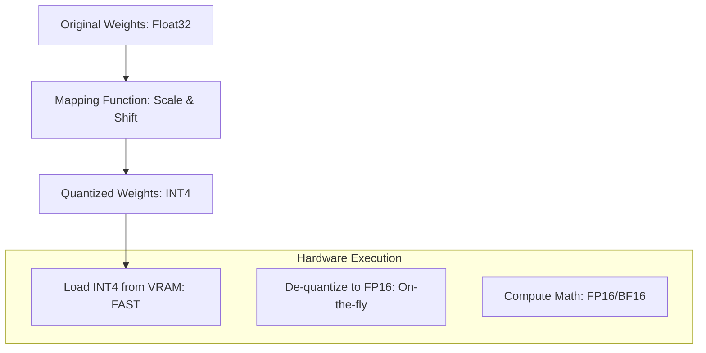

# 📉 Quantization Techniques: Squeezing Knowledge into Bits
> **Objective:** Master the art of reducing LLM precision (from 16-bit to 4-bit or even 1-bit) to run massive models on smaller hardware while maintaining intelligence | **Language:** Hinglish | **Standard:** 2026 Expert Framework

---

## 🧭 1. Beginner-Friendly Hinglish Explanation
Quantization ka matlab hai "Numbers ko chota karna takki wo kam jagah gherien".

- **The Problem:** Ek 70B model ko store karne ke liye 140GB RAM chahiye (FP16). Par saste GPUs mein sirf 8GB ya 24GB hoti hai.
- **The Solution:** Quantization. Hum har number (Weight) ki detail kam kar dete hain. 
  - **FP16:** Bahut detail (High resolution).
  - **INT4:** Kam detail (Low resolution).
- **Intuition:** Ye ek "Badi 4K Movie" ko "720p" mein convert karne jaisa hai. Resolution kam hui, file size $10x$ chota hua, par movie abhi bhi dekhne layak hai.

---

## 🧠 2. Deep Technical Explanation
Quantization maps a large set of values (Floating point) to a smaller set (Integers):

1. **PTQ (Post-Training Quantization):** Quantizing a model *after* it's trained. Fast and easy.
2. **QAT (Quantization-Aware Training):** Training the model *while* simulating low precision. Much more accurate but slow.
3. **Methods:**
   - **GGUF:** The standard for CPU/Apple Silicon (llama.cpp).
   - **AWQ (Activation-aware Weight Quantization):** Protects the most important $1\%$ of weights to keep accuracy high.
   - **GPTQ:** One-shot weight quantization for 4-bit GPUs.
   - **FP8/FP4:** Using new hardware-native formats for the highest speed.

---

## 📐 3. Mathematical Intuition
Linear Quantization formula:
$$Q(x) = \text{round}\left(\frac{x}{S} + Z\right)$$
- $S$ (Scale): Controls the range.
- $Z$ (Zero-point): Shifts the values.
To recover (De-quantize): $x \approx S(Q(x) - Z)$.
The "Quantization Error" is $|x - \text{dq}(Q(x))|$. We want to minimize this error during the mapping.

---

## 🏗️ 4. Architecture Diagrams


---

## 💻 5. Production-Ready Examples
Using `bitsandbytes` to load a model in 4-bit:
```python
from transformers import AutoModelForCausalLM, BitsAndBytesConfig

# Configure 4-bit quantization (QLoRA standard)
quant_config = BitsAndBytesConfig(
    load_in_4bit=True,
    bnb_4bit_compute_dtype=torch.bfloat16,
    bnb_4bit_quant_type="nf4", # Normal Float 4
    bnb_4bit_use_double_quant=True,
)

model = AutoModelForCausalLM.from_pretrained(
    "meta-llama/Llama-3-8b",
    quantization_config=quant_config
)
```

---

## 🌍 6. Real-World Use Cases
- **Local LLMs:** Running a 70B model on a single Mac Studio with 64GB Unified RAM (using GGUF).
- **Mobile AI:** Running a 3B model (Phi-3) on an Android/iPhone using INT4 quantization.

---

## ❌ 7. Failure Cases
- **Perplexity Spike:** If you quantize too much (e.g., to 2-bit), the model starts "Hallucinating" and losing its logic.
- **Outlier Sensitivity:** If one weight is 1000 and others are 0.1, the quantization scale will be ruined. **Fix: Use AWQ or SmoothQuant.**

---

## 🛠️ 8. Debugging Guide
| Problem | Reason | Solution |
| :--- | :--- | :--- |
| **Model says gibberish** | Bad quantization method | Try **AWQ** instead of GPTQ for better logic retention. |
| **Model is slow despite INT4** | CPU bottleneck | Ensure you are using **GGUF** for CPU or **vLLM** for GPU optimization. |

---

## ⚖️ 9. Tradeoffs
- **FP16 (Max Intelligence / Max VRAM)** vs **INT4 (95% Intelligence / 25% VRAM).**

---

## 🛡️ 10. Security Concerns
- **Quantization Trojan:** Hiding a backdoor that only "Activates" after the model is quantized to a specific precision (e.g., INT4).

---

## 📈 11. Scaling Challenges
- **The 1-Bit Barrier:** Researchers are trying to reach "BitNet" (1-bit weights), where the model doesn't even use multiplication, only addition/subtraction.

---

## 💰 12. Cost Considerations
- Quantization allows you to use $\$500$ GPUs instead of $\$30,000$ GPUs, reducing infrastructure costs by $95\%$.

---

## ✅ 13. Best Practices
- **Use NF4 (NormalFloat 4)** for QLoRA fine-tuning.
- **Use AWQ** for production inference.
- **Always benchmark** your quantized model against the FP16 base model using a task-specific evaluation.

漫
---

## 📝 14. Interview Questions
1. "What is the difference between Post-Training Quantization (PTQ) and Quantization-Aware Training (QAT)?"
2. "How does AWQ differ from standard weight quantization?"
3. "Explain why outliers in activations make quantization difficult."

---

## 🚀 15. Latest 2026 LLM Engineering Patterns
- **K-Quants:** Using different bit-widths for different layers (e.g., 6-bit for important middle layers and 4-bit for others).
- **Hardware-Native 4-bit:** New NVIDIA chips that can do math directly in 4-bit without de-quantizing, leading to $4x$ more speed.
漫
