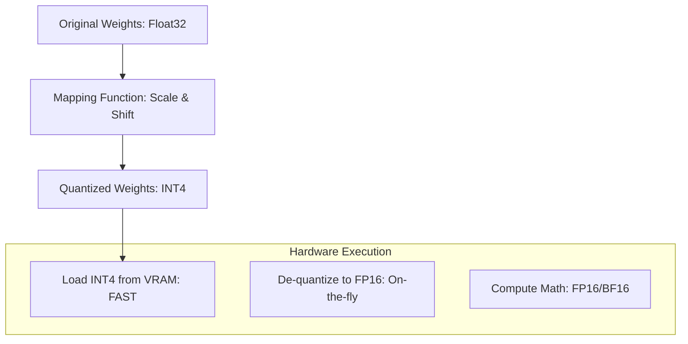

# 📉 Quantization Techniques: Bits mein Knowledge ko Squeeze Karna
> **Objective:** LLM precision ko reduce karne ka art master karna (16-bit se 4-bit ya 1-bit tak) taaki massive models ko chhoti hardware par run kiya ja sake, intelligence maintain karte hue | **Language:** Hinglish | **Standard:** 2026 Expert Framework

---

## 🧭 1. Beginners ke liye Hinglish Explanation
Quantization ka matlab hai "Numbers ko chota karna takki wo kam jagah gherien".

- **The Problem:** Ek 70B model ko store karne ke liye 140GB RAM chahiye (FP16). Par saste GPUs mein sirf 8GB ya 24GB hoti hai.
- **The Solution:** Quantization. Hum har number (Weight) ki detail kam kar dete hain. 
  - **FP16:** Bahut detail (High resolution).
  - **INT4:** Kam detail (Low resolution).
- **Intuition:** Ye ek "Badi 4K Movie" ko "720p" mein convert karne jaisa hai. Resolution kam hui, file size $10x$ chota hua, par movie abhi bhi dekhne layak hai.

---

## 🧠 2. Gahrai se Technical Explanation
Quantization values ke bade set (Floating point) ko chhote set (Integers) mein map karta hai:

1. **PTQ (Post-Training Quantization):** Model ko trained hone ke *baad* quantize karna. Fast aur easy.
2. **QAT (Quantization-Aware Training):** Low precision simulate karte hue model ko train karna. Kaafi accurate hai par slow.
3. **Methods:**
   - **GGUF:** CPU/Apple Silicon ke liye standard (llama.cpp).
   - **AWQ (Activation-aware Weight Quantization):** Sabse important $1\%$ weights ko protect karta hai taki accuracy high rahe.
   - **GPTQ:** 4-bit GPUs ke liye one-shot weight quantization.
   - **FP8/FP4:** Sabse zyada speed ke liye new hardware-native formats use karna.

---

## 📐 3. Mathematical Samajh
Linear Quantization ka formula:
$$Q(x) = \text{round}\left(\frac{x}{S} + Z\right)$$
- $S$ (Scale): Range ko control karta hai.
- $Z$ (Zero-point): Values ko shift karta hai.
Wapas pane ke liye (De-quantize): $x \approx S(Q(x) - Z)$.
"Quantization Error" $|x - \text{dq}(Q(x))|$ hai. Is error ko mapping ke dauran minimize karna chahte hain.

---

## 🏗️ 4. Architecture Diagrams

```mermaid
graph TD
    Weights[Original Weights: Float32] --> Map[Mapping Function: Scale & Shift]
    Map --> Quant[Quantized Weights: INT4]
    subgraph "Hardware Execution"
    Load[Load INT4 from VRAM: FAST]
    Deq[De-quantize to FP16: On-the-fly]
    Compute[Compute Math: FP16/BF16]
    end
    Quant --> Load
```

---

## 💻 5. Production ke liye Ready Examples
`bitsandbytes` ka use karke model ko 4-bit mein load karna:
```python
from transformers import AutoModelForCausalLM, BitsAndBytesConfig

# Configure 4-bit quantization (QLoRA standard)
quant_config = BitsAndBytesConfig(
    load_in_4bit=True,
    bnb_4bit_compute_dtype=torch.bfloat16,
    bnb_4bit_quant_type="nf4", # Normal Float 4
    bnb_4bit_use_double_quant=True,
)

model = AutoModelForCausalLM.from_pretrained(
    "meta-llama/Llama-3-8b",
    quantization_config=quant_config
)
```

---

## 🌍 6. Vastavik Duniya ke Use Cases
- **Local LLMs:** Ek aur Mac Studio par 64GB Unified RAM ke saath 70B model ko run karna (GGUF use karke).
- **Mobile AI:** Android/iPhone par INT4 quantization ka use karke 3B model (Phi-3) run karna.

---

## ❌ 7. Failure ke Cases
- **Perplexity Spike:** Agar aap bahut zyada quantize karenge (jaise, 2-bit tak), to model "Hallucinate" karne lagta hai aur apni logic kho deta hai.
- **Outlier Sensitivity:** Agar ek weight 1000 hai aur baaki 0.1 hain, to quantization scale kharab ho jayega. **Fix: AWQ ya SmoothQuant ka use karein.**

---

## 🛠️ 8. Debugging Guide
| Problem | Reason | Solution |
| :--- | :--- | :--- |
| **Model gibberish bolta hai** | Kharab quantization method | Better logic retention ke liye GPTQ ki jagah **AWQ** aazmaayein. |
| **INT4 hone ke bawajood model slow hai** | CPU bottleneck | Yah sunishchit karein ki aap CPU ke liye **GGUF** ya GPU optimization ke liye **vLLM** use kar rahe hain. |

---

## ⚖️ 9. Tradeoffs
- **FP16 (Max Intelligence / Max VRAM)** vs **INT4 (95% Intelligence / 25% VRAM).**

---

## 🛡️ 10. Security ke Mamle
- **Quantization Trojan:** Ek backdoor chhupana jo model ko specific precision (jaise INT4) par quantize karne ke baad hi "Activate" hota hai.

---

## 📈 11. Scaling Challenges
- **The 1-Bit Barrier:** Researchers "BitNet" (1-bit weights) tak pahunchne ki koshish kar rahe hain, jahan model multiplication bhi use nahi karta, sirf addition/subtraction.

---

## 💰 12. Cost Considerations
- Quantization aapko $\$500$ GPUs ka upayog karne deti hai $\$30,000$ GPUs ke bajaye, infrastructure costs $95\%$ tak kam kar deti hai.

---

## ✅ 13. Best Practices
- **NF4 (NormalFloat 4)** ka istemal karein QLoRA fine-tuning ke liye.
- **AWQ** ka istemal karein production inference ke liye.
- **Hamesha benchmark karein** apne quantized model ko FP16 base model ke against, task-specific evaluation ka istemal karte hue.

漫
---

## 📝 14. Interview ke Sawal
1. "Post-Training Quantization (PTQ) aur Quantization-Aware Training (QAT) mein kya antar hai?"
2. "AWQ standard weight quantization se kaise alag hai?"
3. "Samjhaaiye kyun outliers in activations quantization ko mushkil bana dete hain."

---

## 🚀 15. 2026 ke LLM Engineering Patterns
- **K-Quants:** Alag-alag layers ke liye alag bit-widths ka istemal karna (e.g., important middle layers ke liye 6-bit aur baaki ke liye 4-bit).
- **Hardware-Native 4-bit:** Naye NVIDIA chips jo bina de-quantize kiye directly 4-bit mein math kar sakte hain, jisse $4x$ zyada speed milti hai.
漫