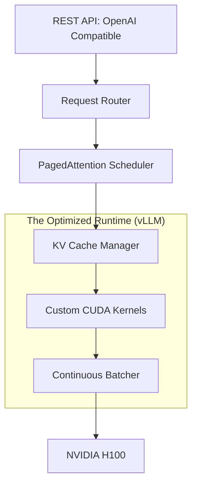

# 🚀 vLLM and Optimized Runtimes: Production Serving
> **Objective:** Master the deployment of LLMs using industry-standard high-performance runtimes like vLLM, TensorRT-LLM, and TGI, focusing on memory management and maximum throughput | **Language:** Hinglish | **Standard:** 2026 Expert Framework

---

## 🧭 1. Beginner-Friendly Hinglish Explanation
vLLM aur Optimized Runtimes wo "Engines" hain jinpar model ko asli duniya mein chalaya jata hai.

- **The Problem:** HuggingFace `generate()` sirf testing ke liye accha hai. Wo production mein bahut slow hai aur VRAM waste karta hai.
- **The Solution:** vLLM. 
  - Ye PagedAttention use karta hai (Jaise Windows ka RAM management).
  - Ye dher saari requests ko ek sath handle karta hai (Continuous Batching).
- **Intuition:** HuggingFace ek "Slow Passenger Train" jaisa hai. vLLM ek "Bullet Train" hai jo sirf speed aur efficiency ke liye bani hai.

---

## 🧠 2. Deep Technical Explanation
Optimized runtimes focus on three areas: **Memory, Compute, and Scheduling**:

1. **vLLM (The King of Memory):** Invented **PagedAttention**. It avoids VRAM fragmentation, allowing for a $2x-4x$ higher batch size than standard methods.
2. **TensorRT-LLM (The King of Speed):** NVIDIA's own runtime. It compiles the model into specialized GPU kernels. Fastest raw performance but harder to set up.
3. **TGI (Text Generation Inference):** HuggingFace's production-ready server. Great for safety and enterprise features.
4. **SGLang / LMDeploy:** Newer runtimes (2026) that optimize the "KV Cache" even further for multi-turn conversations.

---

## 📐 3. Mathematical Intuition
Throughput gain from PagedAttention:
In standard runtimes, we reserve the *max context length* (e.g., 8k) for every user, even if they only use 10 tokens. Waste = $99\%$.
In vLLM, we only use what is needed + 1 Page (usually 16 tokens). Waste $\approx 1\%$.
**Result:** You can fit $\approx 10x$ more users in the same VRAM.

---

## 🏗️ 4. Architecture Diagrams


---

## 💻 5. Production-Ready Examples
Deploying an OpenAI-compatible server with vLLM:
```bash
# Install
pip install vllm

# Run the server (Llama-3 70B across 4 GPUs)
python -m vllm.entrypoints.openai.api_server \
    --model meta-llama/Llama-3-70b \
    --tensor-parallel-size 4 \
    --gpu-memory-utilization 0.95 \
    --max-num-seqs 256 \
    --port 8000
```
Now you can use any OpenAI client to talk to your local server!

---

## 🌍 6. Real-World Use Cases
- **AI Startups:** Using vLLM to serve their own fine-tuned models to thousands of customers without going broke on GPU costs.
- **Internal Tools:** A company hosting its own "Private ChatGPT" on a local server using TensorRT-LLM for maximum privacy and speed.

---

## ❌ 7. Failure Cases
- **Over-subscription:** Setting `gpu-memory-utilization` too high ($>0.99$), causing the server to crash when it needs a tiny bit of extra memory for a new request.
- **Quantization Mismatch:** Trying to run an AWQ model on a runtime that only supports GPTQ.

---

## 🛠️ 8. Debugging Guide
| Problem | Reason | Solution |
| :--- | :--- | :--- |
| **Server crashes under load** | KV cache overflow | Decrease **`max_num_seqs`** or use **Quantized KV Cache**. |
| **Latency is inconsistent** | Token generation fluctuates | Use **Chunked Prefill** to stabilize the decoding steps. |

---

## ⚖️ 9. Tradeoffs
- **vLLM (Extremely Easy / Very Fast / High Memory Efficiency).**
- **TensorRT-LLM (Hard to set up / Fastest Raw Speed / NVIDIA only).**

---

## 🛡️ 10. Security Concerns
- **Remote Code Execution (RCE):** Ensure `trust_remote_code=False` unless you are $100\%$ sure about the model's source, to prevent malicious weights from running code on your server.

---

## 📈 11. Scaling Challenges
- **Multi-Node Serving:** Serving a 400B model requires vLLM to span across multiple physical servers, which requires **Ray** and a very high-speed network.

---

## 💰 12. Cost Considerations
- Switching from HuggingFace to vLLM can reduce your cloud GPU bill by $70\%$ by allowing you to process more users on a single machine.

---

## ✅ 13. Best Practices
- **Use the OpenAI-compatible entrypoint** for easy integration with existing tools.
- **Enable Prefix Caching** if your users often ask questions about the same long context (e.g., a PDF).
- **Use Multi-LoRA** support if you need to serve 10 different fine-tuned versions of the same model.

漫
---

## 📝 14. Interview Questions
1. "How does vLLM handle memory differently than standard PyTorch?"
2. "What is Tensor Parallelism and why is it needed for large models like 70B?"
3. "Explain the benefits of an 'OpenAI-compatible' API server."

---

## 🚀 15. Latest 2026 LLM Engineering Patterns
- **Speculative Runtimes:** vLLM natively running speculative decoding with a built-in draft model to double output speed.
- **Serverless LLM Scaling:** Runtimes that can "Sleep" and wake up in milliseconds when a request arrives, saving $90\%$ of idle GPU costs.
漫
漫
