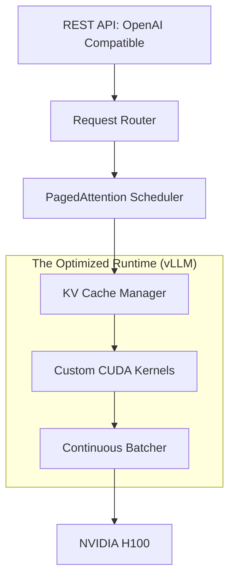

# 🚀 vLLM aur Optimized Runtimes: Production Serving
> **Maqsad:** LLMs ka deployment master karo industry-standard high-performance runtimes jaise vLLM, TensorRT-LLM, aur TGI ka use karke, memory management aur maximum throughput par focus karte hue | **Bhasha:** Hinglish | **Standard:** 2026 Expert Framework

---

## 🧭 1. Beginner-Friendly Hinglish Explanation
vLLM aur Optimized Runtimes wo "Engines" hain jinpar model ko asli duniya mein chalaya jata hai.

- **The Problem:** HuggingFace `generate()` sirf testing ke liye accha hai. Wo production mein bahut slow hai aur VRAM waste karta hai.
- **The Solution:** vLLM. 
  - Ye PagedAttention use karta hai (Jaise Windows ka RAM management).
  - Ye dher saari requests ko ek sath handle karta hai (Continuous Batching).
- **Intuition:** HuggingFace ek "Slow Passenger Train" jaisa hai. vLLM ek "Bullet Train" hai jo sirf speed aur efficiency ke liye bani hai.

---

## 🧠 2. Gehrai Se Technical Explanation
Optimized runtimes teen areas par focus karte hain: **Memory, Compute, aur Scheduling**:

1. **vLLM (Memory ka Raja):** Isne **PagedAttention** invent kiya. Yeh VRAM fragmentation se bachta hai, jisse standard methods ke comparison mein $2x-4x$ zyada batch size possible hota hai.
2. **TensorRT-LLM (Speed ka Raja):** NVIDIA ka khud ka runtime. Yeh model ko specialized GPU kernels mein compile karta hai. Raw performance sabse fast hai, lekin set up karna mushkil hai.
3. **TGI (Text Generation Inference):** HuggingFace ka production-ready server. Safety aur enterprise features ke liye bahut achha hai.
4. **SGLang / LMDeploy:** Naye runtimes (2026) jo multi-turn conversations ke liye "KV Cache" ko aur bhi optimize karte hain.

---

## 📐 3. Ganitik Intuition
PagedAttention se throughput gain:
Standard runtimes mein, hum har user ke liye *max context length* (jaise 8k) reserve karte hain, chahe wo sirf 10 tokens hi use karein. Waste = $99\%$.
vLLM mein, hum sirf utna hi istemal karte hain jitna zaroorat hai + 1 Page (jo aam taur par 16 tokens hoti hai). Waste $\approx 1\%$.
**Parinaam:** Aap ussi VRAM mein $\approx 10x$ zyada users fit kar sakte hain.

---

## 🏗️ 4. Architecture ke Diagrams

```mermaid
graph TD
    API[REST API: OpenAI Compatible] --> Router[Request Router]
    Router --> Scheduler[PagedAttention Scheduler]
    subgraph "The Optimized Runtime (vLLM)"
    Engine[KV Cache Manager]
    Kernels[Custom CUDA Kernels]
    Batch[Continuous Batcher]
    end
    Scheduler --> Engine
    Engine --> Kernels
    Kernels --> Batch
    Batch --> GPU[NVIDIA H100]
```

---

## 💻 5. Production ke Liye Tayar Udaharan
vLLM ke saath OpenAI-compatible server deploy karna:
```bash
# Install
pip install vllm

# Run the server (Llama-3 70B across 4 GPUs)
python -m vllm.entrypoints.openai.api_server \
    --model meta-llama/Llama-3-70b \
    --tensor-parallel-size 4 \
    --gpu-memory-utilization 0.95 \
    --max-num-seqs 256 \
    --port 8000
```
Ab aap koi bhi OpenAI client use karke apne local server se baat kar sakte hain!

---

## 🌍 6. Vastavik Duniya ke Use Cases
- **AI Startups:** vLLM ka use karke apne fine-tuned models ko hazaaron customers ko serve kar rahe hain bina GPU costs mein doobey.
- **Internal Tools:** Ek company apna khud ka "Private ChatGPT" local server par host kar rahi hai TensorRT-LLM ka use karke maximum privacy aur speed ke liye.

---

## ❌ 7. Asafalta ke Mamle
- **Over-subscription:** `gpu-memory-utilization` ko bahut zyada set karna ($>0.99$), jisse server crash ho jata hai jab use naye request ke liye thoda extra memory chahiye.
- **Quantization Mismatch:** AWQ model ko runtime par chalane ki koshish karna jo sirf GPTQ support karta hai.

---

## 🛠️ 8. Debugging Guide
| Samasya | Karan | Samadhan |
| :--- | :--- | :--- |
| **Load ke waqt server crash ho jata hai** | KV cache overflow | **`max_num_seqs`** kam karein ya **Quantized KV Cache** use karein. |
| **Latency consistent nahi hai** | Token generation fluctuate hota hai | Decoding steps ko stabilize karne ke liye **Chunked Prefill** use karein. |

---

## ⚖️ 9. Samjhota
- **vLLM (Bahut Asaan / Bahut Fast / High Memory Efficiency).**
- **TensorRT-LLM (Set up karna mushkil / Sabse Fast Raw Speed / Sirf NVIDIA ke liye).**

---

## 🛡️ 10. Suraksha Chintayein
- **Remote Code Execution (RCE):** Yeh pakka karein ki `trust_remote_code=False`, jab tak aap model ke source ke baare mein $100\%$ sure nahi hain, taaki malicious weights server par code run na kar sakein.

---

## 📈 11. Scaling ki Chunautiyaan
- **Multi-Node Serving:** 400B model ko serve karne ke liye vLLM ko multiple physical servers mein span karna hota hai, jiske liye **Ray** aur ek bahut high-speed network chahiye.

---

## 💰 12. Laagat ke Vichar
- HuggingFace se vLLM par switch karne se aapka cloud GPU bill $70\%$ tak kam ho sakta hai, kyunki aap ek machine par zyada users process kar sakte hain.

---

## ✅ 13. Sabse Behtar Tareeke
- **OpenAI-compatible entrypoint use karein** existing tools ke saath easy integration ke liye.
- **Prefix Caching enable karein** agar aapke users aksar ek hi long context (jaise PDF) ke baare mein sawaal poochte hain.
- **Multi-LoRA support use karein** agar aapko ek hi model ke 10 different fine-tuned versions serve karne hain.

漫
---

## 📝 14. Interview ke Prashn
1. "vLLM memory ko standard PyTorch se alag kaise handle karta hai?"
2. "Tensor Parallelism kya hai aur large models jaise 70B ke liye iski kyun zaroorat hai?"
3. "Ek 'OpenAI-compatible' API server ke benefits explain karein."

---

## 🚀 15. 2026 ke Nayee LLM Engineering Patterns
- **Speculative Runtimes:** vLLM native taur par speculative decoding chalata hai built-in draft model ke saath, jisse output speed double ho jati hai.
- **Serverless LLM Scaling:** Aise runtimes jo "Sleep" kar sakte hain aur request aate hi milliseconds mein wake up ho sakte hain, jisse idle GPU costs mein $90\%$ ki bachat hoti hai.

漫
漫