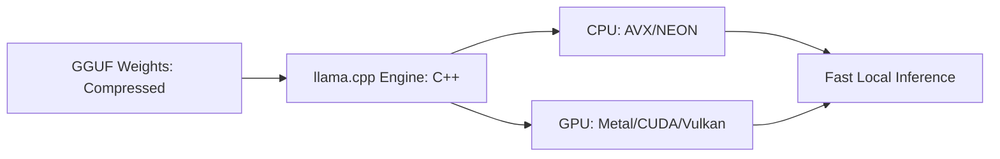

# llama.cpp: LLMs on Every Device

## 1. Beginner-friendly Hinglish Explanation 🇮🇳
Bhai, socho tumhe Llama model chalana hai par tumhare paas koi mehenga NVIDIA GPU nahi hai. Sirf ek simple MacBook ya ek chota sa Windows laptop hai. Kya tum AI nahi chala sakte? Bilkul chala sakte ho!

**llama.cpp** ek aisa magic tool hai jo LLMs ko C++ mein likhta hai taaki woh bina GPU ke bhi, sirf tumhare CPU aur RAM par super-fast chal sakein. Yeh **GGUF** format use karta hai jo model ko compress kar deta hai. Isse tum apne phone, Raspberry Pi, ya purane laptop par bhi "Local AI" chala sakte ho bina internet ke. Yeh "AI Democratization" ka asli hero hai.

---

## 2. Deep Technical Explanation
llama.cpp is a plain C/C++ implementation of the Llama architecture with no heavy dependencies (like PyTorch).
- **Quantization (GGUF)**: Supports 2-bit, 3-bit, 4-bit, 5-bit, 6-bit, and 8-bit quantization.
- **Metal/CUDA Support**: While it runs on CPU, it also uses Apple's Metal API (for Mac) and CUDA (for NVIDIA) to accelerate inference.
- **Unified Memory**: On Macs (Apple Silicon), it uses the unified RAM for both CPU and GPU tasks, allowing it to run models larger than the VRAM of a standard GPU.

---

## 3. Mathematical Intuition
**Quantization logic**: Mapping a 16-bit float range $[-65504, 65504]$ to a 4-bit integer range $[0, 15]$.
To minimize error, llama.cpp uses **Block-wise Quantization**:
$$w_q = \text{round}\left(\frac{w}{s}\right) + z$$
where $s$ is the scale and $z$ is the zero-point, calculated for every block of 32 or 64 weights. This preserves the "relative" importance of weights even at high compression.

---

## 4. Architecture Diagrams


---

## 5. Production-ready Examples
Running a model with `llama.cpp` CLI:

```bash
# 1. Download a GGUF model
wget https://huggingface.co/lmstudio-community/Meta-Llama-3-8B-Instruct-GGUF/resolve/main/Meta-Llama-3-8B-Instruct-Q4_K_M.gguf

# 2. Run inference
./main -m Meta-Llama-3-8B-Instruct-Q4_K_M.gguf \
    -n 128 \
    -p "The meaning of life is" \
    --threads 8
```

Using Python bindings (`llama-cpp-python`):
```python
from llama_cpp import Llama

llm = Llama(model_path="./model.gguf", n_gpu_layers=-1) # -1 uses all GPU layers
output = llm("Q: Name the planets. A: ", max_tokens=32, stop=["Q:", "\n"])
print(output['choices'][0]['text'])
```

---

## 6. Real-world Use Cases
- **Local AI Assistants**: Tools like LM Studio or Ollama (which use llama.cpp under the hood).
- **Edge Computing**: Running AI on drones or offline devices.
- **Privacy-First AI**: Running sensitive medical/legal queries without sending data to the cloud.

---

## 7. Failure Cases
- **Perplexity Degradation**: 2-bit or 3-bit quantization can make the model "Dumb" and forget facts.
- **Dependency on GGUF**: You can't just run a Safetensors model; you must convert it to GGUF first.

---

## 8. Debugging Guide
1. **Thread Tuning**: If inference is slow, ensure `--threads` matches your physical CPU cores (not logical ones).
2. **Offloading Check**: Look for `llm_load_tensors: offloaded 32/32 layers to GPU` in the logs.

---

## 9. Tradeoffs
| Feature | PyTorch (Transformers) | llama.cpp |
|---|---|---|
| Speed (CPU) | Very Slow | Fast |
| Memory | High | Very Low |
| Features | Cutting Edge | Slightly Behind |

---

## 10. Security Concerns
- **Binary Exploits**: Since it's C++, it's susceptible to memory safety issues (buffer overflows) if the GGUF file is maliciously crafted.

---

## 11. Scaling Challenges
- **Throughput**: llama.cpp is optimized for single-user latency, not high-throughput batching like vLLM.

---

## 12. Cost Considerations
- **Hardware Cost**: Zero. Use your existing laptop instead of renting H100s at $4/hr.

---

## 13. Best Practices
- Use **Q4_K_M** quantization for the best balance of speed and intelligence.
- On Mac, always use **-ngl 99** to offload all layers to the GPU (M1/M2/M3).

---

## 14. Interview Questions
1. What is GGUF and why is it better than the older GGML format?
2. How does llama.cpp achieve high speed on CPUs?

---

## 15. Latest 2026 Patterns
- **LLM in a Browser**: Compiling llama.cpp to WebAssembly (WASM) to run LLMs directly in Chrome/Safari.
- **Distributed llama.cpp**: Running a 70B model across two old laptops by splitting the layers between them over a local network.
