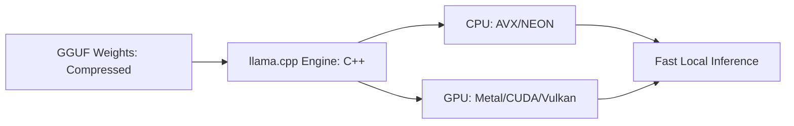

# llama.cpp: LLMs har device par

## 1. Beginner ke liye Hinglish Samjhaayi 🇮🇳
Bhai, socho tumhe Llama model chalana hai par tumhare paas koi mehenga NVIDIA GPU nahi hai. Sirf ek simple MacBook ya ek chota sa Windows laptop hai. Kya tum AI nahi chala sakte? Bilkul chala sakte ho!

**llama.cpp** ek aisa magic tool hai jo LLMs ko C++ mein likhta hai taaki woh bina GPU ke bhi, sirf tumhare CPU aur RAM par super-fast chal sakein. Yeh **GGUF** format use karta hai jo model ko compress kar deta hai. Isse tum apne phone, Raspberry Pi, ya purane laptop par bhi "Local AI" chala sakte ho bina internet ke. Yeh "AI Democratization" ka asli hero hai.

---

## 2. Gehri Technical Samjhaayi
llama.cpp ek saada C/C++ implementation hai Llama architecture ka jisme koi heavy dependencies nahi hain (jaise PyTorch).
- **Quantization (GGUF)**: 2-bit, 3-bit, 4-bit, 5-bit, 6-bit, aur 8-bit quantization ko support karta hai.
- **Metal/CUDA Support**: Yeh CPU par bhi chalta hai, lekin Apple ka Metal API (Mac ke liye) aur CUDA (NVIDIA ke liye) bhi use karta hai inference ko accelerate karne ke liye.
- **Unified Memory**: Macs (Apple Silicon) par, yeh unified RAM use karta hai CPU aur GPU dono tasks ke liye, jisse yeh models chala sakta hai jo standard GPU ke VRAM se bade hain.

---

## 3. Mathematical Samajh
**Quantization logic**: Ek 16-bit float range $[-65504, 65504]$ ko 4-bit integer range $[0, 15]$ mein map karna.
Error minimize karne ke liye, llama.cpp **Block-wise Quantization** use karta hai:
$$w_q = \text{round}\left(\frac{w}{s}\right) + z$$
Jahan $s$ scale hai aur $z$ zero-point hai, jo har block of 32 ya 64 weights ke liye calculate kiya jaata hai. Yeh high compression par bhi weights ki "relative" importance ko preserve karta hai.

---

## 4. Architecture Diagrams

```mermaid
graph LR
    Weights[GGUF Weights: Compressed] --> CPP[llama.cpp Engine: C++]
    CPP --> CPU[CPU: AVX/NEON]
    CPP --> GPU[GPU: Metal/CUDA/Vulkan]
    CPU & GPU --> Result[Fast Local Inference]
```

---

## 5. Production-ready Udaharan
`llama.cpp` CLI ke saath model chalana:

```bash
# 1. Download a GGUF model
wget https://huggingface.co/lmstudio-community/Meta-Llama-3-8B-Instruct-GGUF/resolve/main/Meta-Llama-3-8B-Instruct-Q4_K_M.gguf

# 2. Run inference
./main -m Meta-Llama-3-8B-Instruct-Q4_K_M.gguf \
    -n 128 \
    -p "The meaning of life is" \
    --threads 8
```

Python bindings (`llama-cpp-python`) ka upyog karte hue:
```python
from llama_cpp import Llama

llm = Llama(model_path="./model.gguf", n_gpu_layers=-1) # -1 uses all GPU layers
output = llm("Q: Name the planets. A: ", max_tokens=32, stop=["Q:", "\n"])
print(output['choices'][0]['text'])
```

---

## 6. Real-world Upyog Cases
- **Local AI Assistants**: Tools jaise LM Studio ya Ollama (jo under the hood llama.cpp use karte hain).
- **Edge Computing**: AI ko drones ya offline devices par chalana.
- **Privacy-First AI**: Sensitive medical/legal queries ko cloud par data bheje bina chalana.

---

## 7. Failure ke Mamle
- **Perplexity Degradation**: 2-bit ya 3-bit quantization model ko "Dumb" bana sakta hai aur facts bhool sakta hai.
- **Dependency on GGUF**: Aap directly Safetensors model nahi chala sakte; pehle usey GGUF mein convert karna padega.

---

## 8. Debugging Guide
1. **Thread Tuning**: Agar inference slow hai, to ensure karo ki `--threads` tumhare physical CPU cores se match kare (logical cores se nahi).
2. **Offloading Check**: Logs mein `llm_load_tensors: offloaded 32/32 layers to GPU` dekho.

---

## 9. Tradeoffs
| Feature | PyTorch (Transformers) | llama.cpp |
|---|---|---|
| Speed (CPU) | Very Slow | Fast |
| Memory | High | Very Low |
| Features | Cutting Edge | Slightly Behind |

---

## 10. Security ke Mudde
- **Binary Exploits**: Since yeh C++ hai, yeh memory safety issues (buffer overflows) ke liye susceptible hai agar GGUF file maliciously craft ki gayi ho.

---

## 11. Scaling Chuneautiyan
- **Throughput**: llama.cpp single-user latency ke liye optimized hai, na ki high-throughput batching jaisi vLLM mein hoti hai.

---

## 12. Kharch ke Vichar
- **Hardware Cost**: Zero. Apne existing laptop ka upyog karen, H100s ko $4/hr kiraye par lene ke bajaye.

---

## 13. Best Practices
- **Q4_K_M** quantization ka upyog karein speed aur intelligence ke behatar santulan ke liye.
- Mac par, hamesha **-ngl 99** ka upyog karein sab layers ko GPU (M1/M2/M3) par offload karne ke liye.

---

## 14. Interview Sawaal
1. GGUF kya hai aur yeh purane GGML format se behtar kyun hai?
2. llama.cpp CPUs par high speed kaise prapt karta hai?

---

## 15. 2026 ke Latest Patterns
- **LLM in a Browser**: llama.cpp ko WebAssembly (WASM) mein compile karke LLMs ko direct Chrome/Safari mein chalana.
- **Distributed llama.cpp**: Do purane laptops par 70B model ko layers split karke local network par chalana.