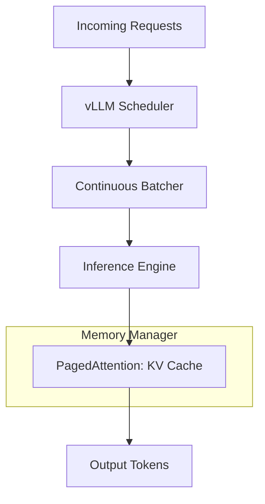

# vLLM: Production-Grade Inference Engine

## 1. Beginner-friendly Hinglish Explanation 🇮🇳
Bhai, socho tumne ek model train kar liya, ab tumhe use 10,000 logon ko serve karna hai. Agar tum simple PyTorch use karoge, toh tumhara server baith jayega (crash). 

**vLLM** woh "Super Engine" hai jo models ko production mein chalane ke liye design kiya gaya hai. Iska sabse bada feature hai **PagedAttention**. Jaise computer ki RAM chote chote pages mein divided hoti hai taaki jagah waste na ho, vLLM bhi model ki memory (KV Cache) ko pages mein divide karta hai. Isse memory waste nahi hoti aur tum ek hi GPU par 10x zyada users handle kar sakte ho. Yeh 2026 mein LLM serving ka "Gold Standard" hai.

---

## 2. Deep Technical Explanation
vLLM is a high-throughput serving engine for LLMs.
- **PagedAttention**: Manages KV cache memory by partitioning it into blocks (pages), similar to virtual memory in OS. This eliminates external fragmentation and reduces wasted memory by up to 96%.
- **Continuous Batching**: Instead of waiting for a whole batch to finish, vLLM inserts new requests as soon as one request finishes a token.
- **Support**: Supports Llama, Mistral, Mixtral, and most popular open-weight models.

---

## 3. Mathematical Intuition
Traditional serving has high **Internal Fragmentation**. If a user has a 512 token limit but only uses 10 tokens, 502 tokens worth of KV cache is reserved but wasted.
vLLM uses **Logical to Physical mapping**:
$$\text{Physical\_Addr} = \text{MappingTable}[\text{Logical\_Page\_ID}] \times \text{BlockSize} + \text{Offset}$$
This allows non-contiguous memory allocation, maximizing GPU utilization.

---

## 4. Architecture Diagrams


---

## 5. Production-ready Examples
Serving a model with `vLLM` (CLI):

```bash
# Start an OpenAI-compatible API server
python -m vllm.entrypoints.openai.api_server \
    --model meta-llama/Llama-3-8B-Instruct \
    --tensor-parallel-size 1 \
    --max-model-len 4096
```

Using vLLM in Python code:
```python
from vllm import LLM, SamplingParams

llm = LLM(model="meta-llama/Llama-3-8B")
sampling_params = SamplingParams(temperature=0.8, top_p=0.95)

prompts = ["Hello, my name is", "The future of AI is"]
outputs = llm.generate(prompts, sampling_params)

for output in outputs:
    print(output.outputs[0].text)
```

---

## 6. Real-world Use Cases
- **Public API Providers**: Companies like Anyscale or Together AI use vLLM style engines.
- **Self-hosted LLMs**: Companies serving their own internal models for employees.

---

## 7. Failure Cases
- **VRAM OOM**: If you set `gpu_memory_utilization` too high, the system might crash during heavy load.
- **Cold Starts**: Loading a 70B model into vLLM takes a minute or more.

---

## 8. Debugging Guide
1. **Throughput logs**: Watch the `avg_prompt_throughput` and `avg_generation_throughput` in the console.
2. **Fragmentation check**: Monitor the `free_gpu_memory`. If it's always near zero, you are maximizing the engine.

---

## 9. Tradeoffs
| Feature | HuggingFace Generate | vLLM |
|---|---|---|
| Throughput | Low | 10x - 20x Higher |
| Latency | Medium | Low (Continuous Batching) |
| Flexibility | High | Medium (Supports specific models) |

---

## 10. Security Concerns
- **Request Poisoning**: Sending thousands of very short requests to fill up the PagedAttention slots and deny service to others.

---

## 11. Scaling Challenges
- **Multi-GPU (Tensor Parallelism)**: Scaling vLLM across 8 GPUs requires fast NVLink interconnects.

---

## 12. Cost Considerations
- **Cost per Request**: vLLM drastically reduces the cost per request by fitting more users on one GPU.

---

## 13. Best Practices
- Use **FP8 or AWQ quantization** with vLLM for even higher throughput.
- Set **`max_num_seqs`** based on your GPU's VRAM to prevent thrashing.

---

## 14. Interview Questions
1. How does PagedAttention solve memory fragmentation?
2. What is "Continuous Batching" and why is it better than static batching?

---

## 15. Latest 2026 Patterns
- **vLLM + LoRA Adapters**: Dynamically swapping LoRA adapters in and out of the vLLM engine without restarting the server.
- **Prefix Caching**: Automatically caching the prompt prefix (like system instructions) across different users to save compute.
