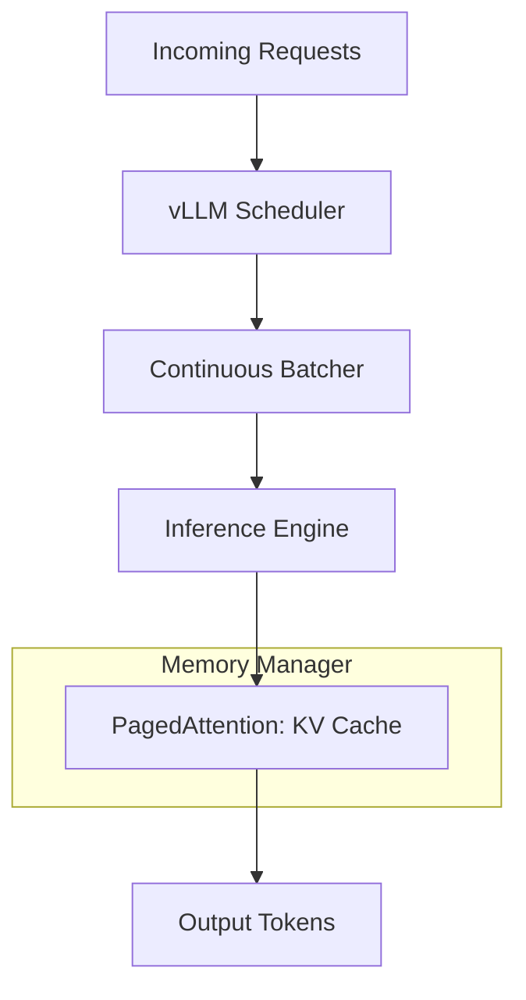

# vLLM: Production-Grade Inference Engine

## 1. Beginner ke liye Hinglish Explanation 🇮🇳
Bhai, socho tumne ek model train kar liya, ab tumhe use 10,000 logon ko serve karna hai. Agar tum simple PyTorch use karoge, toh tumhara server baith jayega (crash). 

**vLLM** woh "Super Engine" hai jo models ko production mein chalane ke liye design kiya gaya hai. Iska sabse bada feature hai **PagedAttention**. Jaise computer ki RAM chote chote pages mein divided hoti hai taaki jagah waste na ho, vLLM bhi model ki memory (KV Cache) ko pages mein divide karta hai. Isse memory waste nahi hoti aur tum ek hi GPU par 10x zyada users handle kar sakte ho. Yeh 2026 mein LLM serving ka "Gold Standard" hai.

---

## 2. Gehri Technical Samjhaai
vLLM ek high-throughput serving engine hai LLMs ke liye.
- **PagedAttention**: KV cache memory ko blocks (pages) mein divide karke manage karta hai, jaise OS mein virtual memory hoti hai. Ye external fragmentation ko khatam karta hai aur wasted memory ko 96% tak reduce kar deta hai.
- **Continuous Batching**: Poori batch ke finish hone ka wait karne ke bajay, vLLM naye requests insert karta hai jaise hi ek request ek token finish karti hai.
- **Support**: Llama, Mistral, Mixtral, aur most popular open-weight models ko support karta hai.

---

## 3. Ganit ka Intuition
Traditional serving mein high **Internal Fragmentation** hoti hai. Agar kisi user ke paas 512 token limit hai lekin woh sirf 10 tokens use karta hai, toh 502 tokens ke equivalent KV cache reserve ho jaati hai lekin waste hoti hai.
vLLM **Logical to Physical mapping** use karta hai:
$$\text{Physical\_Addr} = \text{MappingTable}[\text{Logical\_Page\_ID}] \times \text{BlockSize} + \text{Offset}$$
Ye non-contiguous memory allocation allow karta hai, jo GPU utilization ko maximize karta hai.

---

## 4. Architecture ke Diagrams

```mermaid
graph TD
    Req[Incoming Requests] --> Sch[vLLM Scheduler]
    Sch --> Batch[Continuous Batcher]
    Batch --> Engine[Inference Engine]
    Engine --> Paged[PagedAttention: KV Cache]
    Paged --> Out[Output Tokens]
    
    subgraph "Memory Manager"
        Paged
    end
```

---

## 5. Production ke Liye Examples
Model ko serve karna `vLLM` ke saath (CLI):

```bash
# Start an OpenAI-compatible API server
python -m vllm.entrypoints.openai.api_server \
    --model meta-llama/Llama-3-8B-Instruct \
    --tensor-parallel-size 1 \
    --max-model-len 4096
```

Python code mein vLLM use karna:
```python
from vllm import LLM, SamplingParams

llm = LLM(model="meta-llama/Llama-3-8B")
sampling_params = SamplingParams(temperature=0.8, top_p=0.95)

prompts = ["Hello, my name is", "The future of AI is"]
outputs = llm.generate(prompts, sampling_params)

for output in outputs:
    print(output.outputs[0].text)
```

---

## 6. Asli Duniya ke Use Cases
- **Public API Providers**: Companies jaise Anyscale ya Together AI vLLM style engines use karte hain.
- **Self-hosted LLMs**: Companies jo apne internal models ko employees ke liye serve karti hain.

---

## 7. Fail Cases
- **VRAM OOM**: Agar aap `gpu_memory_utilization` bahut high set karte hain, toh system heavy load ke dauran crash ho sakta hai.
- **Cold Starts**: vLLM mein 70B model load karne mein ek minute ya usse zyada lagta hai.

---

## 8. Debugging Guide (Debug ka Guide)
1. **Throughput logs**: Console mein `avg_prompt_throughput` aur `avg_generation_throughput` dekhte raho.
2. **Fragmentation check**: `free_gpu_memory` ko monitor karo. Agar ye hamesha zero ke paas hai, toh aap engine ko maximize kar rahe ho.

---

## 9. Tradeoffs
| Feature | HuggingFace Generate | vLLM |
|---|---|---|
| Throughput | Low | 10x - 20x Zyada |
| Latency | Medium | Low (Continuous Batching) |
| Flexibility | High | Medium (Khaas models ko support karta hai) |

---

## 10. Security ke Chinta
- **Request Poisoning**: Hazaaron chhote-chhote requests bhejna taaki PagedAttention slots bhar jayein aur doosron ko service na mile.

---

## 11. Scale karne ki Chunautiyaan
- **Multi-GPU (Tensor Parallelism)**: vLLM ko 8 GPUs par scale karne ke liye fast NVLink interconnects chahiye.

---

## 12. Cost ke Baare mein
- **Cost per Request**: vLLM ek GPU par zyada users fit karke cost per request ko drastic reduce karta hai.

---

## 13. Best Practices (Sabase achhe tarike)
- Use **FP8 ya AWQ quantization** with vLLM for even higher throughput.
- **`max_num_seqs`** ko apne GPU ke VRAM ke hisaab se set karo taaki thrashing se bacha ja sake.

---

## 14. Interview ke Sawal
1. PagedAttention memory fragmentation ko kaise solve karta hai?
2. "Continuous Batching" kya hai aur ye static batching se behtar kyun hai?

---

## 15. 2026 ke Latest Patterns
- **vLLM + LoRA Adapters**: Server ko restart kiye bina vLLM engine mein LoRA adapters ko dynamically swap karna.
- **Prefix Caching**: Alag-alag users ke liye prompt prefix (jaise system instructions) ko automatically cache karna taaki compute bach sake.