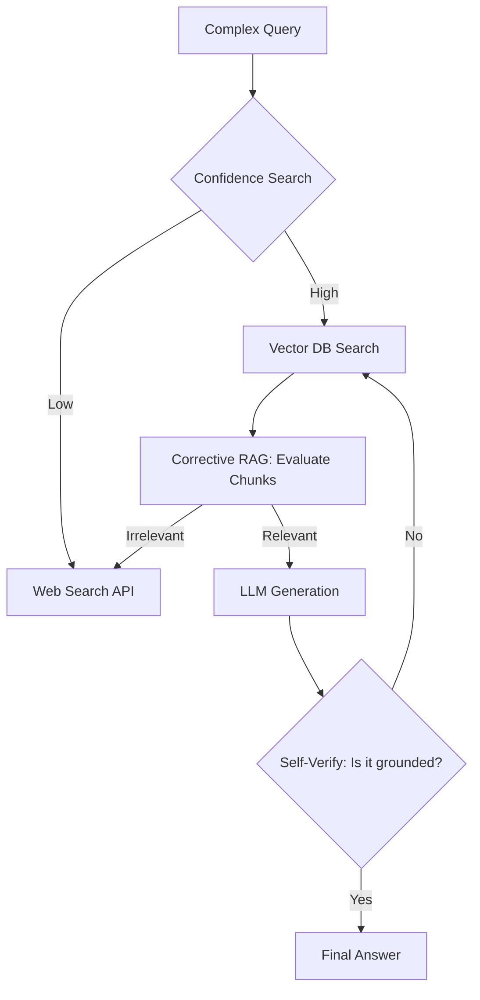

# 🚀 Advanced RAG Patterns: State-of-the-Art Retrieval
> **Objective:** Master the sophisticated architectural patterns that push RAG beyond simple search—from Self-RAG and Corrective RAG to Agentic and Multi-Hop retrieval | **Language:** Hinglish | **Standard:** 2026 Expert Framework

---

## 🧭 1. Beginner-Friendly Hinglish Explanation
Advanced RAG ka matlab hai "Simple search ko ek 'Smart Robot' mein badalna jo khud decide karta hai ki use kya chahiye".

- **Simple RAG:** User Query $\rightarrow$ Search $\rightarrow$ Answer. (Bahut basic).
- **Advanced RAG:** 
  - **Self-RAG:** Model khud check karta hai ki kya retrieved info sahi hai? Agar nahi, toh wo phir se search karta hai.
  - **Multi-hop:** Agar ek sawal ka answer 3 alag files mein hai, toh model ek-ek karke unhe "Dhoondta" hai.
- **Intuition:** Ye ek "Junior Intern" aur ek "Senior Researcher" ke beech ka fark hai. Senior Researcher har answer ko verify karta hai aur gehri research karta hai.

---

## 🧠 2. Deep Technical Explanation
SOTA (State-of-the-Art) RAG architectures focus on **Iteration and Verification**:

1. **Self-RAG (Reflection):** The model uses specialized "Reflection Tokens" to evaluate:
   - Is retrieval needed?
   - Is the retrieved document relevant?
   - Is the final answer supported by the document?
2. **Corrective RAG (CRAG):** A system that evaluates the "Confidence" of retrieval. If low, it triggers a web search to find missing information.
3. **Multi-Hop Retrieval:** For complex queries like "Who is the CEO of the company that bought X?", the system first finds X's buyer, then finds the CEO of that buyer.
4. **Parent-Document Retrieval:** Storing small chunks for search but retrieving the whole "Parent" document for the LLM to provide better context.

---

## 📐 3. Mathematical Intuition
**Confidence-based Routing:**
If the retrieval score $S < \tau$ (a threshold), we switch from Vector Search to a "Fallback" mechanism (like Web Search or a larger model).
$$\text{Action} = \begin{cases} \text{Use RAG} & \text{if } S \geq \tau \\ \text{Web Search} & \text{if } S < \tau \end{cases}$$
This prevents the LLM from trying to "Guess" based on low-quality search results.

---

## 🏗️ 4. Architecture Diagrams


---

## 💻 5. Production-Ready Examples
The **Multi-Step Agentic RAG** pattern in 2026:
```python
# Using a state-machine approach (e.g., LangGraph)
def research_agent(query):
    state = "init"
    context = []
    while state != "end":
        if state == "init":
            # Plan the research
            plan = llm.invoke(f"Plan research for: {query}")
            state = "search"
        elif state == "search":
            # Perform targeted search
            new_info = search_db(plan.next_step)
            context.append(new_info)
            if llm_check_done(context): state = "end"
            else: update_plan()
    return generate_answer(query, context)
```

---

## 🌍 6. Real-World Use Cases
- **Scientific Discovery:** Researching 10 related papers and synthesizing a new hypothesis.
- **Cybersecurity Audit:** Looking through millions of logs across 5 different systems to find a single attack path.
- **Financial Forensics:** Tracing a transaction through multiple bank statements and entities.

---

## ❌ 7. Failure Cases
- **The "Research Loop":** The agent keeps searching and never stops because it's looking for "The Perfect Answer". **Fix: Set a Max-Iteration limit.**
- **Context Overload:** Multi-hop RAG can gather too much info, confusing the model. **Fix: Use a summarization step after every hop.**

---

## 🛠️ 8. Debugging Guide
| Problem | Reason | Solution |
| :--- | :--- | :--- |
| **Agent is very slow** | Too many LLM calls | Use a **smaller model** for intermediate "Decision" steps. |
| **Final answer is disjointed** | Chunks from different sources don't match | Add a **Synthesizer model** specifically trained for multi-doc summary. |

---

## ⚖️ 9. Tradeoffs
- **Advanced RAG (Extreme Accuracy / Deep reasoning / High Cost & Latency).**
- **Simple RAG (Fast / Cheap / Fails at complex logic).**

---

## 🛡️ 10. Security Concerns
- **Logic Hijacking:** Tricking the agent's "Decision" step into spending all your credits on infinite web searches.

---

## 📈 11. Scaling Challenges
- **The State Management Problem:** Keeping track of the research "State" for thousands of concurrent users requires a robust persistent layer (like Redis).

---

## 💰 12. Cost Considerations
- One Advanced RAG query can cost $10x - 50x$ more than a simple query because it makes multiple LLM calls for "Thinking" and "Verifying".

---

## ✅ 13. Best Practices
- **Use LangGraph or similar state-management tools.** 
- **Always provide a 'Kill Switch'.** Don't let agents run forever.
- **Implement 'Contextual Caching'.** If two users ask similar multi-hop questions, reuse the research results.

漫
---

## 📝 14. Interview Questions
1. "How does Corrective RAG (CRAG) handle low-confidence search results?"
2. "Explain the concept of 'Multi-Hop' retrieval with an example."
3. "What are the benefits of using a Knowledge Graph in a RAG system?"

---

## 🚀 15. Latest 2026 LLM Engineering Patterns
- **Active RAG (A-RAG):** The model continuously updates its search query *while* it is writing the answer.
- **Speculative RAG:** Running 5 different search paths in parallel and letting the model pick the best one in the end.
漫
漫
