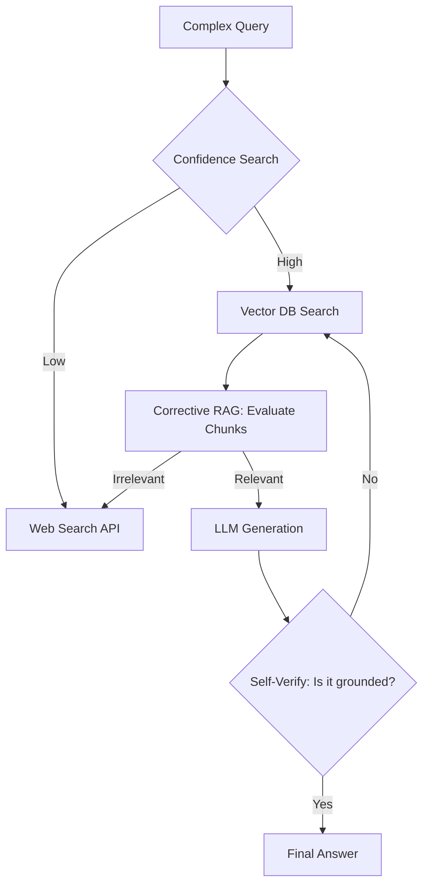

# 🚀 Advanced RAG Patterns: State-of-the-Art Retrieval
> **Objective:** Un sophisticated architectural patterns ko master karo jo RAG ko simple search se aage le jaate hain—Self-RAG aur Corrective RAG se lekar Agentic aur Multi-Hop retrieval tak | **Language:** Hinglish | **Standard:** 2026 Expert Framework

---

## 🧭 1. Shuruaat Ke Liye Aasan Hinglish Samjhaai (Beginner-Friendly Hinglish Explanation)
Advanced RAG ka matlab hai "Simple search ko ek 'Smart Robot' mein badalna jo khud decide karta hai ki use kya chahiye".

- **Simple RAG:** User Query $\rightarrow$ Search $\rightarrow$ Answer. (Bahut basic).
- **Advanced RAG:** 
  - **Self-RAG:** Model khud check karta hai ki kya retrieved info sahi hai? Agar nahi, toh wo phir se search karta hai.
  - **Multi-hop:** Agar ek sawal ka answer 3 alag files mein hai, toh model ek-ek karke unhe "Dhoondta" hai.
- **Intuition:** Ye ek "Junior Intern" aur ek "Senior Researcher" ke beech ka fark hai. Senior Researcher har answer ko verify karta hai aur gehri research karta hai.

---

## 🧠 2. Gehri Technical Samjhaai (Deep Technical Explanation)
SOTA (State-of-the-Art) RAG architectures **Iteration aur Verification** par focus karte hain:

1. **Self-RAG (Reflection):** Model specialized "Reflection Tokens" use karta hai evaluate karne ke liye:
   - Kya retrieval zaroori hai?
   - Kya retrieved document relevant hai?
   - Kya final answer document dwara supported hai?
2. **Corrective RAG (CRAG):** Ek system jo retrieval ki "Confidence" ko evaluate karta hai. Agar low confidence hai, toh missing information dhundhne ke liye web search trigger karta hai.
3. **Multi-Hop Retrieval:** Complex queries ke liye jaise "Who is the CEO of the company that bought X?", system pehle X ka buyer dhondhta hai, phir us buyer ka CEO dhondhta hai.
4. **Parent-Document Retrieval:** Search ke liye chhote chunks store karna, lekin LLM ko better context dene ke liye poora "Parent" document retrieve karna.

---

## 📐 3. Ganitik Soch (Mathematical Intuition)
**Confidence-based Routing:** Agar retrieval score $S < \tau$ (ek threshold), toh hum Vector Search se "Fallback" mechanism (jaise Web Search ya bada model) par switch karte hain.
$$\text{Action} = \begin{cases} \text{Use RAG} & \text{if } S \geq \tau \\ \text{Web Search} & \text{if } S < \tau \end{cases}$$
Ye LLM ko low-quality search results ke basis par "Guess" karne se rokta hai.

---

## 🏗️ 4. Architecture Diagrams (Sanrachna Chitra)

```mermaid
graph TD
    User[Complex Query] --> Route{Confidence Search}
    Route -->|Low| Web[Web Search API]
    Route -->|High| Vector[Vector DB Search]
    Vector --> CRAG[Corrective RAG: Evaluate Chunks]
    CRAG -->|Irrelevant| Web
    CRAG -->|Relevant| LLM[LLM Generation]
    LLM --> Verify{Self-Verify: Is it grounded?}
    Verify -->|No| Vector
    Verify -->|Yes| Final[Final Answer]
```

---

## 💻 5. Utpadan Ke Liye Taiyar Udaaharan (Production-Ready Examples)
2026 mein **Multi-Step Agentic RAG** pattern:
```python
# Using a state-machine approach (e.g., LangGraph)
def research_agent(query):
    state = "init"
    context = []
    while state != "end":
        if state == "init":
            # Plan the research
            plan = llm.invoke(f"Plan research for: {query}")
            state = "search"
        elif state == "search":
            # Perform targeted search
            new_info = search_db(plan.next_step)
            context.append(new_info)
            if llm_check_done(context): state = "end"
            else: update_plan()
    return generate_answer(query, context)
```

---

## 🌍 6. Vastavik Duniya Ke Upayog (Real-World Use Cases)
- **Scientific Discovery:** 10 related papers par research karna aur ek naya hypothesis synthesize karna.
- **Cybersecurity Audit:** Millions of logs across 5 different systems mein se ek single attack path dhundhna.
- **Financial Forensics:** Multiple bank statements aur entities ke through ek transaction trace karna.

---

## ❌ 7. Kamzori Ke Mamle (Failure Cases)
- **The "Research Loop":** Agent search karta rehta hai aur kabhi nahi rukta kyunki wo "The Perfect Answer" dhundh raha hai. **Solution: Max-Iteration limit set karo.**
- **Context Overload:** Multi-hop RAG bahut zyada info gather kar sakta hai, model confuse ho jata hai. **Solution: Har hop ke baad ek summarization step use karo.**

---

## 🛠️ 8. Samasya Samadhan Margdarshika (Debugging Guide)
| Samasya | Karan | Samadhan |
| :--- | :--- | :--- |
| **Agent bahut slow hai** | Bahut zyada LLM calls | Intermediate "Decision" steps ke liye **chhota model** use karo. |
| **Final answer disjointed (bikhra) hai** | Different sources ke chunks match nahi karte | Multi-doc summary ke liye specially trained **Synthesizer model** add karo. |

---

## ⚖️ 9. Samjhaute (Tradeoffs)
- **Advanced RAG (Bilkul Sahi / Deep reasoning / High Cost aur Latency).**
- **Simple RAG (Tez / Sasta / Complex logic mein fail).**

---

## 🛡️ 10. Suraksha Chintaen (Security Concerns)
- **Logic Hijacking:** Agent ke "Decision" step ko trick karna ki wo saare credits infinite web searches par kharach kar de.

---

## 📈 11. Scaling Ki Chunautiyaan (Scaling Challenges)
- **The State Management Problem:** Hazaaron concurrent users ke liye research "State" ka track rakhna ek robust persistent layer (jaise Redis) ki zaroorat hai.

---

## 💰 12. Kharcha Sambandhi Vichar (Cost Considerations)
- Ek Advanced RAG query ek simple query se $10x - 50x$ zyada kharch ho sakti hai kyunki isme "Thinking" aur "Verifying" ke liye multiple LLM calls hote hain.

---

## ✅ 13. Sabse Achchhi Practices (Best Practices)
- **LangGraph ya similar state-management tools ka upyog karo.**
- **Hamesha 'Kill Switch' provide karo.** Agents ko hamesha nahi chalne do.
- **'Contextual Caching' implement karo.** Agar do users similar multi-hop questions poochhte hain, toh research results reuse karo.

漫
---

## 📝 14. Interview Ke Sawaal (Interview Questions)
1. "Corrective RAG (CRAG) low-confidence search results ko kaise handle karta hai?"
2. "'Multi-Hop' retrieval ke concept ko ek udaharan ke saath samjhao."
3. "RAG system mein Knowledge Graph upyog karne ke kya labh hain?"

---

## 🚀 15. 2026 Ke Latest LLM Engineering Patterns
- **Active RAG (A-RAG):** Model answer likhne ke dauran continuously apne search query ko update karta hai.
- **Speculative RAG:** 5 different search paths ko parallel mein chalana aur end mein model ko best path choose karne dena.
漫
漫