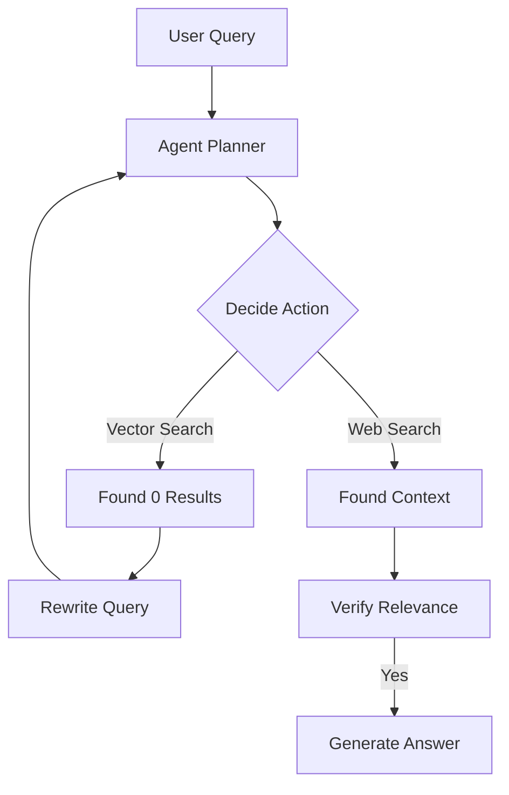

# Agentic RAG: Self-Governing Retrieval

## 1. Beginner-friendly Hinglish Explanation 🇮🇳
Bhai, normal RAG bilkul ek "Gullible" (Seedha-saadha) system hai. Tumne jo poocha, usne search kiya aur jo mila woh de diya, bhale hi woh bekaar ho. 

**Agentic RAG** ek "Smart Research Assistant" ki tarah hai. Jab tum kuch poochte ho, toh woh pehle "Plan" banata hai. Agar search results bekaar hain, toh woh "Search Query" badal kar dobara search karta hai. Agar use lagta hai ki use "Google Search" bhi karna chahiye, toh woh woh bhi karta hai. Yeh model sirf search nahi karta, balki search ki quality ko judge karta hai aur tab tak nahi rukta jab tak use sahi answer na mil jaye. Yeh RAG ka "Next Level" hai.

---

## 2. Deep Technical Explanation
Agentic RAG uses an LLM in a loop to control the retrieval process.
- **Routing**: Deciding which tool to use (e.g., Vector DB vs. SQL vs. Web Search).
- **Query Rewriting**: If initial results are poor, the agent rewrites the user query to be more "Search-friendly".
- **Self-Correction**: The agent reviews retrieved chunks and rejects irrelevant ones.
- **Multi-Step Retrieval**: Breaking a complex question into sub-questions and retrieving info for each step-by-step.

---

## 3. Mathematical Intuition
Agentic RAG is a **Markov Decision Process (MDP)**.
At each step $t$, the agent takes an action $a_t$ (Search, Summarize, Finish) based on current state $s_t$ (User query + already found info).
The objective is to maximize the final answer quality $Q$.
Unlike static RAG which is a single function $f(x) \to y$, Agentic RAG is a policy $\pi(a|s)$.

---

## 4. Architecture Diagrams


---

## 5. Production-ready Examples
Implementing an Agentic RAG loop with `LangGraph`:

```python
# Conceptual LangGraph structure
workflow = StateGraph(AgentState)

workflow.add_node("retrieve", retrieve_docs)
workflow.add_node("grade_docs", grade_retrieved_docs)
workflow.add_node("generate", generate_answer)

workflow.add_edge("retrieve", "grade_docs")
workflow.add_conditional_edges(
    "grade_docs",
    decide_to_generate,
    {
        "generate": "generate",
        "rewrite": "retrieve" # Loop back if docs are bad
    }
)
```

---

## 6. Real-world Use Cases
- **Technical Troubleshooting**: Searching through 100s of manuals, rewriting the error code until a match is found.
- **Market Research**: Combining internal sales data (SQL) with external news (Web Search).
- **Academic Writing**: Finding citations, checking their validity, and looking for counter-arguments.

---

## 7. Failure Cases
- **Infinite Loops**: The agent keeps rewriting the query and searching forever.
- **Tool Hallucination**: The agent tries to use a tool that doesn't exist or provides wrong arguments to the search function.

---

## 8. Debugging Guide
1. **Trace Analysis**: Use LangSmith or Arize Phoenix to see every step of the agent's thought process.
2. **Step Limits**: Always set a `max_iterations=5` to prevent the agent from burning through your API credits.

---

## 9. Tradeoffs
| Feature | Standard RAG | Agentic RAG |
|---|---|---|
| Latency | Fast (< 2s) | Slow (5s - 20s) |
| Cost | Low | High (Multiple LLM calls) |
| Accuracy | Medium | High |

---

## 10. Security Concerns
- **Agentic Escape**: If the agent is allowed to generate and run code (Code Interpreter) for data analysis, it could potentially be tricked into attacking the host system.

---

## 11. Scaling Challenges
- **Concurrency**: Managing hundreds of parallel "Reasoning" loops without hitting rate limits.

---

## 12. Cost Considerations
- **Token Multiplier**: Agentic RAG often uses 5x to 10x more tokens than standard RAG per user request.

---

## 13. Best Practices
- **Explicit Instruction**: Give the agent a "Persona" (e.g., "You are a picky librarian").
- **Structured Output**: Use Pydantic to ensure the agent's "Actions" are always in a valid JSON format.

---

## 14. Interview Questions
1. How does Agentic RAG solve the "No results found" problem?
2. What are the risks of using loops in RAG systems?

---

## 15. Latest 2026 Patterns
- **Corrective RAG (CRAG)**: A specific pattern that uses a "Evaluator" to decide if retrieved docs are good, ambiguous, or bad, and triggers web search for "bad" results.
- **Multi-Agent RAG**: One agent for retrieval, one for grading, and one for synthesis, all arguing to reach the best answer.
