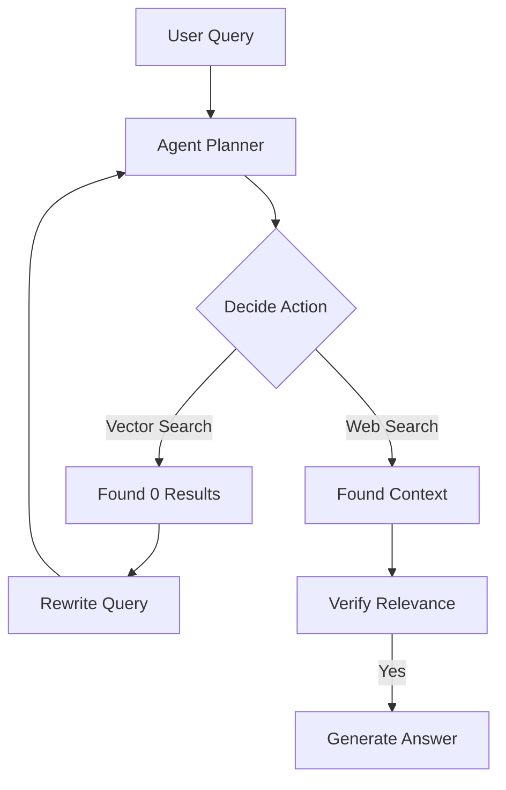

# Agentic RAG: Self-Governing Retrieval

## 1. Beginner-friendly Hinglish Explanation 🇮🇳
Bhai, normal RAG bilkul ek "Gullible" (Seedha-saadha) system hai. Tumne jo poocha, usne search kiya aur jo mila woh de diya, bhale hi woh bekaar ho. 

**Agentic RAG** ek "Smart Research Assistant" ki tarah hai. Jab tum kuch poochte ho, toh woh pehle "Plan" banata hai. Agar search results bekaar hain, toh woh "Search Query" badal kar dobara search karta hai. Agar use lagta hai ki use "Google Search" bhi karna chahiye, toh woh woh bhi karta hai. Yeh model sirf search nahi karta, balki search ki quality ko judge karta hai aur tab tak nahi rukta jab tak use sahi answer na mil jaye. Yeh RAG ka "Next Level" hai.

---

## 2. Deep Technical Explanation
Agentic RAG ek LLM ko loop mein use karta hai retrieval process ko control karne ke liye.
- **Routing**: Decide karna kaunsa tool use karna hai (e.g., Vector DB vs. SQL vs. Web Search).
- **Query Rewriting**: Agar initial results poor hain, toh agent user query ko rewrite karta hai taki woh zyada "Search-friendly" ho.
- **Self-Correction**: Agent retrieved chunks ko review karta hai aur irrelevant ones ko reject karta hai.
- **Multi-Step Retrieval**: Complex question ko sub-questions mein break karna aur har ek ke liye step-by-step info retrieve karna.

---

## 3. Mathematical Intuition
Agentic RAG ek **Markov Decision Process (MDP)** hai.
Har step $t$ par, agent current state $s_t$ (User query + already found info) ke basis par ek action $a_t$ (Search, Summarize, Finish) leta hai.
Objective hai final answer quality $Q$ ko maximize karna.
Static RAG ke opposite jo ek single function $f(x) \to y$ hai, Agentic RAG ek policy $\pi(a|s)$ hai.

---

## 4. Architecture Diagrams

```mermaid
graph TD
    Query[User Query] --> Planner[Agent Planner]
    Planner --> Action{Decide Action}
    Action -- Vector Search --> Res1[Found 0 Results]
    Res1 --> Rewrite[Rewrite Query]
    Rewrite --> Planner
    Action -- Web Search --> Res2[Found Context]
    Res2 --> Verify[Verify Relevance]
    Verify -- Yes --> Final[Generate Answer]
```

---

## 5. Production-ready Examples
Agentic RAG loop ko implement karna `LangGraph` ke saath:

```python
# Conceptual LangGraph structure
workflow = StateGraph(AgentState)

workflow.add_node("retrieve", retrieve_docs)
workflow.add_node("grade_docs", grade_retrieved_docs)
workflow.add_node("generate", generate_answer)

workflow.add_edge("retrieve", "grade_docs")
workflow.add_conditional_edges(
    "grade_docs",
    decide_to_generate,
    {
        "generate": "generate",
        "rewrite": "retrieve" # Loop back if docs are bad
    }
)
```

---

## 6. Real-world Use Cases
- **Technical Troubleshooting**: 100s of manuals mein search karna, error code ko rewrite karna jab tak match na mil jaye.
- **Market Research**: Internal sales data (SQL) ko external news (Web Search) ke saath combine karna.
- **Academic Writing**: Citations dhundhna, unki validity check karna, aur counter-arguments dhundhna.

---

## 7. Failure Cases
- **Infinite Loops**: Agent query ko rewrite karta rehta hai aur hamesha search karta rehta hai.
- **Tool Hallucination**: Agent aisa tool use karne ki koshish karta hai jo exist nahi karta ya search function ko wrong arguments provide karta hai.

---

## 8. Debugging Guide
1. **Trace Analysis**: Agent ke thought process ke har step ko dekhne ke liye LangSmith ya Arize Phoenix ka use karein.
2. **Step Limits**: Hamesha `max_iterations=5` set karein taaki agent aapke API credits ko burn na kare.

---

## 9. Tradeoffs
| Feature | Standard RAG | Agentic RAG |
|---|---|---|
| Latency | Fast (< 2s) | Slow (5s - 20s) |
| Cost | Low | High (Multiple LLM calls) |
| Accuracy | Medium | High |

---

## 10. Security Concerns
- **Agentic Escape**: Agar agent ko data analysis ke liye code generate aur run karne diya jaye (Code Interpreter), toh yeh potentially host system par attack karne ke liye trick ho sakta hai.

---

## 11. Scaling Challenges
- **Concurrency**: Rate limits ko hit kiye bina hundreds of parallel "Reasoning" loops ko manage karna.

---

## 12. Cost Considerations
- **Token Multiplier**: Agentic RAG often 5x to 10x zyada tokens use karta hai standard RAG se per user request.

---

## 13. Best Practices
- **Explicit Instruction**: Agent ko ek "Persona" dein (e.g., "You are a picky librarian").
- **Structured Output**: Pydantic ka use karein taaki agent ke "Actions" hamesha valid JSON format mein hon.

---

## 14. Interview Questions
1. Agentic RAG "No results found" problem ko kaise solve karta hai?
2. RAG systems mein loops use karne ke risks kya hain?

---

## 15. Latest 2026 Patterns
- **Corrective RAG (CRAG)**: Ek specific pattern jo ek "Evaluator" use karta hai yeh decide karne ke liye ki retrieved docs good, ambiguous, ya bad hain, aur "bad" results ke liye web search trigger karta hai.
- **Multi-Agent RAG**: Ek agent retrieval ke liye, ek grading ke liye, aur ek synthesis ke liye, sab best answer tak pahunchne ke liye arguing karte hain.