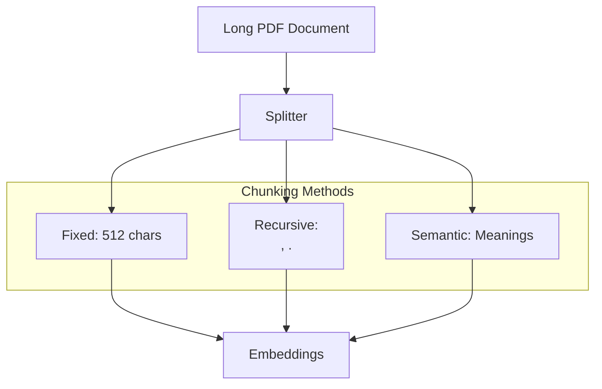

# Chunking Strategies: The Art of Splitting Text

## 1. Beginner-friendly Hinglish Explanation 🇮🇳
Bhai, socho tumhe ek 500-page ki book ke basis par RAG banana hai. Tum poori book ek saath prompt mein nahi daal sakte. Tumhe use chote-chote tukdon mein baantna padega (Chunks). 

Lekin tukde kaise karein? Agar tumne ek sentence beech mein se kaat diya, toh uska matlab (context) khatam ho jayega. **Chunking Strategies** wahi "Kala" (Art) hai jahan hum decide karte hain ki text ko kaise kaatein taaki uska meaning salamat rahe. Sahi chunking ke bina, tumhara RAG "Dabba gul" (fails) ho jayega kyunki use sahi context nahi milega.

---

## 2. Deep Technical Explanation
Chunking is the process of breaking down long documents into smaller, meaningful segments for embedding and retrieval.
- **Fixed-size Chunking**: Splitting by character or token count (e.g., every 512 tokens). Fast but breaks sentences.
- **Recursive Character Chunking**: Splits by a list of characters (e.g., `\n\n`, `\n`, `.`, ` `) to keep paragraphs and sentences together.
- **Semantic Chunking**: Uses a model to find "Meaningful breaks" in the text by measuring the cosine similarity between adjacent sentences.
- **Overlap**: Keeping a small portion of the previous chunk in the current one (e.g., 10-20%) to maintain continuity.

---

## 3. Mathematical Intuition
Semantic Chunking logic:
1. Split document into individual sentences $S_1, S_2, ..., S_n$.
2. Calculate embedding $E_i$ for each sentence.
3. Calculate distance $D_i = 1 - \cos(E_i, E_{i+1})$.
4. If $D_i > \text{threshold}$, create a chunk boundary.
This ensures each chunk is a "Coherent Island of Meaning".

---

## 4. Architecture Diagrams


---

## 5. Production-ready Examples
Using `LangChain` for recursive chunking:

```python
from langchain.text_splitter import RecursiveCharacterTextSplitter

text = "Deep Learning is a subset of Machine Learning. It uses Neural Networks..."

text_splitter = RecursiveCharacterTextSplitter(
    chunk_size = 500,
    chunk_overlap  = 50, # Keeps context across chunks
    length_function = len,
    separators = ["\n\n", "\n", " ", ""]
)

chunks = text_splitter.split_text(text)
print(f"Number of chunks: {len(chunks)}")
```

---

## 6. Real-world Use Cases
- **Customer Support**: Chunking help articles so the bot can cite the exact paragraph.
- **Legal Analysis**: Splitting contracts by clauses/articles.
- **Coding**: Chunking by function or class definitions using AST (Abstract Syntax Tree).

---

## 7. Failure Cases
- **Context Fragmentation**: A chunk says "He was born in Paris", but the previous chunk has the name "Napoleon". The model won't know who "He" is.
- **Too Large Chunks**: Dilutes the semantic meaning, making retrieval less precise.

---

## 8. Debugging Guide
1. **Retrieve & Read**: Manually check the top 5 chunks. If they look "incomplete" or cut off mid-sentence, increase your overlap.
2. **Chunk Size Tuning**: If your model is "forgetting" facts, try smaller, more focused chunks.

---

## 9. Tradeoffs
| Method | Accuracy | Speed |
|---|---|---|
| Fixed | Low | Very Fast |
| Recursive | Medium | Fast |
| Semantic | High | Slow (requires LLM/Embedding) |

---

## 10. Security Concerns
- **Chunk Leakage**: If chunks contain PII, an attacker can use RAG to retrieve and extract private data piece by piece.

---

## 11. Scaling Challenges
- **Massive PDF collections**: Processing millions of pages with semantic chunking can take a huge amount of GPU compute.

---

## 12. Cost Considerations
- **Storage Cost**: More chunks = more vectors = higher vector DB bill.
- **Embedding Cost**: Overlapping chunks means you embed some text twice, increasing API costs.

---

## 13. Best Practices
- **Use Overlap**: 10-15% is the sweet spot.
- **Context Enrichment**: Prepend the document title or summary to every chunk so the model knows where it came from.
- **Metadata Tagging**: Store page numbers, sources, and timestamps with each chunk.

---

## 14. Interview Questions
1. Why is "Overlap" important in RAG chunking?
2. How does Recursive Character splitting differ from simple character splitting?

---

## 15. Latest 2026 Patterns
- **Agentic Chunking**: Letting an LLM decide where to split the document for optimal retrieval.
- **Small-to-Big Retrieval**: Retrieving small chunks (for precision) but feeding the larger surrounding parent chunk (for context) to the LLM.
