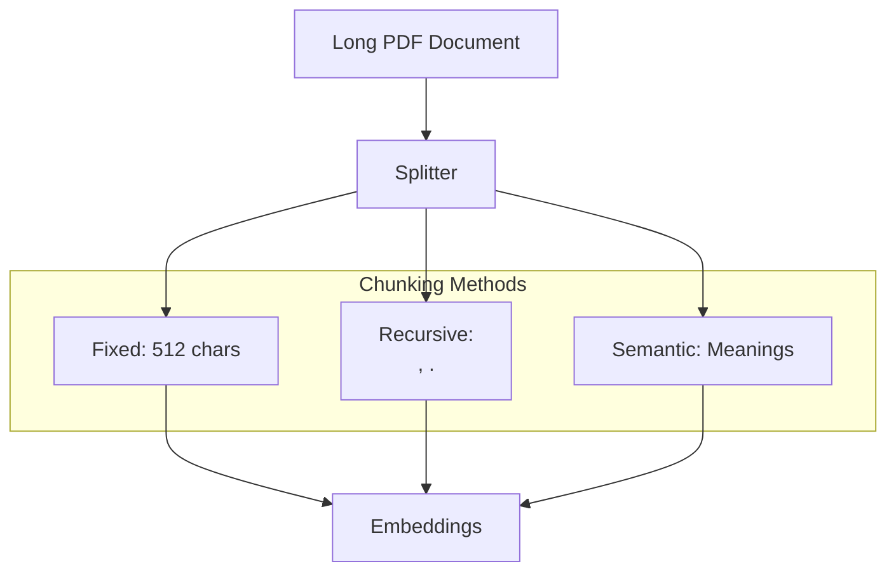

# Chunking Strategies: Text ko kaatne ki Kala

## 1. Beginner-friendly Hinglish Explanation 🇮🇳
Bhai, socho tumhe ek 500-page ki book ke basis par RAG banana hai. Tum poori book ek saath prompt mein nahi daal sakte. Tumhe use chote-chote tukdon mein baantna padega (Chunks). 

Lekin tukde kaise karein? Agar tumne ek sentence beech mein se kaat diya, toh uska matlab (context) khatam ho jayega. **Chunking Strategies** wahi "Kala" (Art) hai jahan hum decide karte hain ki text ko kaise kaatein taaki uska meaning salamat rahe. Sahi chunking ke bina, tumhara RAG "Dabba gul" (fails) ho jayega kyunki use sahi context nahi milega.

---

## 2. Gehri Technical Explanation
Chunking long documents ko chhote, meaningful segments mein todne ka process hai embedding aur retrieval ke liye.
- **Fixed-size Chunking**: Character ya token count ke hisaab se splitting (jaise, har 512 tokens). Fast hai lekin sentences tod deta hai.
- **Recursive Character Chunking**: Characters ki list ke hisaab se split karta hai (jaise `\n\n`, `\n`, `.`, ` `) taaki paragraphs aur sentences saath rahein.
- **Semantic Chunking**: Ek model use karta hai text mein "Meaningful breaks" dhundhne ke liye adjacent sentences ke beech cosine similarity measure karke.
- **Overlap**: Previous chunk ka ek chhota hissa current chunk mein rakhna (jaise 10-20%) continuity maintain karne ke liye.

---

## 3. Ganitik Samajh
Semantic Chunking ka logic:
1. Document ko individual sentences mein split karo $S_1, S_2, ..., S_n$.
2. Har sentence ke liye embedding $E_i$ calculate karo.
3. Distance calculate karo $D_i = 1 - \cos(E_i, E_{i+1})$.
4. Agar $D_i > \text{threshold}$, toh chunk boundary banao.
Isse ensure hota hai ki har chunk ek "Coherent Island of Meaning" hai.

---

## 4. Architecture ke Diagrams

```mermaid
graph TD
    Doc[Long PDF Document] --> Split[Splitter]
    subgraph "Chunking Methods"
        Fixed[Fixed: 512 chars]
        Rec[Recursive: \n, .]
        Sem[Semantic: Meanings]
    end
    Split --> Fixed & Rec & Sem
    Fixed & Rec & Sem --> Vector[Embeddings]
```

---

## 5. Production-ready Udaharan
Recursive chunking ke liye `LangChain` ka upyog karte hue:

```python
from langchain.text_splitter import RecursiveCharacterTextSplitter

text = "Deep Learning is a subset of Machine Learning. It uses Neural Networks..."

text_splitter = RecursiveCharacterTextSplitter(
    chunk_size = 500,
    chunk_overlap  = 50, # Keeps context across chunks
    length_function = len,
    separators = ["\n\n", "\n", " ", ""]
)

chunks = text_splitter.split_text(text)
print(f"Number of chunks: {len(chunks)}")
```

---

## 6. Vastavik Duniya Mein Use Cases
- **Customer Support**: Help articles ko chunk karna taaki bot exact paragraph cite kar sake.
- **Legal Analysis**: Contracts ko clauses/articles ke hisaab se split karna.
- **Coding**: Functions ya class definitions ke hisaab se chunk karna using AST (Abstract Syntax Tree).

---

## 7. Viphalata ke Mamle
- **Context Fragmentation**: Ek chunk kehti hai "He was born in Paris", lekin previous chunk mein naam hai "Napoleon". Model nahi jaantega "He" kaun hai.
- **Too Large Chunks**: Semantic meaning dilute ho jata hai, jisse retrieval less precise ho jata hai.

---

## 8. Samasya Nivaaran Guide
1. **Retrieve & Read**: Manually top 5 chunks check karo. Agar woh "incomplete" ya mid-sentence mein cut off dikhte hain, toh overlap badhao.
2. **Chunk Size Tuning**: Agar aapka model facts "forget" kar raha hai, toh smaller, more focused chunks try karo.

---

## 9. Samjhauta
| Method | Accuracy | Speed |
|---|---|---|
| Fixed | Kam | Bahut Tez |
| Recursive | Madhyam | Tez |
| Semantic | Zyada | Dheema (LLM/Embedding chahiye) |

---

## 10. Suraksha ki Chintayen
- **Chunk Leakage**: Agar chunks mein PII ho, toh attacker RAG use karke private data piece by piece retrieve aur extract kar sakta hai.

---

## 11. Badhotri ki Chunotiyan
- **Massive PDF collections**: Millions of pages ko semantic chunking se process karne mein GPU compute kaafi zyada lagta hai.

---

## 12. Kharch ke Vichar
- **Storage Cost**: Zyada chunks = zyada vectors = vector DB bill zyada.
- **Embedding Cost**: Overlapping chunks ka matlab hai aap kuch text do baar embed karte hain, jisse API costs badh jaate hain.

---

## 13. Sabse Achhe Tariqe
- **Use Overlap**: 10-15% sweet spot hai.
- **Context Enrichment**: Har chunk mein document title ya summary prepend karo taaki model ko pata ho ki yeh kahan se aaya.
- **Metadata Tagging**: Har chunk ke saath page numbers, sources, aur timestamps store karo.

---

## 14. Interview ke Prashn
1. RAG chunking mein "Overlap" kyun important hai?
2. Recursive Character splitting simple character splitting se kaise alag hai?

---

## 15. 2026 ke Latest Patterns
- **Agentic Chunking**: LLM ko decide karne dena ki document ko kahan split karna hai optimal retrieval ke liye.
- **Small-to-Big Retrieval**: Small chunks retrieve karna (precision ke liye) lekin surrounding parent chunk (context ke liye) LLM ko feed karna.