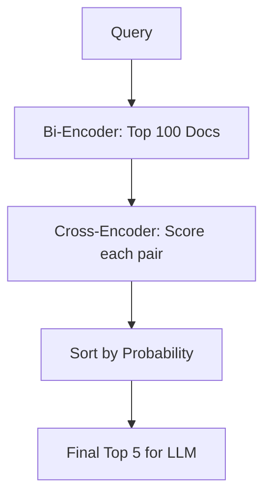

# Cross-Encoder Reranking: Precision Retrieval

## 1. Beginner-friendly Hinglish Explanation 🇮🇳
Bhai, socho tum ek HR manager ho aur tumhe 10,000 resumes mein se 1 best candidate chunna hai. 
1. Pehle tumne ek "Filter" lagaya aur 100 resumes select kiye (Yeh hai **Bi-Encoder / Vector Search**—Tez hai lekin rough hai). 
2. Phir tumne un 100 resumes ko ek-ek karke dhyan se padha aur compare kiya (Yeh hai **Cross-Encoder**—Sasta nahi hai, time leta hai, lekin result 100% accurate deta hai).

Reranking wahi process hai jahan hum retrieval ke baad top results ko "Dhyan se" dobara check karte hain. Iske bina tumhara RAG system "Sahi document" toh dhund lega, lekin use "Pehle number" par nahi dikha payega.

---

## 2. Deep Technical Explanation
In RAG pipelines, retrieval is often a multi-stage process.
- **Bi-Encoder (Retriever)**: Encodes query and docs independently. Fast ($O(1)$ search with ANN).
- **Cross-Encoder (Reranker)**: Feeds the query and document *together* into a single Transformer. It sees the interaction between every word in the query and every word in the doc.
- **Why it's better**: It uses full self-attention across the query-document pair, capturing nuances that embeddings miss.

---

## 3. Mathematical Intuition
Bi-Encoder: $s = \cos(f(q), f(d))$ - Separate embeddings.
Cross-Encoder: $s = f(q, d)$ - Combined processing.
The Cross-Encoder acts as a **Binary Classifier** (Is this doc relevant to this query? Yes/No) and outputs a probability score. Since it's $O(N \cdot M)$ where $N$ is query length and $M$ is doc length, we can only run it on a small number of documents (usually top 10-50).

---

## 4. Architecture Diagrams


---

## 5. Production-ready Examples
Using `SentenceTransformers` for reranking:

```python
from sentence_transformers import CrossEncoder

model = CrossEncoder('cross-encoder/ms-marco-MiniLM-L-6-v2')

query = "How to optimize LLM inference?"
documents = [
    "You can use quantization and KV cache.",
    "The weather in Paris is nice.",
    "Flash Attention is a key optimization."
]

# Rerank
scores = model.predict([(query, doc) for doc in documents])

# Sort results
results = sorted(zip(scores, documents), reverse=True)
for score, doc in results:
    print(f"Score: {score:.4f} | Doc: {doc}")
```

---

## 6. Real-world Use Cases
- **Enterprise Search**: Where retrieving the "Second best" document instead of the "Best" is a failure.
- **Legal/Compliance**: Ensuring the exact clause is presented to the user.

---

## 7. Failure Cases
- **Latency Spikes**: Adding a reranker can add 100ms-500ms to the search time.
- **Context Limits**: Cross-encoders have small context windows (usually 512 tokens), so they might miss relevant info if the chunk is too long.

---

## 8. Debugging Guide
1. **MRR (Mean Reciprocal Rank)**: Check if MRR increases after adding the reranker.
2. **Top-1 vs Top-5**: If the correct answer is in Top-5 but not Top-1, your reranker needs better fine-tuning.

---

## 9. Tradeoffs
| Metric | Bi-Encoder (Search) | Cross-Encoder (Rerank) |
|---|---|---|
| Speed | < 10ms | 100ms - 500ms |
| Accuracy | Medium | Very High |
| Scalability | Billions | Tens/Hundreds |

---

## 10. Security Concerns
- **Relevance Hijacking**: Crafting a document that "looks" extremely relevant to a Cross-Encoder (by repeating query keywords in context) to push it to the top.

---

## 11. Scaling Challenges
- **Throughput**: For a high-traffic site, you need a large GPU cluster just to run the reranking step for every user query.

---

## 12. Cost Considerations
- **Compute cost**: Reranking consumes significantly more GPU FLOPs per query compared to simple vector lookups.

---

## 13. Best Practices
- **Retrieve 100, Rerank 25**: Don't rerank too many documents; it's a waste of time.
- **Use specialized models**: Models trained on MS-MARCO are the industry standard for reranking.

---

## 14. Interview Questions
1. Why can't we use a Cross-Encoder for the initial retrieval step?
2. How does the interaction between query and document differ in Bi-encoders vs Cross-encoders?

---

## 15. Latest 2026 Patterns
- **Late Interaction (ColBERT)**: A middle-ground that provides Cross-Encoder accuracy with Bi-Encoder speed.
- **LLM-as-a-Reranker**: Using GPT-4o-mini or a fine-tuned Llama-3-8B to rerank documents by simply asking "Is this relevant?".
