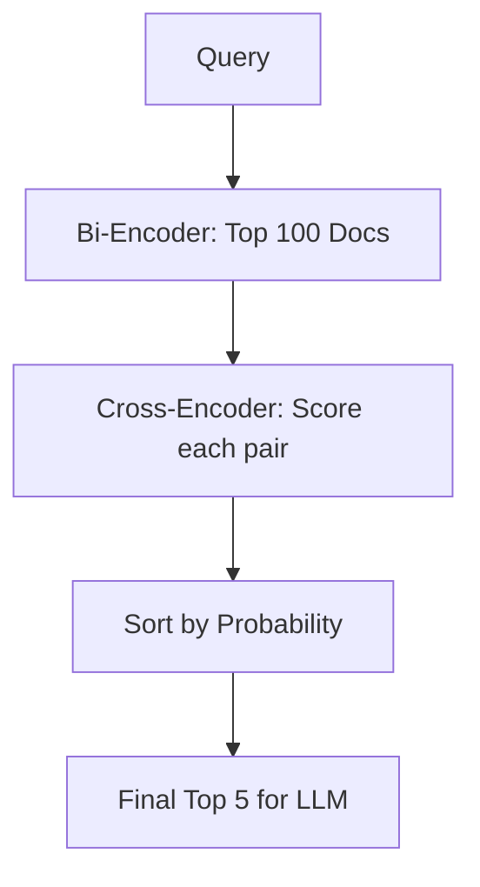

# Cross-Encoder Reranking: Precision Retrieval

## 1. Shuruati Hinglish Samjhaai 🇮🇳
Bhai, socho tum ek HR manager ho aur tumhe 10,000 resumes mein se 1 best candidate chunna hai. 
1. Pehle tumne ek "Filter" lagaya aur 100 resumes select kiye (Yeh hai **Bi-Encoder / Vector Search**—Tez hai lekin rough hai). 
2. Phir tumne un 100 resumes ko ek-ek karke dhyan se padha aur compare kiya (Yeh hai **Cross-Encoder**—Sasta nahi hai, time leta hai, lekin result 100% accurate deta hai).

Reranking wahi process hai jahan hum retrieval ke baad top results ko "Dhyan se" dobara check karte hain. Iske bina tumhara RAG system "Sahi document" toh dhund lega, lekin use "Pehle number" par nahi dikha payega.

---

## 2. Deep Technical Samjhaai
RAG pipelines me, retrieval aksar multi-stage process hota hai.
- **Bi-Encoder (Retriever)**: Query aur documents ko independently encode karta hai. Fast hai ($O(1)$ search with ANN).
- **Cross-Encoder (Reranker)**: Query aur document ko *ek saath* ek single Transformer me feed karta hai. Ye query ke har word aur doc ke har word ke beech interaction dekhta hai.
- **Ye kyun behtar hai**: Ye full self-attention use karta hai query-document pair par, aise nuances capture karta hai jo embeddings miss karte hain.

---

## 3. Mathematical Samajh
Bi-Encoder: $s = \cos(f(q), f(d))$ - Alag embeddings.
Cross-Encoder: $s = f(q, d)$ - Sanyukt processing.
Cross-Encoder **Binary Classifier** ki tarah act karta hai (Kya ye doc is query ke liye relevant hai? Haan/Nahi) aur probability score output karta hai. Kyunki ye $O(N \cdot M)$ hai (jahaan $N$ query length hai aur $M$ doc length hai), hum ise sirf limited number of documents (usually top 10-50) par hi chala sakte hain.

---

## 4. Architecture Diagrams

```mermaid
graph TD
    Q[Query] --> Retriever[Bi-Encoder: Top 100 Docs]
    Retriever --> Reranker[Cross-Encoder: Score each pair]
    Reranker --> Sort[Sort by Probability]
    Sort --> Top5[Final Top 5 for LLM]
```

---

## 5. Production-ready Udaharan
SentenceTransformers ka use karte hue reranking ke liye:

```python
from sentence_transformers import CrossEncoder

model = CrossEncoder('cross-encoder/ms-marco-MiniLM-L-6-v2')

query = "How to optimize LLM inference?"
documents = [
    "You can use quantization and KV cache.",
    "The weather in Paris is nice.",
    "Flash Attention is a key optimization."
]

# Rerank
scores = model.predict([(query, doc) for doc in documents])

# Sort results
results = sorted(zip(scores, documents), reverse=True)
for score, doc in results:
    print(f"Score: {score:.4f} | Doc: {doc}")
```

---

## 6. Real-world Upyog Ke Mamle
- **Enterprise Search**: Jahaan "Best" document ki jagah "Second best" retrieve karna failure maana jaata hai.
- **Legal/Compliance**: Exact clause user ko present ho, iska dhyan rakhna.

---

## 7. Failure Cases
- **Latency Spikes**: Reranker add karne se search time me 100ms-500ms ka add ho sakta hai.
- **Context Limits**: Cross-encoders ka context window chhota hota hai (usually 512 tokens), isliye agar chunk bahut lamba hai toh relevant info miss ho sakti hai.

---

## 8. Debugging Guide
1. **MRR (Mean Reciprocal Rank)**: Check karo ki reranker add karne ke baad MRR badha ya nahi.
2. **Top-1 vs Top-5**: Agar correct answer Top-5 me hai lekin Top-1 me nahi, toh tumhara reranker better fine-tuning maang raha hai.

---

## 9. Tradeoffs
| Metric | Bi-Encoder (Search) | Cross-Encoder (Rerank) |
|---|---|---|
| Speed | < 10ms | 100ms - 500ms |
| Accuracy | Medium | Very High |
| Scalability | Billions | Tens/Hundreds |

---

## 10. Security Chintaen
- **Relevance Hijacking**: Aisa document banana jo Cross-Encoder ko "extremely relevant" lage (query keywords ko context me repeat karke) taaki wo top par aa jaye.

---

## 11. Scaling Challenges
- **Throughput**: Ek high-traffic site ke liye, har user query ke liye reranking step chalane ke liye hi badi GPU cluster ki zaroorat hoti hai.

---

## 12. Cost Khayal
- **Compute cost**: Simple vector lookups ke comparison me, reranking prati query significantly zyada GPU FLOPs consume karta hai.

---

## 13. Best Practices
- **Retrieve 100, Rerank 25**: Zyada documents ko rerank mat karo; ye time waste hai.
- **Use specialized models**: MS-MARCO par trained models reranking ke liye industry standard hain.

---

## 14. Interview Sawal
1. Initial retrieval step me Cross-Encoder kyun nahi use kar sakte?
2. Bi-encoders aur Cross-encoders me query aur document ke beech interaction kaise differ karta hai?

---

## 15. Latest 2026 Patterns
- **Late Interaction (ColBERT)**: Ek middle-ground jo Cross-Encoder accuracy aur Bi-Encoder speed provide karta hai.
- **LLM-as-a-Reranker**: GPT-4o-mini ya fine-tuned Llama-3-8B ka use karke documents ko rerank karna, bas "Kya ye relevant hai?" pooch kar.