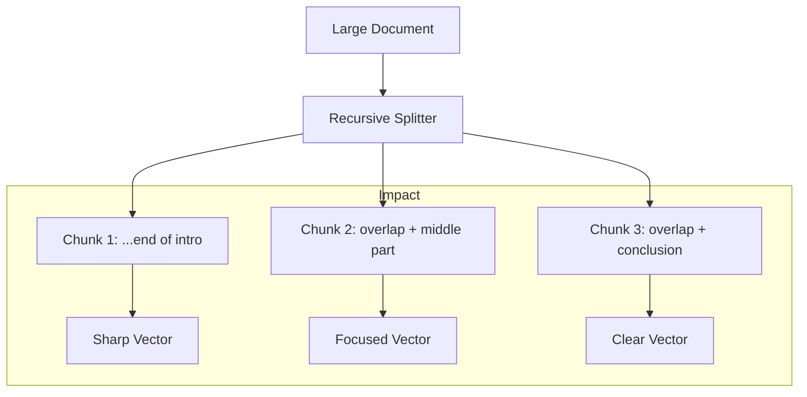

# ✂️ Document Chunking Strategies: The Art of Splitting Text
> **Objective:** Master the techniques of dividing large documents into optimal segments for RAG, balancing semantic coherence with retrieval precision and context window constraints | **Language:** Hinglish | **Standard:** 2026 Expert Framework

---

## 🧭 1. Beginner-Friendly Hinglish Explanation
Chunking ka matlab hai "Bade document ko sahi tarike se kaatna".

- **The Problem:** Ek 500-page ki book ko aap ek sath LLM mein nahi bhej sakte (Context limit). Aur agar pura page ek vector banega, toh uske "Specific details" kho jayenge.
- **The Solution:** Chunking. 
  - Hum document ko chote-chote "Dabbo" (Chunks) mein todte hain.
  - Har dabba itna bada hona chahiye ki usme "Matlab" (Context) bana rahe, par itna chota ho ki search accurate ho.
- **Intuition:** Ye ek "Pizza" kaatne jaisa hai. Slice itni badi ho ki pet bhare, par itni choti ki aap use aaram se kha sakein.

---

## 🧠 2. Deep Technical Explanation
Chunking is the most underrated part of RAG. There are four main strategies:

1. **Fixed-Size Chunking:** Splitting by a fixed number of characters or tokens (e.g., 500 tokens). Simple but often cuts mid-sentence.
2. **Recursive Character Chunking:** Splitting by a list of separators (e.g., `\n\n`, `\n`, ` `, ``). It tries to keep paragraphs and sentences together. (The industry standard).
3. **Semantic Chunking:** Using an embedding model to find "Natural breaks" in the meaning of the text. It splits when the topic changes.
4. **Structure-Aware Chunking:** Using Markdown or HTML headers to split. (e.g., every `###` is a new chunk).

---

## 📐 3. Mathematical Intuition
**The Overlap ($O$):**
To ensure no context is lost at the boundary of two chunks, we overlap them by $10-20\%$.
If chunk size is $C$ and overlap is $O$:
$$\text{Next Chunk Start} = \text{Current Chunk Start} + (C - O)$$
Overlap ensures that if a key fact is split at the end of Chunk A, it is also fully present at the start of Chunk B.

---

## 🏗️ 4. Architecture Diagrams


---

## 💻 5. Production-Ready Examples
Using `LangChain`'s Recursive Splitter (Best for 2026):
```python
from langchain.text_splitter import RecursiveCharacterTextSplitter

text = "Your very long document text..."

splitter = RecursiveCharacterTextSplitter(
    chunk_size=500, # Tokens/Chars
    chunk_overlap=50, # Keep some context from previous chunk
    separators=["\n\n", "\n", ".", " ", ""] # Priority list
)

chunks = splitter.split_text(text)
print(f"Created {len(chunks)} chunks.")
```

---

## 🌍 6. Real-World Use Cases
- **Customer Support:** Chunking a "Troubleshooting Guide" by each specific problem title.
- **Financial Reports:** Chunking by "Quarterly Results" sections to ensure numbers aren't mixed up.

---

## ❌ 7. Failure Cases
- **Broken Logic:** If you split in the middle of a "Not" (e.g., "This drug is [split] NOT safe"), the first chunk might say the drug is safe. **Fix: Use Overlap and Sentence-splitting.**
- **Table Chaos:** Standard chunking destroys Markdown or CSV tables. **Fix: Use specialized Table-Parsers.**

---

## 🛠️ 8. Debugging Guide
| Problem | Reason | Solution |
| :--- | :--- | :--- |
| **Model loses context** | Chunk size too small | Increase **chunk_size** to 500-1000. |
| **Search returns too much noise** | Chunk size too large | Decrease **chunk_size** and increase **overlap**. |

---

## ⚖️ 9. Tradeoffs
- **Small Chunks (Precise search / Lost context)** vs **Large Chunks (Great context / Noisy search).**

---

## 🛡️ 10. Security Concerns
- **Context Injection:** Crafting a document that, when chunked, creates a specific malicious instruction that is highly likely to be retrieved.

---

## 📈 11. Scaling Challenges
- **Dynamic Chunking:** Handling 100 different file types (PDF, Word, Code) requires 100 different chunking strategies.

---

## 💰 12. Cost Considerations
- More chunks = More vectors = Higher Vector DB bill. Don't over-chunk if your documents are already short.

---

## ✅ 13. Best Practices
- **Use 10-15% Overlap.** 
- **Chunk by Logic.** If it's code, chunk by functions. If it's a legal doc, chunk by clauses.
- **Save Metadata.** Always keep the original filename and page number with every chunk.

漫
---

## 📝 14. Interview Questions
1. "Why is Recursive Character Chunking better than Fixed-Size Chunking?"
2. "What is the role of 'Overlap' in document chunking?"
3. "How would you handle chunking for a table in a PDF?"

---

## 🚀 15. Latest 2026 LLM Engineering Patterns
- **LLM-Based Chunking:** Using a small model to read the document and say: "Split here, this is a new topic."
- **Late Chunking:** Embedding the entire document first and then splitting the embeddings based on attention density (Very advanced).
漫
