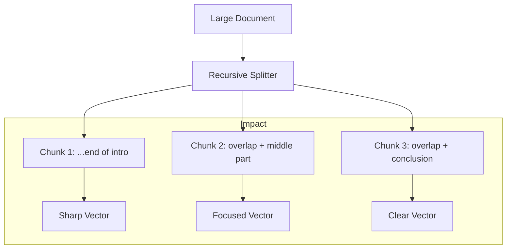

# ✂️ Document Chunking Strategies: Text Ko Kaatne Ki Kala
> **Objective:** Bade documents ko RAG ke liye optimal segments mein divide karne ki techniques master karna, semantic coherence aur retrieval precision aur context window constraints ko balance karte hue | **Language:** Hinglish | **Standard:** 2026 Expert Framework

---

## 🧭 1. Beginners Ke Liye Hinglish Samjhaai
Chunking ka matlab hai "Bade document ko sahi tarike se kaatna".

- **The Problem:** Ek 500-page ki book ko aap ek sath LLM mein nahi bhej sakte (Context limit). Aur agar pura page ek vector banega, toh uske "Specific details" kho jayenge.
- **The Solution:** Chunking. 
  - Hum document ko chote-chote "Dabbo" (Chunks) mein todte hain.
  - Har dabba itna bada hona chahiye ki usme "Matlab" (Context) bana rahe, par itna chota ho ki search accurate ho.
- **Intuition:** Ye ek "Pizza" kaatne jaisa hai. Slice itni badi ho ki pet bhare, par itni choti ki aap use aaram se kha sakein.

---

## 🧠 2. Gehra Technical Samjhaai
Chunking RAG ka sabse underrated part hai. Iski char main strategies hain:

1. **Fixed-Size Chunking:** Fixed number of characters ya tokens ke basis par split karna (e.g., 500 tokens). Simple hai par aksar beech sentence mein cut kar deta hai.
2. **Recursive Character Chunking:** Separators ki list ke hisaab se split karna (e.g., `\n\n`, `\n`, ` `, ``). Ye paragraphs aur sentences ko ek saath rakhne ki koshish karta hai. (Industry standard).
3. **Semantic Chunking:** Text ke meaning mein "Natural breaks" dhundhne ke liye embedding model ka upyog karna. Jab topic badalta hai tab split karta hai.
4. **Structure-Aware Chunking:** Markdown ya HTML headers ka upyog karke split karna. (e.g., har `###` ek naya chunk hai).

---

## 📐 3. Ganit Samjhaai
**The Overlap ($O$):**
Is baat ko pakka karne ke liye ki do chunks ki boundary par context lose na ho, hum unhe $10-20\%$ overlap karte hain.
Agar chunk size $C$ hai aur overlap $O$ hai:
$$\text{Next Chunk Start} = \text{Current Chunk Start} + (C - O)$$
Overlap yeh ensure karta hai ki agar ek important fact Chunk A ke end mein split ho jaye, toh woh Chunk B ke start mein bhi fully present ho.

---

## 🏗️ 4. Architecture Diagrams

```mermaid
graph TD
    Doc[Large Document] --> Rec[Recursive Splitter]
    Rec --> C1[Chunk 1: ...end of intro]
    Rec --> C2[Chunk 2: overlap + middle part]
    Rec --> C3[Chunk 3: overlap + conclusion]
    subgraph "Impact"
    C1 --> V1[Sharp Vector]
    C2 --> V2[Focused Vector]
    C3 --> V3[Clear Vector]
    end
```

---

## 💻 5. Production-Ready Examples
Using `LangChain`'s Recursive Splitter (Best for 2026):
```python
from langchain.text_splitter import RecursiveCharacterTextSplitter

text = "Your very long document text..."

splitter = RecursiveCharacterTextSplitter(
    chunk_size=500, # Tokens/Chars
    chunk_overlap=50, # Keep some context from previous chunk
    separators=["\n\n", "\n", ".", " ", ""] # Priority list
)

chunks = splitter.split_text(text)
print(f"Created {len(chunks)} chunks.")
```

---

## 🌍 6. Real-World Use Cases
- **Customer Support:** "Troubleshooting Guide" ko har specific problem title ke hisaab se chunk karna.
- **Financial Reports:** "Quarterly Results" sections ke hisaab se chunk karna taake numbers mix na ho.

---

## ❌ 7. Failure Cases
- **Broken Logic:** Agar aap "Not" ke beech mein split karte hain (e.g., "This drug is [split] NOT safe"), toh pehla chunk yeh kahega ki drug safe hai. **Fix: Overlap aur Sentence-splitting ka upyog karein.**
- **Table Chaos:** Standard chunking Markdown ya CSV tables ko kharab kar deta hai. **Fix: Specialized Table-Parsers ka upyog karein.**

---

## 🛠️ 8. Debugging Guide
| Problem | Reason | Solution |
| :--- | :--- | :--- |
| **Model context khota hai** | Chunk size bahut chota hai | **chunk_size** badhake 500-1000 karein. |
| **Search bahut noise return karta hai** | Chunk size bahut bada hai | **chunk_size** kam karein aur **overlap** badhaye. |

---

## ⚖️ 9. Tradeoffs
- **Small Chunks (Precise search / Lost context)** vs **Large Chunks (Great context / Noisy search).**

---

## 🛡️ 10. Security Concerns
- **Context Injection:** Aisa document banana jo chunk hone par ek specific malicious instruction banaye jiske retrieve hone ki sambhavana bahut zyada ho.

---

## 📈 11. Scaling Challenges
- **Dynamic Chunking:** 100 different file types (PDF, Word, Code) ko handle karne ke liye 100 different chunking strategies chahiye.

---

## 💰 12. Cost Considerations
- Zyada chunks = Zyada vectors = Zyada Vector DB bill. Agar aapke documents already short hain toh over-chunk na karein.

---

## ✅ 13. Best Practices
- **10-15% Overlap ka upyog karein.**
- **Logic ke hisaab se chunk karein.** Agar code hai, functions ke hisaab se chunk karein. Agar legal document hai, clauses ke hisaab se.
- **Metadata save karein.** Har chunk ke saath original filename aur page number hamesha rakhein.

漫
---

## 📝 14. Interview Questions
1. "Recursive Character Chunking Fixed-Size Chunking se behtar kyun hai?"
2. "Document chunking mein 'Overlap' ki kya bhumika hai?"
3. "Aap PDF mein ek table ke liye chunking kaise handle karenge?"

---

## 🚀 15. 2026 Ke Naye LLM Engineering Patterns
- **LLM-Based Chunking:** Ek chhote model ka upyog document padhne aur yeh batane ke liye: "Yahan split karo, yeh naya topic hai."
- **Late Chunking:** Pehle poore document ko embed karna aur phir attention density ke aadhar par embeddings ko split karna (Bahut advanced).
漫