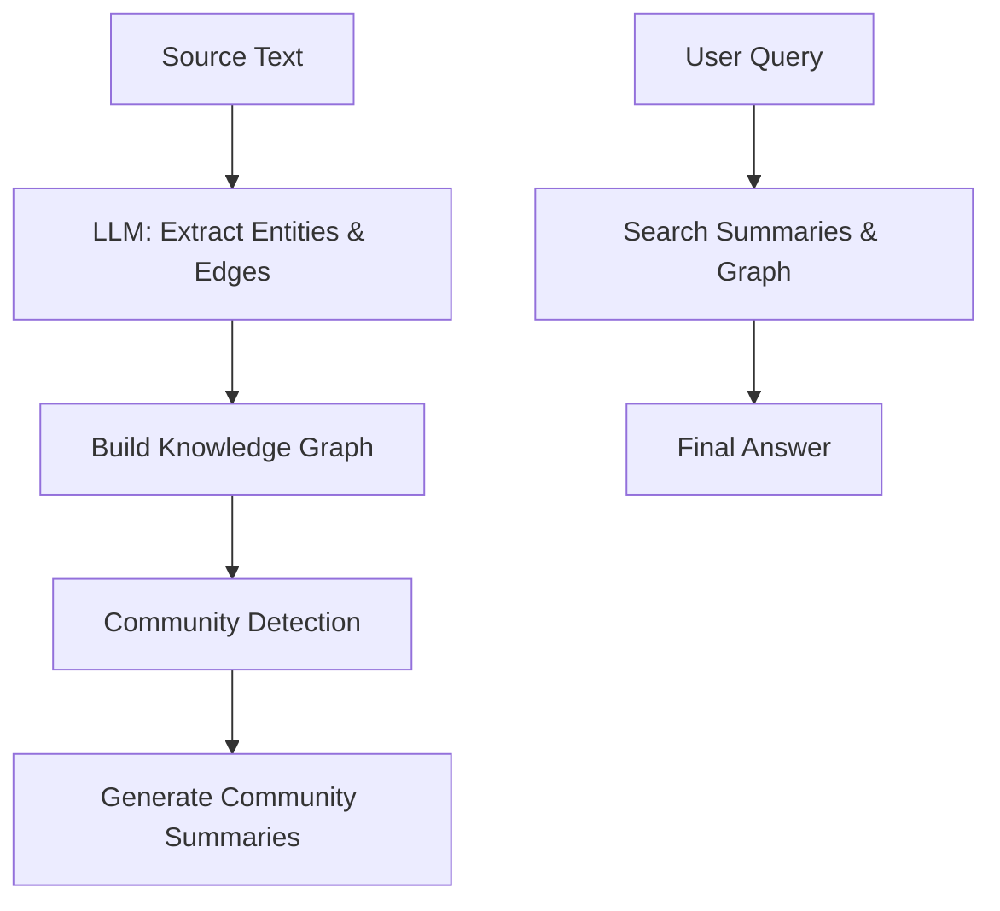

# GraphRAG: Retrieval at Scale

## 1. Beginner-friendly Hinglish Explanation 🇮🇳
Bhai, normal RAG sirf "Similarity" par kaam karta hai—woh bas "Related" tukde dhundta hai. Lekin socho tum ek poori series (jaise Game of Thrones) par question pooch rahe ho: "Sansa aur Arya ka rishta kaise badla?". Iske liye tumhe sirf ek chapter nahi, balki poori kahani ke "Connections" chahiye.

**GraphRAG** kya karta hai? Yeh text se "Entities" (Log, Jagah, Events) nikalta hai aur unka ek "Web" (Graph) banata hai. Phir woh in entities ka "Summary" banata hai. Jab tum question poochte ho, toh woh sirf documents nahi dekhta, balki us pure web of knowledge ko scan karta hai. Yeh complex, long-form queries ke liye "Baap" technology hai.

---

## 2. Deep Technical Explanation
GraphRAG (popularized by Microsoft Research) combines Knowledge Graphs with LLM retrieval.
- **Extraction**: LLM extracts nodes (entities) and edges (relationships) from raw text.
- **Community Detection**: Using algorithms like Leiden to group related entities into "Communities".
- **Summarization**: Generating summaries for each community at different levels of granularity.
- **Querying**: Instead of searching for top chunks, GraphRAG searches through these community summaries to provide global context.

---

## 3. Mathematical Intuition
GraphRAG moves from **Local Similarity** to **Global Structure**.
The graph $G = (V, E)$ is partitioned into clusters $\{C_1, C_2, ..., C_k\}$.
For a query $Q$, GraphRAG finds the most relevant communities $C_i$ and uses their pre-generated summaries $S(C_i)$ to answer.
This solves the **Information Fragmentation** problem where related info is spread across thousands of pages.

---

## 4. Architecture Diagrams


---

## 5. Production-ready Examples
Conceptual flow using `Microsoft GraphRAG` library:

```python
# 1. Indexing (High Cost)
# graphrag index --root ./my_project

# 2. Querying (Global Search)
# graphrag query --root ./my_project --method global --query "What are the main themes of the document?"

# 3. Local Search (For specific entity details)
# graphrag query --root ./my_project --method local --query "Who is the protagonist?"
```

---

## 6. Real-world Use Cases
- **Large Scale Intelligence**: Analyzing 10,000 internal emails to find a conspiracy or a trend.
- **Complex Literature**: Summarizing the plot of a 10-book fantasy series.
- **Scientific Research**: Connecting ideas across 100s of research papers that don't share keywords.

---

## 7. Failure Cases
- **Extraction Noise**: If the LLM extracts "He" and "Him" as separate entities instead of linking them to "Elon Musk".
- **High Indexing Latency**: Building the graph for 1 million tokens can take hours and cost $100s in LLM calls.

---

## 8. Debugging Guide
1. **Graph Visualization**: Use tools like Gephi or Neo4j to see if your graph looks like a "Hairball" (too messy) or separate islands (no connections).
2. **Community Check**: Ensure the summaries actually cover the content of the underlying nodes.

---

## 9. Tradeoffs
| Feature | Baseline RAG | GraphRAG |
|---|---|---|
| Query Scope | Local (Specific) | Global (Broad) |
| Indexing Cost | Low | Very High |
| Latency | Fast | Slow (Iterative) |

---

## 10. Security Concerns
- **Relationship Inference**: GraphRAG might connect two pieces of information that were meant to be separate, accidentally revealing a secret relationship (Inference Attack).

---

## 11. Scaling Challenges
- **Graph Pruning**: As the graph grows to millions of nodes, traversing it becomes a classic graph-theory bottleneck.

---

## 12. Cost Considerations
- **LLM Usage**: GraphRAG is "Heavy" on LLM calls because it uses the model to extract every single relationship and summarize every community.

---

## 13. Best Practices
- **Entity Resolution**: Use a strong model for extraction to ensure "GPT-4" and "GPT4" are merged into one node.
- **Hierarchical Clustering**: Use multi-level communities so you can answer both broad and specific questions.

---

## 14. Interview Questions
1. How does GraphRAG handle "Global" questions that baseline RAG fails at?
2. What is the role of "Community Detection" in GraphRAG?

---

## 15. Latest 2026 Patterns
- **Real-time GraphRAG**: Using specialized Graph Databases (Neo4j) to update the knowledge graph instantly as new data arrives.
- **Lightweight GraphRAG**: Using smaller models (like Llama-3-8B) for extraction to reduce indexing costs by 90%.
