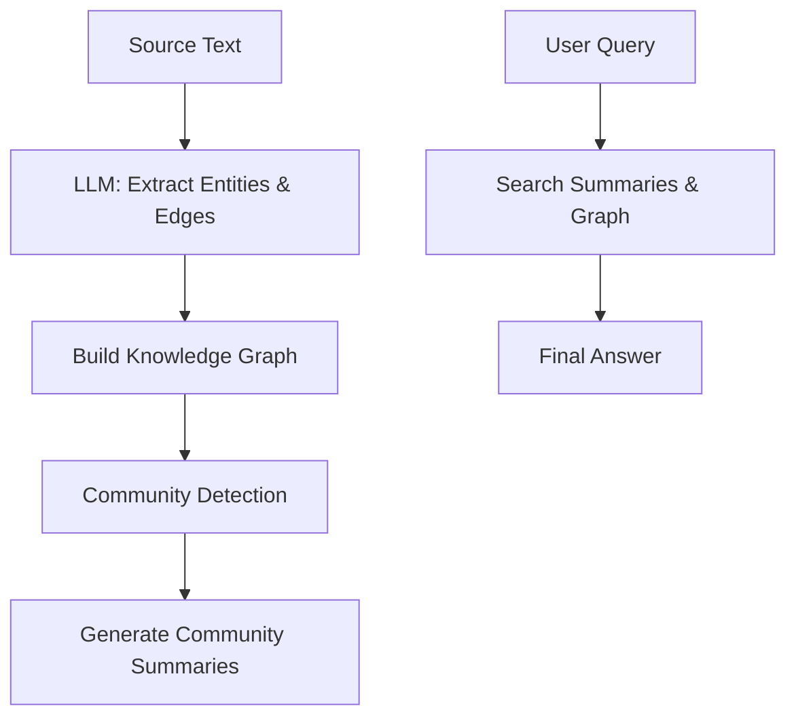

# GraphRAG: Retrieval at Scale

## 1. Beginner-friendly Hinglish Explanation 🇮🇳
Bhai, normal RAG sirf "Similarity" par kaam karta hai—woh bas "Related" tukde dhundta hai. Lekin socho tum ek poori series (jaise Game of Thrones) par question pooch rahe ho: "Sansa aur Arya ka rishta kaise badla?". Iske liye tumhe sirf ek chapter nahi, balki poori kahani ke "Connections" chahiye.

**GraphRAG** kya karta hai? Yeh text se "Entities" (Log, Jagah, Events) nikalta hai aur unka ek "Web" (Graph) banata hai. Phir woh in entities ka "Summary" banata hai. Jab tum question poochte ho, toh woh sirf documents nahi dekhta, balki us pure web of knowledge ko scan karta hai. Yeh complex, long-form queries ke liye "Baap" technology hai.

---

## 2. Deep Technical Explanation
GraphRAG (jise Microsoft Research ne popular kiya hai) Knowledge Graphs aur LLM retrieval ko combine karta hai.

- **Extraction**: LLM raw text se nodes (entities) aur edges (relationships) extract karta hai.
- **Community Detection**: Leiden jaise algorithms ka use karke related entities ko "Communities" mein group karna.
- **Summarization**: Har community ke summaries generate karna different levels of granularity par.
- **Querying**: Top chunks search karne ki jagah, GraphRAG in community summaries ke through search karta hai global context provide karne ke liye.

---

## 3. Mathematical Intuition
GraphRAG **Local Similarity** se **Global Structure** ki taraf move karta hai.

Graph $G = (V, E)$ ko clusters $\{C_1, C_2, ..., C_k\}$ mein partition kiya jaata hai.
Ek query $Q$ ke liye, GraphRAG sabse relevant communities $C_i$ ko dhundhta hai aur unke pre-generated summaries $S(C_i)$ ka use karta hai answer dene ke liye.
Yeh **Information Fragmentation** problem ko solve karta hai jahan related info hazaaron pages mein spread hoti hai.

---

## 4. Architecture Diagrams

```mermaid
graph TD
    Text[Source Text] --> Extract[LLM: Extract Entities & Edges]
    Extract --> Graph[Build Knowledge Graph]
    Graph --> Detect[Community Detection]
    Detect --> Summary[Generate Community Summaries]
    Query[User Query] --> Search[Search Summaries & Graph]
    Search --> Answer[Final Answer]
```

---

## 5. Production-ready Examples
`Microsoft GraphRAG` library ka use karte hue conceptual flow:

```python
# 1. Indexing (High Cost)
# graphrag index --root ./my_project

# 2. Querying (Global Search)
# graphrag query --root ./my_project --method global --query "What are the main themes of the document?"

# 3. Local Search (For specific entity details)
# graphrag query --root ./my_project --method local --query "Who is the protagonist?"
```

---

## 6. Real-world Use Cases
- **Large Scale Intelligence**: 10,000 internal emails ko analyze karke koi conspiracy ya trend dhundhna.
- **Complex Literature**: 10-book fantasy series ke plot ko summarize karna.
- **Scientific Research**: 100s of research papers mein ideas ko connect karna jo keywords share nahi karte.

---

## 7. Failure Cases
- **Extraction Noise**: Agar LLM "He" aur "Him" ko "Elon Musk" se link karne ke bajay alag entities extract karta hai.
- **High Indexing Latency**: 1 million tokens ke liye graph banana hours le sakta hai aur LLM calls mein $100s ka cost aa sakta hai.

---

## 8. Debugging Guide
1. **Graph Visualization**: Gephi ya Neo4j jaise tools use karke dekho ki aapka graph "Hairball" (bahut messy) dikhta hai ya separate islands (koi connection nahi).
2. **Community Check**: Yeh ensure karo ki summaries actually underlying nodes ke content ko cover karein.

---

## 9. Tradeoffs
| Feature | Baseline RAG | GraphRAG |
|---|---|---|
| Query Scope | Local (Specific) | Global (Broad) |
| Indexing Cost | Low | Very High |
| Latency | Fast | Slow (Iterative) |

---

## 10. Security Concerns
- **Relationship Inference**: GraphRAG do information pieces ko connect kar sakta hai jo separate rehni chahiye thi, accidentally ek secret relationship reveal ho sakta hai (Inference Attack).

---

## 11. Scaling Challenges
- **Graph Pruning**: Jab graph millions of nodes tak badh jaata hai, ise traverse karna ek classic graph-theory bottleneck ban jaata hai.

---

## 12. Cost Considerations
- **LLM Usage**: GraphRAG LLM calls ke mamle mein "heavy" hai kyunki ye har single relationship ko extract karne aur har community ko summarize karne ke liye model ka use karta hai.

---

## 13. Best Practices
- **Entity Resolution**: Extraction ke liye ek strong model use karo taaki "GPT-4" aur "GPT4" ek node mein merge ho jayein.
- **Hierarchical Clustering**: Multi-level communities ka use karo taaki tum broad aur specific dono tarah ke questions ko answer kar sako.

---

## 14. Interview Questions
1. GraphRAG un "Global" questions ko kaise handle karta hai jahan baseline RAG fail ho jaata hai?
2. GraphRAG mein "Community Detection" ka kya role hai?

---

## 15. Latest 2026 Patterns
- **Real-time GraphRAG**: Specialized Graph Databases (Neo4j) ka use karke knowledge graph ko instantly update karna jaise hi naya data aata hai.
- **Lightweight GraphRAG**: Extraction ke liye chhote models (jaise Llama-3-8B) ka use karke indexing costs ko 90% tak reduce karna.