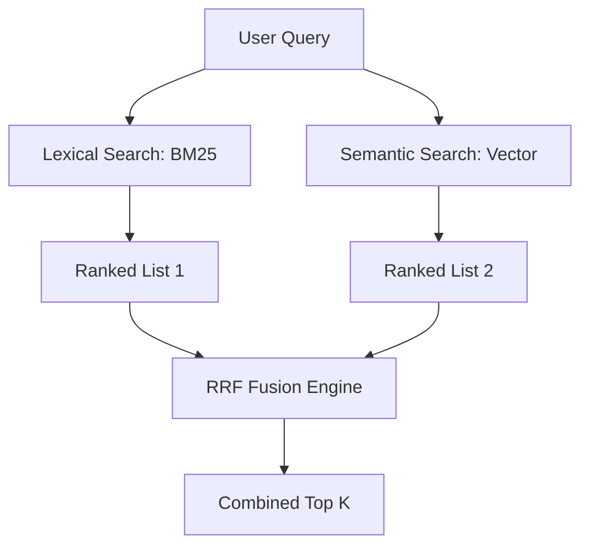

# Hybrid Search: The Best of Both Worlds

## 1. Beginner-friendly Hinglish Explanation 🇮🇳
Bhai, socho tum ek library mein "Harry Potter" ki book dhund rahe ho. Do tarike hain:
1. **Keyword Search**: Tum library ke register mein "Harry Potter" check karte ho (Exact Match).
2. **Semantic Search**: Tum librarian se kehte ho "Mujhe magic aur jaadu wali book chahiye" (Meaning Match).

**Hybrid Search** in dono ka mix hai. Yeh exact keywords ko bhi dekhta hai (taaki "iPhone 15 Pro Max" jaise names miss na hon) aur meanings ko bhi (taaki context samajh sake). In dono results ko hum **RRF (Reciprocal Rank Fusion)** se combine karte hain. 2026 mein koi bhi serious RAG system sirf ek tarike par bharosa nahi karta, woh hamesha hybrid search use karta hai.

---

## 2. Deep Technical Explanation
Hybrid search combines Lexical (Keyword) and Dense (Semantic) retrieval.
- **Lexical Search (BM25)**: Based on TF-IDF. Excellent for acronyms, technical terms, part numbers, and specific names.
- **Dense Search (Vector)**: Based on embeddings. Excellent for capturing synonyms, intent, and cross-lingual meaning.
- **Fusion**: Combining scores from two completely different systems. The standard is **RRF (Reciprocal Rank Fusion)**, which is scale-independent.

---

## 3. Mathematical Intuition
**RRF Formula**:
$$RRF(d) = \sum_{r \in R} \frac{1}{k + rank(r, d)}$$
where $R$ is the set of rankers (Keyword, Vector), $d$ is a document, and $k$ is a constant (usually 60).
This formula ensures that documents that appear high in both lists get a massive boost, but even if a document is only in one list (e.g., a rare keyword match), it still has a chance.

---

## 4. Architecture Diagrams


---

## 5. Production-ready Examples
Using `Pinecone` or `Weaviate` for Hybrid search (Conceptual):

```python
# Weaviate Hybrid Search Example
result = client.query.get("Document", ["content"]) \
    .with_hybrid(
        query="LLM optimization",
        alpha=0.5 # 1.0 is pure vector, 0.0 is pure keyword
    ) \
    .with_limit(5) \
    .do()

# Alpha = 0.5 is the starting point for most production systems.
```

---

## 6. Real-world Use Cases
- **Medical Search**: Searching for "COVID-19" (Keyword) vs "Symptoms of the 2020 pandemic" (Semantic).
- **Code Search**: Searching for a specific function name `get_user_auth()` vs "How to login users".

---

## 7. Failure Cases
- **Alpha Misalignment**: If alpha is too high, you miss exact matches. If too low, you miss the context.
- **Collisions**: When a common keyword matches a million documents, polluting the hybrid results.

---

## 8. Debugging Guide
1. **Side-by-side comparison**: Run the query 3 times: Lexical only, Vector only, and Hybrid. If Hybrid isn't better than both, your fusion logic is broken.
2. **Re-ranker Check**: Often, Hybrid search retrieves the right document in top 20, but not top 3. Use a Re-ranker to fix the order.

---

## 9. Tradeoffs
| Feature | BM25 (Lexical) | Vector (Dense) | Hybrid |
|---|---|---|---|
| Domain Specificity | High | Medium | High |
| Latency | Low | Medium | Medium-High |
| Setup Complexity| Low | High | Very High |

---

## 10. Security Concerns
- **Keyword Stuffing**: An attacker adding invisible, rare keywords to a document to make it appear first in the Hybrid search results (Search Poisoning).

---

## 11. Scaling Challenges
- **Dual Indexing**: You have to maintain two indexes (Elasticsearch/Solr for keywords and a Vector DB for embeddings) and keep them synchronized.

---

## 12. Cost Considerations
- **Compute**: Hybrid search is roughly 2x more expensive in terms of compute than single-method search.

---

## 13. Best Practices
- **Use RRF**: Don't try to "normalize" scores (e.g., 0.8 cosine vs 20.5 BM25); it's mathematically difficult. Rank-based fusion is more robust.
- **Stemming**: Ensure your keyword search uses proper stemming (running $\to$ run) for better matches.

---

## 14. Interview Questions
1. What is RRF and why is it used in Hybrid Search?
2. When would BM25 outperform a state-of-the-art Vector embedding?

---

## 15. Latest 2026 Patterns
- **Sparse-Dense Embeddings**: Using a single model (like SPLADE) that generates both sparse (keyword-like) and dense features in one vector.
- **Learnable Fusion**: Training a small neural network to decide the weight of Lexical vs. Semantic search based on the query type.
