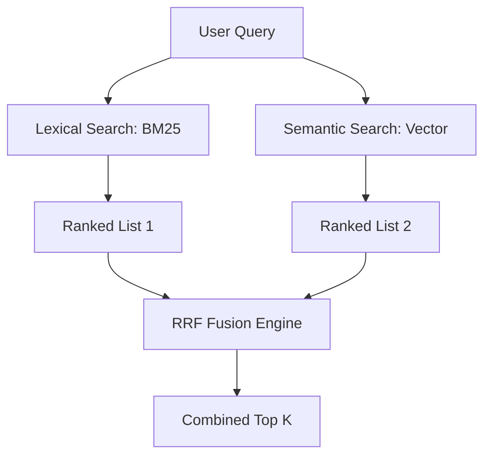

# Hybrid Search: Dono ka behtareen combination

## 1. Beginner-friendly Hinglish Explanation 🇮🇳
Bhai, socho tum ek library mein "Harry Potter" ki book dhund rahe ho. Do tarike hain:
1. **Keyword Search**: Tum library ke register mein "Harry Potter" check karte ho (Exact Match).
2. **Semantic Search**: Tum librarian se kehte ho "Mujhe magic aur jaadu wali book chahiye" (Meaning Match).

**Hybrid Search** in dono ka mix hai. Yeh exact keywords ko bhi dekhta hai (taaki "iPhone 15 Pro Max" jaise names miss na hon) aur meanings ko bhi (taaki context samajh sake). In dono results ko hum **RRF (Reciprocal Rank Fusion)** se combine karte hain. 2026 mein koi bhi serious RAG system sirf ek tarike par bharosa nahi karta, woh hamesha hybrid search use karta hai.

---

## 2. Deep Technical Explanation
Hybrid search Lexical (Keyword) aur Dense (Semantic) retrieval ko combine karta hai.
- **Lexical Search (BM25)**: TF-IDF par based hai. Acronyms, technical terms, part numbers, aur specific names ke liye excellent hai.
- **Dense Search (Vector)**: Embeddings par based hai. Synonyms, intent, aur cross-lingual meaning capture karne ke liye excellent hai.
- **Fusion**: Do completely different systems ke scores ko combine karna. Standard **RRF (Reciprocal Rank Fusion)** hai, jo scale-independent hai.

---

## 3. Mathematical Intuition
**RRF Formula**:
$$RRF(d) = \sum_{r \in R} \frac{1}{k + rank(r, d)}$$
Yahan $R$ rankers ka set hai (Keyword, Vector), $d$ document hai, aur $k$ constant hai (usually 60).
Yeh formula ensure karta hai ki jo document dono lists mein upar dikhta hai, usko massive boost milta hai, lekin agar document sirf ek list mein hai (e.g., rare keyword match), toh bhi uska chance hai.

---

## 4. Architecture Diagrams

```mermaid
graph TD
    Query[User Query] --> Lex[Lexical Search: BM25]
    Query --> Semantic[Semantic Search: Vector]
    Lex --> Res1[Ranked List 1]
    Semantic --> Res2[Ranked List 2]
    Res1 & Res2 --> Fusion[RRF Fusion Engine]
    Fusion --> Final[Combined Top K]
```

---

## 5. Production-ready Examples
`Pinecone` ya `Weaviate` use karte hue Hybrid search (Conceptual):

```python
# Weaviate Hybrid Search ka Udaharan
result = client.query.get("Document", ["content"]) \
    .with_hybrid(
        query="LLM optimization",
        alpha=0.5 # 1.0 pure vector hai, 0.0 pure keyword hai
    ) \
    .with_limit(5) \
    .do()

# Alpha = 0.5 zyadatar production systems ke liye starting point hai.
```

---

## 6. Real-world Use Cases
- **Medical Search**: "COVID-19" (Keyword) vs "Symptoms of the 2020 pandemic" (Semantic) search karna.
- **Code Search**: Specific function name `get_user_auth()` vs "How to login users" search karna.

---

## 7. Failure Cases
- **Alpha Misalignment**: Agar alpha bahut high hai, toh exact matches miss hote hain. Agar bahut low hai, toh context miss hota hai.
- **Collisions**: Jab ek common keyword million documents match karta hai, toh hybrid results pollute ho jate hain.

---

## 8. Debugging Guide
1. **Side-by-side comparison**: Query ko 3 baar run karo: sirf Lexical, sirf Vector, aur Hybrid. Agar Hybrid dono se better nahi hai, toh fusion logic broken hai.
2. **Re-ranker Check**: Aksar, Hybrid search right document ko top 20 mein laata hai, lekin top 3 mein nahi. Order theek karne ke liye Re-ranker use karo.

---

## 9. Tradeoffs
| Feature | BM25 (Lexical) | Vector (Dense) | Hybrid |
|---|---|---|---|
| Domain Specificity | High | Medium | High |
| Latency | Low | Low | Medium |
| Setup Complexity| Low | High | Very High |

---

## 10. Security Concerns
- **Keyword Stuffing**: Attacker invisible, rare keywords document mein add karta hai taaki woh Hybrid search results mein pehle dikhe (Search Poisoning).

---

## 11. Scaling Challenges
- **Dual Indexing**: Aapko do indexes maintain karne hote hain (keywords ke liye Elasticsearch/Solr aur embeddings ke liye Vector DB) aur unhe synchronized rakhna hota hai.

---

## 12. Cost Considerations
- **Compute**: Hybrid search compute ke mamle mein single-method search se roughly 2x zyada expensive hai.

---

## 13. Best Practices
- **Use RRF**: Scores ko "normalize" karne ki koshish mat karo (e.g., 0.8 cosine vs 20.5 BM25); yeh mathematically difficult hai. Rank-based fusion zyada robust hai.
- **Stemming**: Ensure karo ki aapka keyword search proper stemming use kare (running $\to$ run) better matches ke liye.

---

## 14. Interview Questions
1. RRF kya hai aur Hybrid Search mein kyun use kiya jata hai?
2. Kab BM25 state-of-the-art Vector embedding ko outperform karega?

---

## 15. Latest 2026 Patterns
- **Sparse-Dense Embeddings**: Ek single model (like SPLADE) use karna jo ek vector mein sparse (keyword-like) aur dense features dono generate karta hai.
- **Learnable Fusion**: Ek chhoti neural network train karna jo query type ke based Lexical vs. Semantic search ke weight decide kare.