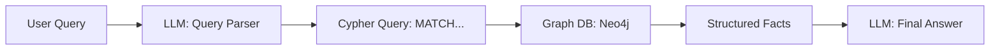

# Knowledge Graph RAG: Structured Retrieval

## 1. Beginner-friendly Hinglish Explanation 🇮🇳
Bhai, normal RAG (Vector RAG) bilkul ek "Search Engine" ki tarah hai jo sirf related text dikhata hai. Lekin **Knowledge Graph RAG** bilkul ek "Database" ki tarah hai. 

Ismein hum data ko (Subject -> Relationship -> Object) ke format mein store karte hain (Jaise: Elon Musk -> CEO of -> Tesla). Jab tum poochte ho "Tesla ke CEO ki dusri companies kaunsi hain?", toh model graph par "Elon Musk" se judi saari nodes check karta hai (SpaceX, Neuralink). Yeh "Factually 100% correct" hone ke liye best hai kyunki yeh vectors ke "Andaze" par nahi, balki graph ke "Facts" par chalta hai.

---

## 2. Deep Technical Explanation
KG-RAG integrates structured graph data with LLMs.
- **Triplets**: Data is stored as (head, relation, tail) triplets.
- **Cypher/SPARQL**: LLMs generate queries to fetch data from graph databases like Neo4j or AWS Neptune.
- **Path Traversal**: Ability to answer multi-hop questions by following edges in the graph.
- **Schema Enforcement**: Unlike vector search, KG-RAG follows a strict schema, reducing hallucinations.

---

## 3. Mathematical Intuition
KG-RAG is a walk on a directed multigraph $G = (V, E, R)$.
For a query $Q$, we find starting entities $v \in V$ and traverse edges $e \in E$ with labels $r \in R$.
The search space is defined by the **N-hop neighborhood** of the query entities.
Unlike vector search which is probabilistic ($P(\text{rel} | q)$), KG-RAG is deterministic ($E \in G$).

---

## 4. Architecture Diagrams


---

## 5. Production-ready Examples
Generating Cypher queries with `LangChain`:

```python
from langchain_community.graphs import Neo4jGraph
from langchain.chains import GraphCypherQAChain

graph = Neo4jGraph(url="bolt://localhost:7687", username="neo4j", password="password")

# LLM translates natural language to Cypher
chain = GraphCypherQAChain.from_llm(llm, graph=graph, verbose=True)

response = chain.invoke({"query": "Who is the CEO of Tesla and what else does he run?"})
# Output: MATCH (p:Person {name: 'Elon Musk'})-[:CEO_OF]->(c:Company) RETURN c.name
```

---

## 6. Real-world Use Cases
- **Supply Chain**: "Which parts from Supplier A are used in Product B and are they delayed?"
- **Fraud Detection**: "Is User X connected to any known fraudulent accounts within 3 hops?"
- **Medical Diagnosis**: "What diseases share symptoms with Diabetes and have specific genetic markers?"

---

## 7. Failure Cases
- **Stale Schema**: If the graph schema changes, the LLM's query generation will break.
- **Missing Edges**: If a relationship isn't explicitly in the graph, KG-RAG won't "guess" it (unlike Vector RAG).

---

## 8. Debugging Guide
1. **Query Inspection**: Print the generated Cypher/SPARQL query. If it's syntactically wrong, your prompt needs few-shot examples.
2. **Schema Mapping**: Ensure your entity names (e.g., "Apple Inc.") match exactly what's in the DB.

---

## 9. Tradeoffs
| Feature | Vector RAG | Knowledge Graph RAG |
|---|---|---|
| Consistency | Medium | Very High |
| Complex Joins | Poor | Excellent |
| Flexibility | High | Low (Needs Schema) |

---

## 10. Security Concerns
- **Cypher Injection**: A user query designed to make the LLM generate a `DELETE` or `DROP` graph command. Always use read-only users.

---

## 11. Scaling Challenges
- **Graph Density**: In a very dense graph, "traversing" can lead to an explosion of results (The "Supernode" problem).

---

## 12. Cost Considerations
- **Graph Hosting**: Managed graph databases are generally more expensive per GB than vector databases.

---

## 13. Best Practices
- **Hybrid RAG**: Use Vector RAG for "Unstructured" info and KG-RAG for "Structured" facts.
- **Entity Linking**: Use an LLM to link user mentions to specific IDs in your graph.

---

## 14. Interview Questions
1. Why is KG-RAG better at "Multi-hop" reasoning than Vector RAG?
2. What are the risks of letting an LLM generate database queries?

---

## 15. Latest 2026 Patterns
- **Text-to-Graph-to-Text**: Using an LLM to build the graph dynamically from news feeds and then querying it.
- **Graph Embeddings**: Representing the entire graph structure as a vector to combine the strengths of both systems.
