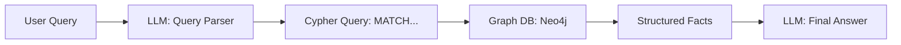

# Knowledge Graph RAG: Structured Retrieval

## 1. Beginner-friendly Hinglish Explanation 🇮🇳
Bhai, normal RAG (Vector RAG) bilkul ek "Search Engine" ki tarah hai jo sirf related text dikhata hai. Lekin **Knowledge Graph RAG** bilkul ek "Database" ki tarah hai. 

Ismein hum data ko (Subject -> Relationship -> Object) ke format mein store karte hain (Jaise: Elon Musk -> CEO of -> Tesla). Jab tum poochte ho "Tesla ke CEO ki dusri companies kaunsi hain?", toh model graph par "Elon Musk" se judi saari nodes check karta hai (SpaceX, Neuralink). Yeh "Factually 100% correct" hone ke liye best hai kyunki yeh vectors ke "Andaze" par nahi, balki graph ke "Facts" par chalta hai.

---

## 2. Deep Technical Explanation
KG-RAG structured graph data ko LLMs ke saath integrate karta hai.
- **Triplets**: Data (head, relation, tail) triplets ke roop mein store hota hai.
- **Cypher/SPARQL**: LLMs Neo4j ya AWS Neptune jaise graph databases se data fetch karne ke liye queries generate karte hain.
- **Path Traversal**: Graph mein edges follow karke multi-hop questions ka answer dene ki ability.
- **Schema Enforcement**: Vector search ke opposite, KG-RAG ek strict schema follow karta hai, jisse hallucinations kam hote hain.

---

## 3. Mathematical Intuition
KG-RAG ek directed multigraph $G = (V, E, R)$ par walk hai.
Query $Q$ ke liye, hum starting entities $v \in V$ find karte hain aur labels $r \in R$ ke saath edges $e \in E$ traverse karte hain.
Search space query entities ke **N-hop neighborhood** se define hota hai.
Vector search jo probabilistic hai ($P(\text{rel} | q)$), uske opposite KG-RAG deterministic hai ($E \in G$).

---

## 4. Architecture Diagrams

```mermaid
graph LR
    Query[User Query] --> Parser[LLM: Query Parser]
    Parser --> Cypher[Cypher Query: MATCH...]
    Cypher --> Neo4j[Graph DB: Neo4j]
    Neo4j --> Result[Structured Facts]
    Result --> Final[LLM: Final Answer]
```

---

## 5. Production-ready Examples
`LangChain` ke saath Cypher queries generate karna:

```python
from langchain_community.graphs import Neo4jGraph
from langchain.chains import GraphCypherQAChain

graph = Neo4jGraph(url="bolt://localhost:7687", username="neo4j", password="password")

# LLM natural language ko Cypher mein translate karta hai
chain = GraphCypherQAChain.from_llm(llm, graph=graph, verbose=True)

response = chain.invoke({"query": "Tesla ka CEO kaun hai aur woh aur kya chalta hai?"})
# Output: MATCH (p:Person {name: 'Elon Musk'})-[:CEO_OF]->(c:Company) RETURN c.name
```

---

## 6. Real-world Use Cases
- **Supply Chain**: "Supplier A ke kaun se parts Product B mein use hote hain aur kya woh delayed hain?"
- **Fraud Detection**: "Kya User X kisi known fraudulent account se 3 hops ke andar connected hai?"
- **Medical Diagnosis**: "Diabetes ke saath kaun si diseases symptoms share karti hain aur unmein specific genetic markers hote hain?"

---

## 7. Failure Cases
- **Stale Schema**: Agar graph schema change hota hai, toh LLM ki query generation break ho jayegi.
- **Missing Edges**: Agar graph mein relationship explicitly exist nahi karta, toh KG-RAG uska "guess" nahi karega (Vector RAG ke opposite).

---

## 8. Debugging Guide
1. **Query Inspection**: Generated Cypher/SPARQL query ko print karo. Agar syntactically wrong hai, toh tumhare prompt mein few-shot examples chahiye.
2. **Schema Mapping**: Ensure karo ki tumhare entity names (jaise "Apple Inc.") DB mein exactly match karte hain.

---

## 9. Tradeoffs
| Feature | Vector RAG | Knowledge Graph RAG |
|---|---|---|
| Consistency | Medium | Very High |
| Complex Joins | Poor | Excellent |
| Flexibility | High | Low (Needs Schema) |

---

## 10. Security Concerns
- **Cypher Injection**: Ek user query jo LLM ko `DELETE` ya `DROP` graph command generate karne ke liye design kiya gaya ho. Hamesha read-only users use karo.

---

## 11. Scaling Challenges
- **Graph Density**: Bohot dense graph mein "traversing" results ke explosion ka cause ban sakta hai (The "Supernode" problem).

---

## 12. Cost Considerations
- **Graph Hosting**: Managed graph databases generally vector databases ke comparison mein per GB zyada expensive hote hain.

---

## 13. Best Practices
- **Hybrid RAG**: "Unstructured" info ke liye Vector RAG aur "Structured" facts ke liye KG-RAG use karo.
- **Entity Linking**: LLM ka use karke user mentions ko graph mein specific IDs se link karo.

---

## 14. Interview Questions
1. KG-RAG "Multi-hop" reasoning mein Vector RAG se behtar kyun hai?
2. LLM ko database queries generate karne dena ke kya risks hain?

---

## 15. Latest 2026 Patterns
- **Text-to-Graph-to-Text**: LLM ka use karke news feeds se dynamically graph build karna aur phir use query karna.
- **Graph Embeddings**: Dono systems ki strengths combine karne ke liye poori graph structure ko ek vector ke roop mein represent karna.