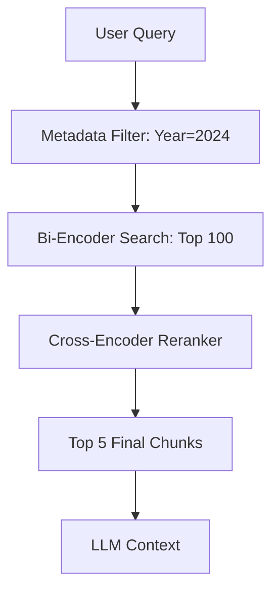

# 🔝 Reranking and Filtering: The Quality Filter
> **Objective:** Master the use of Cross-Encoders and Metadata filters to refine RAG results, ensuring only the most relevant and high-fidelity information reaches the LLM | **Language:** Hinglish | **Standard:** 2026 Expert Framework

---

## 🧭 1. Beginner-Friendly Hinglish Explanation
Reranking aur Filtering ka matlab hai "Kachre ko bahar nikalna aur best info ko top par lana".

- **The Problem:** Vector search (retrieval) thoda "Andaze" se kaam karta hai. Wo 100 results la sakta hai, par unme se shayad sirf 2 hi kaam ke hon. Agar hum saare 100 LLM ko bhej denge, toh wo confuse ho jayega.
- **The Solution:** 
  - **Filtering:** Search se pehle hi rules lagana (e.g., "Sirf 2024 ki files dikhao").
  - **Reranking:** Ek bahut smart model (Cross-Encoder) ko wo 100 results dikhana aur puchna "Inme se best kaunsa hai?".
- **Intuition:** Ye ek "Audition" jaisa hai. Pehle 1000 log aate hain (Retrieval), phir hum unka resume check karte hain (Filtering), aur end mein ek expert unka interview lekar top 3 select karta hai (Reranking).

---

## 🧠 2. Deep Technical Explanation
Reranking is a **Second-stage Retrieval** process:

1. **Bi-Encoders (Initial Search):** Encode Query and Doc separately. Fast, but misses subtle interactions.
2. **Cross-Encoders (Reranking):** Process (Query + Doc) together as a single input. Very accurate because it can see exactly how the query words relate to the doc words.
3. **Hard Filtering:** Using metadata (SQL-like) to eliminate irrelevant data before search.
4. **Soft Filtering (Thresholding):** Rejecting any chunk with a similarity score below a certain value (e.g., $<0.7$).

---

## 📐 3. Mathematical Intuition
**Cross-Encoder Scoring:**
Unlike Cosine similarity (which is just a dot product), a Cross-Encoder $f$ outputs a score $s$ by looking at all interactions between $Q$ and $D$:
$$s = f(Q \oplus D)$$
This model is much more computationally expensive than a Bi-Encoder, which is why we only run it on the top $20-50$ results, never the whole database.

---

## 🏗️ 4. Architecture Diagrams


---

## 💻 5. Production-Ready Examples
Using **BGE-Reranker** (A top 2026 open-source choice):
```python
from sentence_transformers import CrossEncoder

# 1. Load a specialized reranker
model = CrossEncoder('BAAI/bge-reranker-base')

query = "How to fix a flat tire?"
# Assume these are retrieved from a Vector DB
documents = [
    "Cars have four tires and one engine.",
    "To fix a flat tire, first locate the jack and spare tire.",
    "Bicycles also have tires but they are smaller."
]

# 2. Score and Sort
scores = model.predict([(query, doc) for doc in documents])
sorted_results = sorted(zip(documents, scores), key=lambda x: x[1], reverse=True)

for doc, score in sorted_results:
    print(f"Score: {score:.4f} | {doc}")
```

---

## 🌍 6. Real-World Use Cases
- **Legal Tech:** Finding the "Most relevant" clause out of 500 potential matches in a database.
- **E-commerce:** Sorting products not just by "Category" but by how well their description matches the user's specific query.

---

## ❌ 7. Failure Cases
- **The LLM is Smarter than the Reranker:** If you use a tiny 10M parameter reranker for a 70B LLM, the reranker might hide good documents from the LLM.
- **Empty Filter:** If you filter too aggressively (e.g., `year=2025` when it's 2024), you'll get 0 results.

---

## 🛠️ 8. Debugging Guide
| Problem | Reason | Solution |
| :--- | :--- | :--- |
| **Reranking takes 5 seconds** | Model is too large | Use a **Quantized (ONNX)** reranker or move to **Cohere's API**. |
| **Top result is always irrelevant** | Domain mismatch | Fine-tune your **Cross-Encoder** on your specific data (e.g., Medical/Legal). |

---

## ⚖️ 9. Tradeoffs
- **Cross-Encoder Reranking (Extremely Accurate / Slow / High Compute).**
- **Score-based Filtering (Fast / Simple / Less Accurate).**

---

## 🛡️ 10. Security Concerns
- **Filter Inversion:** An attacker could try to guess your metadata structure (e.g., `user_id`) and manipulate the filter to see other people's data.

---

## 📈 11. Scaling Challenges
- **The Fan-out Problem:** If you have 1000 concurrent users, running 100 reranking steps for each user requires a massive GPU cluster. **Fix: Use batch reranking.**

---

## 💰 12. Cost Considerations
- Managed rerankers (like Cohere) charge per search. For internal high-volume tools, self-hosting a small BGE-Reranker is more cost-effective.

---

## ✅ 13. Best Practices
- **Always rerank the top 20-50 results.** 
- **Normalize your metadata.** Use tags like `document_type`, `date_published`, `language`.
- **Use a threshold.** If the best reranked score is still low, tell the user "I couldn't find a good answer."

漫
---

## 📝 14. Interview Questions
1. "What is the difference between a Bi-Encoder and a Cross-Encoder?"
2. "Why can't we use a Cross-Encoder for the initial search across millions of documents?"
3. "How does metadata filtering improve RAG accuracy?"

---

## 🚀 15. Latest 2026 LLM Engineering Patterns
- **ColBERT (Late Interaction):** A specialized architecture that gets Cross-Encoder accuracy at Bi-Encoder speeds by storing multiple vectors per document.
- **Self-Filtering RAG:** An agent that looks at the reranked results and "Decides" if it needs to re-run the search with a different filter.
漫
