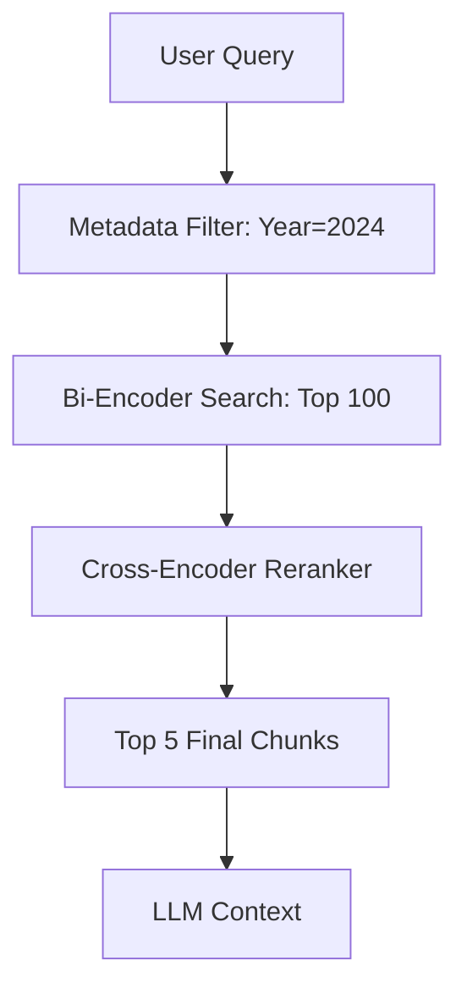

# 🔝 Reranking aur Filtering: The Quality Filter
> **Objective:** Cross-Encoders aur Metadata filters ka use master karna, RAG results ko refine karne ke liye, ensuring ki only the most relevant aur high-fidelity information LLM tak pahuche | **Language:** Hinglish | **Standard:** 2026 Expert Framework

---

## 🧭 1. Beginner-Friendly Hinglish Explanation
Reranking aur Filtering ka matlab hai "Kachre ko bahar nikalna aur best info ko top par lana".

- **Problem:** Vector search (retrieval) thoda "Andaze" se kaam karta hai. Wo 100 results la sakta hai, par unme se shayad sirf 2 hi kaam ke hon. Agar hum saare 100 LLM ko bhej denge, toh wo confuse ho jayega.
- **Solution:** 
  - **Filtering:** Search se pehle hi rules lagana (e.g., "Sirf 2024 ki files dikhao").
  - **Reranking:** Ek bahut smart model (Cross-Encoder) ko wo 100 results dikhana aur puchna "Inme se best kaunsa hai?".
- **Intuition:** Ye ek "Audition" jaisa hai. Pehle 1000 log aate hain (Retrieval), phir hum unka resume check karte hain (Filtering), aur end mein ek expert unka interview lekar top 3 select karta hai (Reranking).

---

## 🧠 2. Deep Technical Explanation
Reranking is a **Second-stage Retrieval** process:

1. **Bi-Encoders (Initial Search):** Query aur Doc ko alag se encode karein. Fast hai, lekin subtle interactions miss ho jate hain.
2. **Cross-Encoders (Reranking):** (Query + Doc) ko ek single input ke tor par process karein. Bahut accurate hai kyunki ye dekh sakta hai ki query words doc words se kaise relate karte hain.
3. **Hard Filtering:** Search se pehle metadata (SQL-like) ka use karke irrelevant data ko eliminate karna.
4. **Soft Filtering (Thresholding):** Kisi bhi chunk ko reject karna jiska similarity score kuch value se niche ho (e.g., $<0.7$).

---

## 📐 3. Mathematical Intuition
**Cross-Encoder Scoring:**
Cosine similarity se different (jo sirf dot product hai), Cross-Encoder $f$ output karta hai score $s$ $Q$ aur $D$ ke beech me all interactions dekh kar:
$$s = f(Q \oplus D)$$
Ye model computationally bahut expensive hai Bi-Encoder se, isliye hum isse sirf top $20-50$ results par hi chalate hain, poore database par nahi.

---

## 🏗️ 4. Architecture Diagrams

```mermaid
graph TD
    User[User Query] --> Filter[Metadata Filter: Year=2024]
    Filter --> BiEnc[Bi-Encoder Search: Top 100]
    BiEnc --> CrossEnc[Cross-Encoder Reranker]
    CrossEnc --> TopK[Top 5 Final Chunks]
    TopK --> LLM[LLM Context]
```

---

## 💻 5. Production-Ready Examples
Using **BGE-Reranker** (2026 ka ek top open-source choice):
```python
from sentence_transformers import CrossEncoder

# 1. Load a specialized reranker
model = CrossEncoder('BAAI/bge-reranker-base')

query = "How to fix a flat tire?"
# Assume these are retrieved from a Vector DB
documents = [
    "Cars have four tires and one engine.",
    "To fix a flat tire, first locate the jack and spare tire.",
    "Bicycles also have tires but they are smaller."
]

# 2. Score and Sort
scores = model.predict([(query, doc) for doc in documents])
sorted_results = sorted(zip(documents, scores), key=lambda x: x[1], reverse=True)

for doc, score in sorted_results:
    print(f"Score: {score:.4f} | {doc}")
```

---

## 🌍 6. Real-World Use Cases
- **Legal Tech:** Database me 500 potential matches me se "Most relevant" clause dhun dhikana.
- **E-commerce:** Products ko sirf "Category" se nahi, balki unke description user ke specific query se kitna match karta hai, us hisaab se sort karna.

---

## ❌ 7. Failure Cases
- **LLM Reranker se zyada smart hai:** Agar aap chhota 10M parameter reranker use karte hain 70B LLM ke liye, toh reranker acchi documents ko LLM se chhupa sakta hai.
- **Empty Filter:** Agar aap bahut aggressively filter karte hain (e.g., `year=2025` jab ki 2024 hai), toh aapko 0 results milenge.

---

## 🛠️ 8. Debugging Guide
| Problem | Reason | Solution |
| :--- | :--- | :--- |
| **Reranking 5 second lagta hai** | **Model bahut bada hai** | **Quantized (ONNX) reranker use karein ya **Cohere's API** par move karein.** |
| **Top result hamesha irrelevant hota hai** | **Domain mismatch** | **Apne specific data (e.g., Medical/Legal) par **Cross-Encoder** ko fine-tune karein.** |

---

## ⚖️ 9. Tradeoffs
- **Cross-Encoder Reranking (Behad Accurate / Dheema / Zyada Compute).**
- **Score-based Filtering (Tez / Simple / Kam Accurate).**

---

## 🛡️ 10. Security Concerns
- **Filter Inversion:** Ek attacker metadata structure (e.g., `user_id`) guess karne ki koshish kar sakta hai aur filter mein manipulation karke doosron ka data dekh sakta hai.

---

## 📈 11. Scaling Challenges
- **Fan-out Problem:** Agar 1000 concurrent users hain, har user ke liye 100 reranking steps chalane me massive GPU cluster chahiye. **Fix: Batch reranking use karein.**

---

## 💰 12. Cost Considerations
- Managed rerankers (jaise Cohere) per search charge karte hain. Internal high-volume tools ke liye, small BGE-Reranker self-host karna zyada cost-effective hai.

---

## ✅ 13. Best Practices
- **Hamesha top 20-50 results ko rerank karein.** 
- **Apne metadata ko normalize karein.** Tags use karein jaise `document_type`, `date_published`, `language`.
- **Threshold use karein.** Agar best reranked score bhi low hai, toh user ko batayein "Mai accha jawab nahi dhundh paya."

漫
---

## 📝 14. Interview Questions
1. "Bi-Encoder aur Cross-Encoder me kya antar hai?"
2. "Hum Cross-Encoder ko initial search ke liye millions of documents par kyun nahi use kar sakte?"
3. "Metadata filtering RAG accuracy ko kaise improve karta hai?"

---

## 🚀 15. Latest 2026 LLM Engineering Patterns
- **ColBERT (Late Interaction):** Ek specialized architecture jo Cross-Encoder accuracy deta hai Bi-Encoder speeds par, multiple vectors per document store karke.
- **Self-Filtering RAG:** Ek agent jo reranked results ko dekhkar "Decides" karta hai ki kya search ko different filter ke saath re-run karna hai.
漫