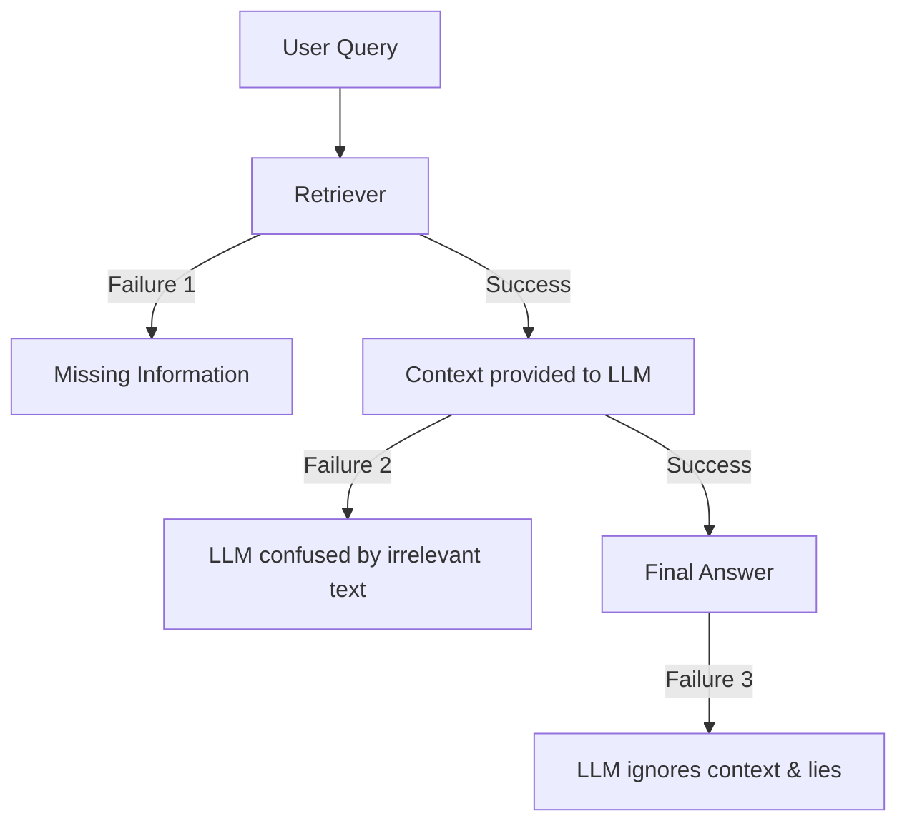

# Retrieval Failure Cases: Why RAG Hallucinates

## 1. Beginner-friendly Hinglish Explanation 🇮🇳
Bhai, log sochte hain ki RAG use karne se model hallucinate karna band kar dega. Yeh bilkul galat hai! 

RAG mein failure ke 3 main point hote hain:
1. **Retrieval Failure**: Model ko sahi document mila hi nahi (Search galat thi).
2. **Context Failure**: Model ko sahi document mil gaya, lekin woh us "Bheed" (Noise) mein kho gaya.
3. **Generation Failure**: Model ko sahi document mila, usne padha bhi, lekin phir bhi "Gajini" ban gaya aur galat answer de diya. 

In failure cases ko samajhna tumhe ek "Prompt Wrapper" se "RAG Architect" banata hai. Is module mein hum har "Dard" (Failure) ki "Dawa" (Solution) samjhenge.

---

## 2. Deep Technical Explanation
Critical failure modes in RAG systems:
- **Low Recall**: The retriever fails to find any relevant chunks (Semantic gap).
- **Low Precision**: The retriever finds too many "False Positives" that confuse the LLM.
- **Lost in the Middle**: The LLM ignores relevant info if it's placed in the middle of a long context window.
- **Negative Rejection**: The LLM answers a question even when the retrieved documents don't have the answer (It should have said "I don't know").

---

## 3. Mathematical Intuition
RAG Success Probability $P(S)$ is the product of two probabilities:
$$P(S) = P(\text{Retrieval Success}) \times P(\text{Generation Success} | \text{Retrieval})$$
If your retriever is 80% accurate and your generator is 80% accurate, your overall system is only **64% accurate** ($0.8 \times 0.8$). This "Cascading Error" is the biggest hurdle in production RAG.

---

## 4. Architecture Diagrams


---

## 5. Production-ready Examples
Testing for "Negative Rejection":

```python
# Test if model admits ignorance
query = "What is the secret code of company X?"
retrieved_docs = ["Company X sells shoes.", "Company X was founded in 1990."]

# Good output: "I don't know based on the provided context."
# Bad output: "The secret code is 1234." (Hallucination)
```

---

## 6. Real-world Use Cases
- **Medical Advice**: A RAG system giving wrong drug dosages because it retrieved an old research paper.
- **Financial Audit**: Missing a small transaction because it was buried in a 1000-page bank statement.

---

## 7. Failure Cases
- **The "Yes-Man" Problem**: The LLM agrees with a false statement because it was found in a (wrong) retrieved document.
- **Conflicting Context**: Document A says "Yes" and Document B says "No". The model flips a coin.

---

## 8. Debugging Guide
1. **Faithfulness Score**: Use **RAGAS** or **TruLens** to measure if the answer is actually supported by the retrieved chunks.
2. **Answer Relevance**: Measure if the answer actually addresses the user's query.

---

## 9. Tradeoffs
| Metric | Simple RAG | Advanced RAG (Rerank/Agent) |
|---|---|---|
| Hallucination Rate | High | Low |
| Latency | < 1s | 5s - 10s |
| Maintenance | Easy | Hard |

---

## 10. Security Concerns
- **RAG Injection**: Injecting a "Poisoned" document into the database that says "The admin password is 'password123'". When an admin asks about passwords, the RAG system retrieves this and lies.

---

## 11. Scaling Challenges
- **Semantic Drift**: As you add more documents, the vector space becomes "Crowded", making it harder to find specific, rare facts.

---

## 12. Cost Considerations
- **LLM Context Pricing**: Feeding 20 retrieved chunks to a model like GPT-4o for every query can cost $0.10+ per request.

---

## 13. Best Practices
- **Strict Guardrails**: Tell the model: "Answer ONLY using the provided context. If you don't find it, say 'I don't know'."
- **Re-rank Everything**: Never trust your vector search results blindly.
- **Filter by Date**: Always prefer the "Newest" document in case of conflicting info.

---

## 14. Interview Questions
1. What is the difference between Retrieval Failure and Generation Failure?
2. How do you measure the "Faithfulness" of a RAG system?

---

## 15. Latest 2026 Patterns
- **Context-Aware Decoding**: Modifying the model's logits at inference time to favor tokens found in the retrieved context.
- **RAGAS (RAG Assessment)**: Using an LLM to automatically audit 1000s of RAG responses for accuracy and relevance.
