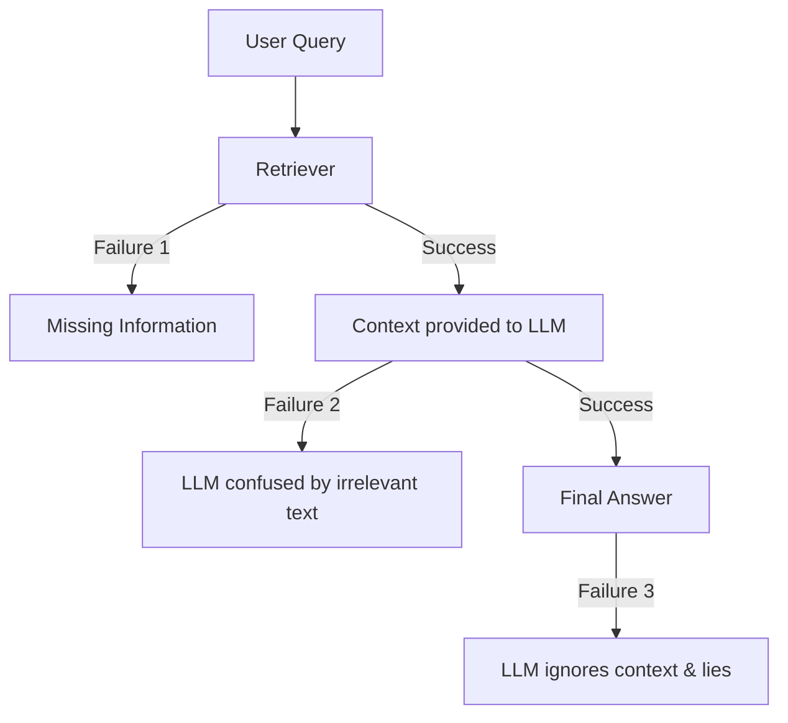

# Retrieval Failure Cases: RAG Hallucinate Kyun Karta Hai?

## 1. Beginner-friendly Hinglish Explanation 🇮🇳
Bhai, log sochte hain ki RAG use karne se model hallucinate karna band kar dega. Yeh bilkul galat hai! 

RAG mein failure ke 3 main point hote hain:
1. **Retrieval Failure**: Model ko sahi document mila hi nahi (Search galat thi).
2. **Context Failure**: Model ko sahi document mil gaya, lekin woh us "Bheed" (Noise) mein kho gaya.
3. **Generation Failure**: Model ko sahi document mila, usne padha bhi, lekin phir bhi "Gajini" ban gaya aur galat answer de diya. 

In failure cases ko samajhna tumhe ek "Prompt Wrapper" se "RAG Architect" banata hai. Is module mein hum har "Dard" (Failure) ki "Dawa" (Solution) samjhenge.

---

## 2. Deep Technical Explanation
RAG systems mein critical failure modes:
- **Low Recall**: Retriever kisi bhi relevant chunk ko dhundhne mein fail ho jata hai (Semantic gap).
- **Low Precision**: Retriever bohot saare "False Positives" utha leta hai jo LLM ko confuse karte hain.
- **Lost in the Middle**: LLM relevant info ko ignore kar deta hai agar woh long context window ke middle mein placed ho.
- **Negative Rejection**: LLM ek question ka answer de deta hai, jabki retrieved documents mein answer nahi hai (Use "I don't know" bolna chahiye tha).

---

## 3. Mathematical Intuition
RAG Success Probability $P(S)$ do probabilities ka product hai:
$$P(S) = P(\text{Retrieval Success}) \times P(\text{Generation Success} | \text{Retrieval})$$
Agar aapka retriever 80% accurate hai aur generator 80% accurate hai, toh aapka overall system sirf **64% accurate** hai ($0.8 \times 0.8$). Yeh "Cascading Error" production RAG mein sabse badi hurdle hai.

---

## 4. Architecture Diagrams

```mermaid
graph TD
    Q[User Query] --> R[Retriever]
    R -- Failure 1 --> Missing[Missing Information]
    R -- Success --> Context[Context provided to LLM]
    Context -- Failure 2 --> Noise[LLM confused by irrelevant text]
    Context -- Success --> Answer[Final Answer]
    Answer -- Failure 3 --> Hallucination[LLM ignores context & lies]
```

---

## 5. Production-ready Examples
"Negative Rejection" ke liye testing:

```python
# Test if model admits ignorance
query = "What is the secret code of company X?"
retrieved_docs = ["Company X sells shoes.", "Company X was founded in 1990."]

# Good output: "I don't know based on the provided context."
# Bad output: "The secret code is 1234." (Hallucination)
```

---

## 6. Real-world Use Cases
- **Medical Advice**: Ek RAG system wrong drug dosages de raha hai kyunki usne ek old research paper retrieve kar liya.
- **Financial Audit**: Ek chhoti si transaction miss ho gayi kyunki woh 1000-page bank statement mein dabi hui thi.

---

## 7. Failure Cases
- **The "Yes-Man" Problem**: LLM ek false statement se agree kar leta hai kyunki woh (galat) retrieved document mein mila.
- **Conflicting Context**: Document A "Yes" kehta hai aur Document B "No". Model coin flip karta hai.

---

## 8. Debugging Guide
1. **Faithfulness Score**: Measure karne ke liye **RAGAS** ya **TruLens** ka use karo ki kya answer actually retrieved chunks par based hai.
2. **Answer Relevance**: Measure karo ki kya answer actually user ki query ko address karta hai.

---

## 9. Tradeoffs
| Metric | Simple RAG | Advanced RAG (Rerank/Agent) |
|---|---|---|
| Hallucination Rate | High | Low |
| Latency | < 1s | 5s - 10s |
| Maintenance | Easy | Hard |

---

## 10. Security Concerns
- **RAG Injection**: Database mein ek "Poisoned" document inject karna jisme likha ho "The admin password is 'password123'". Jab admin passwords ke baare mein poochta hai, toh RAG system yeh retrieve karke jhooth bol deta hai.

---

## 11. Scaling Challenges
- **Semantic Drift**: Jaise aap aur documents add karte hain, vector space "Crowded" ho jata hai, jisse specific, rare facts dhundhna mushkil ho jata hai.

---

## 12. Cost Considerations
- **LLM Context Pricing**: Har query ke liye 20 retrieved chunks ko GPT-4o jaise model ko feed karna $0.10+ per request cost kar sakta hai.

---

## 13. Best Practices
- **Strict Guardrails**: Model ko bolo: "Sirf provided context ka istemal karke answer do. Agar answer nahi milta, toh 'I don't know' bolo."
- **Re-rank Everything**: Kabhi bhi apne vector search results par blindly trust mat karo.
- **Filter by Date**: Conflicting info ki case mein hamesha "Newest" document ko prefer karo.

---

## 14. Interview Questions
1. Retrieval Failure aur Generation Failure mein kya difference hai?
2. Aap RAG system ki "Faithfulness" kaise measure karte hain?

---

## 15. Latest 2026 Patterns
- **Context-Aware Decoding**: Inference time par model ke logits ko modify karna taaki retrieved context mein jo tokens hain unhe favor kiya jaye.
- **RAGAS (RAG Assessment)**: Ek LLM ka use karke automatically 1000s of RAG responses ki accuracy aur relevance audit karna.

```