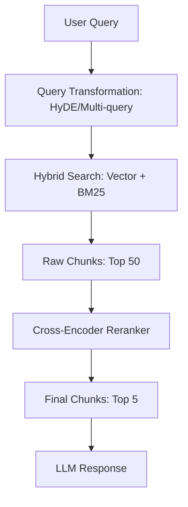

# ⚡ Retrieval Optimization: Finding the Needle in the Haystack
> **Objective:** Master the techniques to improve RAG accuracy by optimizing how information is retrieved—from query expansion to multi-stage retrieval and contextual compression | **Language:** Hinglish | **Standard:** 2026 Expert Framework

---

## 🧭 1. Beginner-Friendly Hinglish Explanation
Retrieval Optimization ka matlab hai "Search ko itna smart banana ki model ko hamesha sahi info mile".

- **The Problem:** Kabhi-kabhi user ka sawal clear nahi hota, ya hamara "Search engine" (Vector DB) galti se galat chunks le aata hai.
- **The Solution:** Optimization. 
  - **Query Expansion:** User ke sawal ko aur behtar tarike se likhna.
  - **Contextual Compression:** Chunks mein se sirf "Kaam ki baat" nikalna.
- **Intuition:** Ye ek "Smart Detective" jaisa hai jo sirf wahi file nikalta hai jisme asli saboot (Evidence) ho, na ki poora cupboard khali kar deta hai.

---

## 🧠 2. Deep Technical Explanation
Optimization occurs at three stages: **Pre-retrieval**, **Retrieval**, and **Post-retrieval**:

1. **Pre-retrieval (Query Transformation):**
   - **Hypothetical Document Embeddings (HyDE):** Model pehle ek "Fake Answer" likhta hai, phir us fake answer se search karta hai. (Very powerful).
   - **Multi-Query:** Ek sawal ko 5 alag tariko se likhna aur 5 bar search karna.
2. **Retrieval (Dense + Sparse):**
   - **Hybrid Search:** Vector search (Meaning) + BM25 (Exact keywords) ko mix karna.
3. **Post-retrieval (Refinement):**
   - **Reranking:** Top 10 results ko ek bade model se re-score karwana.
   - **Contextual Compression:** Chunks mein se irrelevant sentences hatana takki LLM ka context saaf rahe.

---

## 📐 3. Mathematical Intuition
**Reciprocal Rank Fusion (RRF):**
When combining multiple search results (e.g., Vector and Keyword), we use RRF to calculate a final score:
$$\text{Score}(d) = \sum_{r \in R} \frac{1}{k + \text{rank}(r, d)}$$
Where $k$ is a constant (usually 60). This ensures that a document that ranks high in *any* search gets a good final score.

---

## 🏗️ 4. Architecture Diagrams


---

## 💻 5. Production-Ready Examples
Implementing **HyDE** logic in 2026:
```python
def hyde_retrieval(query, retriever, llm):
    # 1. Generate a 'Hypothetical' answer
    hypothetical_answer = llm.invoke(f"Write a short technical answer for: {query}")
    
    # 2. Search using the answer, not the query!
    # This works better because Answer-to-Doc similarity is higher than Query-to-Doc.
    docs = retriever.get_relevant_documents(hypothetical_answer)
    return docs
```

---

## 🌍 6. Real-World Use Cases
- **Enterprise Search:** Searching company codebases where exact keywords (e.g., `init_auth_v2`) are as important as the meaning of the code.
- **Medical RAG:** Expanding "High BP" to "Hypertension" before searching medical journals.

---

## ❌ 7. Failure Cases
- **Over-expansion:** If you expand a query too much, you introduce "Noise" and the search returns completely random results.
- **Reranking Latency:** Using a massive model for reranking can add 2-3 seconds to your response time. **Fix: Use a small Cross-Encoder.**

---

## 🛠️ 8. Debugging Guide
| Problem | Reason | Solution |
| :--- | :--- | :--- |
| **Search ignores key technical terms** | Only using Vector Search | Switch to **Hybrid Search** (Vector + BM25). |
| **Model gives generic answers** | Top results are noisy | Implement a **Reranker** (e.g., Cohere or BGE-Reranker). |

---

## ⚖️ 9. Tradeoffs
- **HyDE (High Accuracy / High Latency)** vs **Standard Search (Lower Accuracy / Fast).**

---

## 🛡️ 10. Security Concerns
- **Retrieval Poisoning:** An attacker can inject documents with specific "Search-friendly" keywords to ensure their malicious content is always at the top of the RAG results.

---

## 📈 11. Scaling Challenges
- **The Reranking Bottleneck:** Reranking 1000 chunks is too slow. Standard practice: Retrieve 100 with ANN $\rightarrow$ Rerank top 20 $\rightarrow$ Feed top 5 to LLM.

---

## 💰 12. Cost Considerations
- Query expansion uses extra LLM tokens. Use a small, cheap model (like Llama-3 1B) for query transformation to save money.

---

## ✅ 13. Best Practices
- **Use Hybrid Search by default.** 
- **Implement a 'Small' Reranker.** Even a tiny one is better than none.
- **Metadata Filtering is your friend.** Don't just search everything; filter by `date` or `category` first.

漫
---

## 📝 14. Interview Questions
1. "How does Hypothetical Document Embedding (HyDE) improve retrieval?"
2. "What is Reciprocal Rank Fusion (RRF) and why is it used in Hybrid Search?"
3. "Explain the difference between a Bi-Encoder and a Cross-Encoder."

---

## 🚀 15. Latest 2026 LLM Engineering Patterns
- **Query-as-a-Service:** A specialized agent that "Investigates" the user's query and fetches data from 5 different sources (Web, SQL, Vector, Graph) before merging the results.
- **Dynamic Context Windowing:** Automatically adjusting the number of retrieved chunks based on the model's confidence in its initial thoughts.
漫
